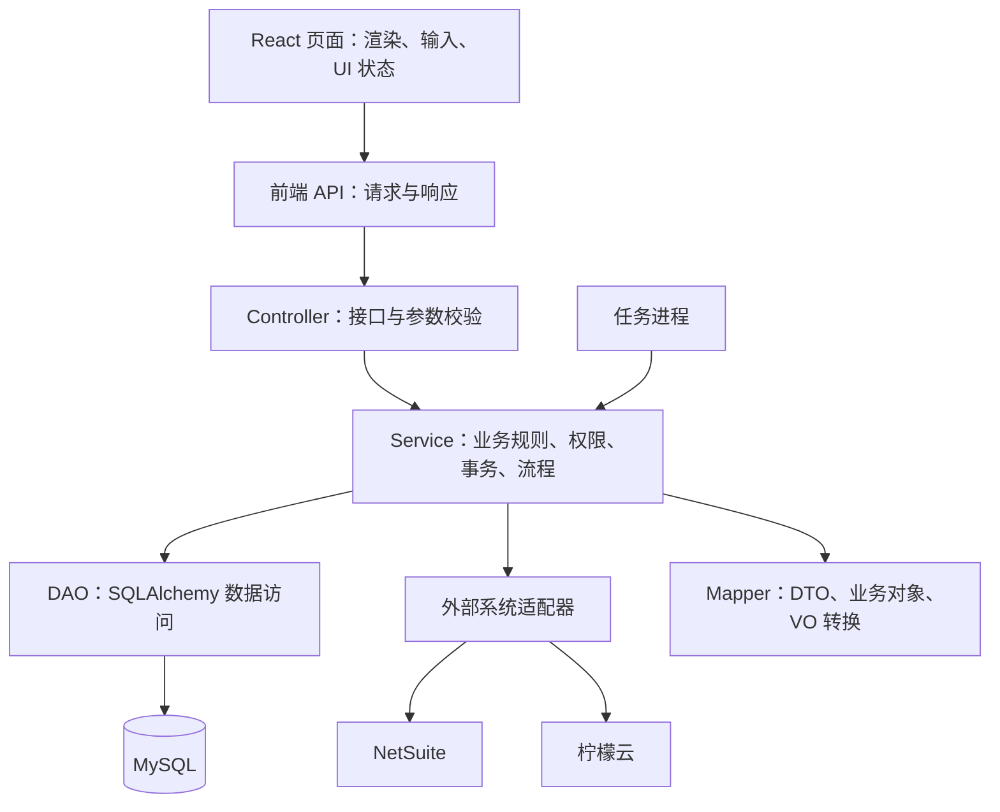
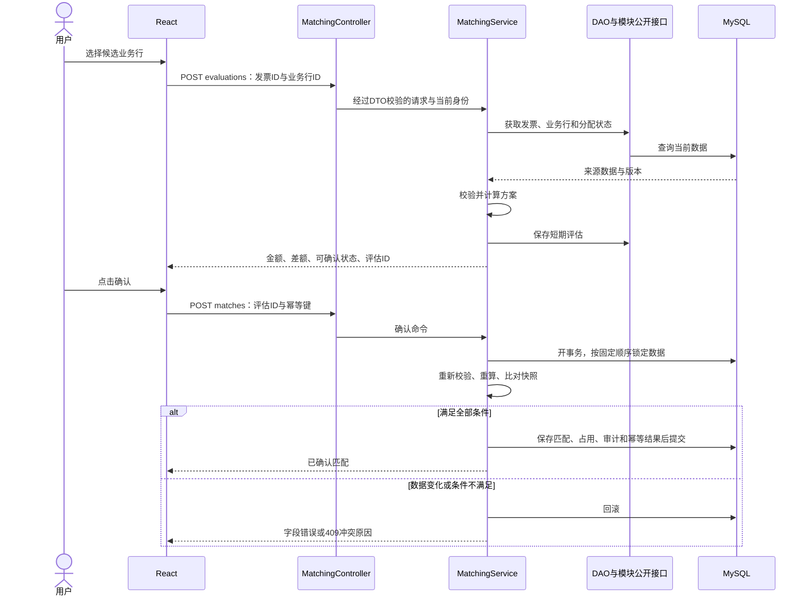
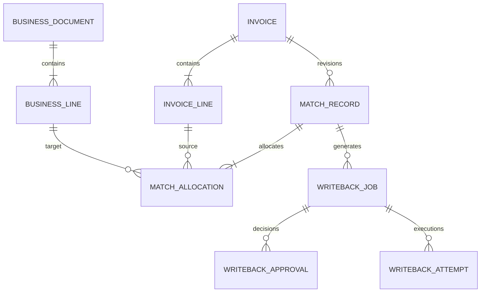
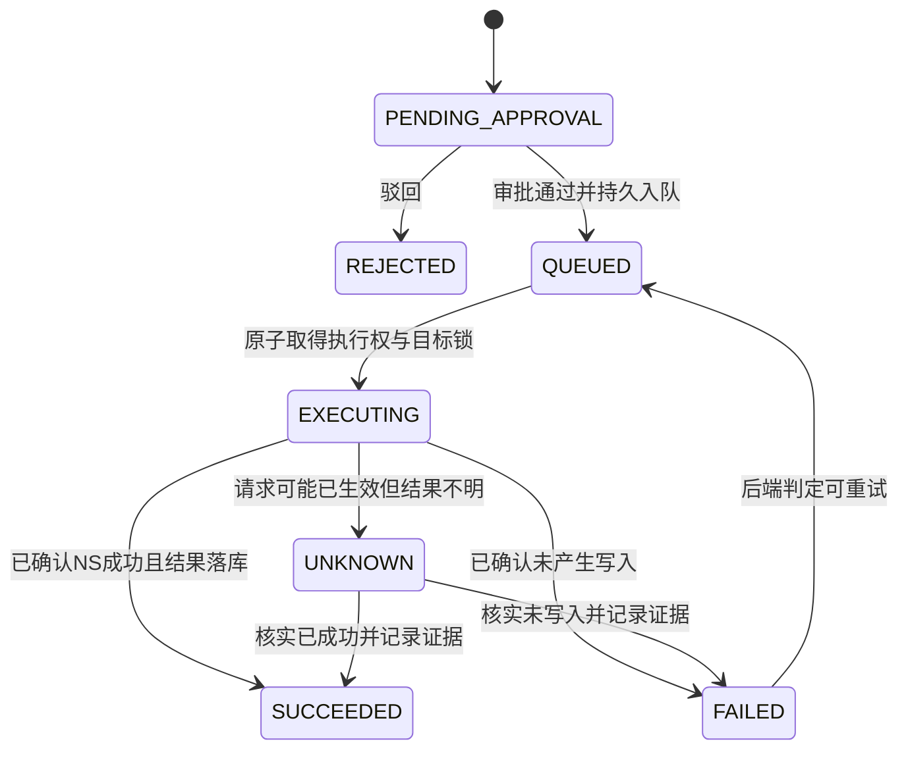

# 发票对账平台：Python 模块化与分层设计方案

阅读当前工程目录请先看[项目目录与架构地图](project-structure.md)，其他资料见[文档索引](README.md)。本文的目标目录与接口草案不作为当前文件清单或部署入口。

设计日期：2026-09-13。本文保留当时的分层方案和阶段规划；截至 2026-09-24，发票导入、匹配、同步保存、财务审核及开票任务已有实现，不能再将 P1—P4 统称为未开发。当前两套数据库、实际接口、模块依赖和未衔接部分见[系统整体链路与实现关系](system-chain.md)。下文“现状”按原设计日期理解，目标目录、`/api/v1/*`、独立 worker 和统一事务等仍须以实际代码核实。

已确定路线：保留 React + TypeScript + Vite 前端，以及 Python + FastAPI + SQLAlchemy + Alembic 后端；借鉴 Java 的业务模块与分层组织方式。所有参数校验、业务校验、金额计算、权限和状态流转由后端负责。

## 1. 现状与目标

### P0 阶段已经具备什么（历史记录）

现有真实链路为“登录 → 查询NS → 生成预览 → 确认写入 → 查询任务”。已完成P0：

| 位置 | 当前职责 |
| --- | --- |
| `web/main.tsx` / `web/app/` | React挂载、正式页面组合与演示懒加载 |
| `web/modules/` | identity、business、sync、writeback的组件和API |
| `web/shared/` | 请求封装、请求状态、公共组件、样式变量 |
| `backend/app.py` / `core/` | 依赖装配、配置、数据库连接、安全中间件 |
| `backend/modules/` | 身份、业务记录查询、连接、回写、审计；有SQL的模块拆DAO和Entity |
| `backend/integrations/netsuite/` | M2M签名、Token和HTTP适配 |
| `app/demo/` | 七个模拟视图，按功能拆分，正式入口不加载其数据 |
| `backend/config.py`等旧路径 | 无重复逻辑的兼容入口，退出条件见backend/README.md |

本轮保持数据库表结构及旧 API 协议；增加 `/api/ns/query`、`/api/ns/preview-text`、`/api/ns/jobs/{id}/view`，供正式页面把输入解析与操作能力交给后端。兼容的手动确认写入尚未成为多角色审批，自动匹配和真实同步仍未实现。详细目录见[后端模块说明](../backend/README.md)。

### 早期目标结构（当前差异见目录地图）

采用一个模块化后端应用、一套数据库迁移和一个前端项目。初期不引入微服务、通用工作流平台或消息中间件。需要异步执行的同步、回写任务落库，由独立任务进程消费。



图中的箭头表示调用依赖。Mapper 是辅助转换组件，不是每次调用都必须经过的独立业务步骤。Controller 通过 Service 的返回结果响应前端。

## 2. 分层职责与 Java 对照

| 层 | Python 落点 | 职责 | 不承担的职责 |
| --- | --- | --- | --- |
| Controller | FastAPI APIRouter，`controller.py` | 声明接口、解析 DTO、获取当前身份、调用 Service、返回 VO | 写 SQL、算金额、直接调用 NS |
| Service | `service.py` | 业务校验、计算、状态转换、事务边界、调用模块公开服务和外部适配器 | 依赖 React、HTTP Request 或页面组件 |
| DAO | `dao.py`，SQLAlchemy Core | 查询、锁定、插入、更新以及数据库约束相关操作 | 自行提交事务、发起审批、调用第三方接口 |
| Mapper | `mapper.py` | 数据库行/业务对象转 VO，字段重命名、显示格式转换 | SQL、网络请求、权限校验、决定业务状态 |
| Entity | `entity.py` | 数据库表定义；必要时增加独立业务数据对象 | 直接作为全部接口响应暴露 |
| DTO | `dto.py`，Pydantic | 请求字段、必填、长度、格式、范围等入口校验 | 校验数据库占用、当前审批状态 |
| VO | `vo.py`，Pydantic | 明确响应结构、金额、标签、可执行操作及原因 | 反向充当可信写入指令 |
| Policy | `policy.py`，按需 | 复杂且可独立测试的业务规则，如匹配约束和评分 | 变成另一套 Service 或跨模块杂物目录 |
| Integration | `integrations/` | 外部认证、HTTP、分页协议和字段适配 | 决定发票能否确认或用户能否审批 |

这里的 Mapper 指对象转换，不是 Java MyBatis 的 SQL Mapper。SQL 统一放 DAO；不同时创建重复的 DAO、Repository、SQL Mapper 三层。

保留当前 SQLAlchemy Core 风格，先不同时改成 ORM。Service 使用 `engine.begin()` 管理短事务，把同一个 Connection 传给参与操作的 DAO。DAO 只执行 SQL，不调用 commit；HTTP 调用不放进长期持锁事务。[SQLAlchemy 的事务上下文](https://docs.sqlalchemy.org/en/20/core/connections.html)支持成功提交、异常回滚的组织方式。

Controller 用 APIRouter 按模块挂载，响应用显式 VO 限定输出字段；这些能力分别由 [FastAPI 多文件应用](https://fastapi.tiangolo.com/tutorial/bigger-applications/)和 [Response Model](https://fastapi.tiangolo.com/tutorial/response-model/)提供。模块命名和 DAO 划分是本项目设计选择。

## 3. 模块边界

| 模块 | 负责的业务 | 主要数据所有权 |
| --- | --- | --- |
| identity | 登录、角色、主体授权、操作者身份 | 用户、会话、授权 |
| invoice | 发票头、发票明细、原票附件、来源状态 | 发票及来源版本 |
| business | 标准化的采购、入库、费用、NS 应付账单及来源关联 | 业务单及行、供应商/SKU 映射 |
| matching | 候选推荐、匹配计算、确认、金额分配、占用释放 | 评估、匹配单、分配关系、占用记录 |
| exception | 差异记录、责任人、处理意见、处理进度 | 异常及处理记录 |
| sync | 同步批次、游标、失败项、重跑与标准化编排 | 同步任务及水位 |
| reconciliation | 按确定口径进行三方核对、保存结果快照 | 对账批次及结果 |
| writeback | 回写方案、业务审批、队列、执行、结果核实 | 回写任务、审批、尝试、目标锁 |
| dashboard | 查询统计、趋势、待处理汇总 | 初期只读，无独立业务状态 |
| audit | 统一记录操作者、对象、变化及关联追踪 ID | 审计日志 |

`business` 是原界面背后缺少的数据模块，用于统一承载 NS 业务单据。`integrations` 是技术适配层，不再保存第二份匹配和审批规则。

跨模块调用规则：

- 只有存在跨模块调用时才建立 `public.py`，暴露必要的数据查询和命令接口，不为所有模块预建门面。
- 不直接导入其他模块的 DAO 或表定义。matching 通过 invoice/business 的公开接口取数和锁定来源行；占用关系由 matching 统一拥有。
- 一个本地业务操作由最外层 Service 开事务；跨模块公开方法接受该 Connection，保证校验、占用和记录一致提交。
- writeback 通过 matching 的公开接口更新分配执行结果；matching 不反向调用 writeback。exception 通过公开命令触发修正，不能直接改发票金额或任务状态。
- 同步发现被确认的来源数据变化时，保存新版本并标记需要复核，不能静默覆盖审批快照。
- dashboard/reconciliation 通过批量公开查询或专用只读投影取数，避免逐条循环请求其他模块。

## 4. 建议目录

这是实施后的目标目录，不要求一次创建所有文件。简单模块先用单文件，复杂后再按用例拆分。

```text
项目根目录/
├── web/
│   ├── main.tsx                       # 挂载应用
│   ├── app/
│   │   ├── App.tsx                    # 布局与页面组合
│   │   └── routes.tsx                 # 业务页面路由
│   ├── modules/
│   │   ├── invoice/
│   │   │   ├── pages/InvoiceListPage.tsx
│   │   │   ├── components/InvoiceTable.tsx
│   │   │   └── api.ts                 # 本模块接口调用
│   │   ├── matching/
│   │   │   ├── pages/MatchDetailPage.tsx
│   │   │   ├── components/CandidateList.tsx
│   │   │   ├── hooks/useMatchEvaluation.ts
│   │   │   └── api.ts
│   │   ├── exception/
│   │   ├── sync/
│   │   ├── reconciliation/
│   │   ├── writeback/
│   │   ├── dashboard/
│   │   └── identity/
│   └── shared/
│       ├── api/http.ts                # Cookie、请求、错误映射
│       ├── api/generated.ts           # 根据 OpenAPI 生成的契约类型
│       ├── components/                # 表格、提示、加载、空状态
│       └── layouts/
├── backend/
│   ├── __main__.py                    # 原启动方式保留
│   ├── app.py                         # create_app、注册模块、生命周期
│   ├── core/
│   │   ├── config.py
│   │   ├── database.py                # 引擎和统一 metadata
│   │   ├── errors.py                  # 与 NS 无关的通用应用异常
│   │   ├── middleware.py
│   │   └── dependencies.py            # 请求身份与 Service 装配
│   ├── modules/
│   │   ├── matching/
│   │   │   ├── controller.py          # /api/v1/matching/*
│   │   │   ├── service.py             # evaluate、confirm、cancel
│   │   │   ├── policy.py              # 候选约束、分配规则
│   │   │   ├── dao.py                 # 评估、匹配与占用 SQL
│   │   │   ├── mapper.py              # 结果和 VO 转换
│   │   │   ├── entity.py              # 本模块表定义
│   │   │   ├── dto.py
│   │   │   ├── vo.py
│   │   │   └── public.py              # 其他模块可调用的窄接口
│   │   ├── invoice/                   # 按需使用同样结构
│   │   ├── business/
│   │   ├── exception/
│   │   ├── sync/
│   │   ├── reconciliation/
│   │   ├── writeback/
│   │   ├── dashboard/
│   │   ├── identity/
│   │   └── audit/
│   ├── integrations/
│   │   ├── netsuite/
│   │   │   ├── client.py              # HTTP、超时、响应
│   │   │   ├── auth.py                # 签名与 Token 缓存
│   │   │   └── mapper.py              # NS 字段转内部标准对象
│   │   └── lemon/
│   │       ├── client.py
│   │       └── mapper.py
│   ├── workers/
│   │   └── runner.py                  # 消费数据库中的同步/回写任务
│   ├── migrations/                    # 保留已有 Alembic 历史
│   ├── manage.py
│   └── tests/
│       ├── unit/
│       ├── api/
│       ├── integration/
│       └── fixtures/                  # FakeNS、模拟发票、模拟业务单
└── docs/
    └── architecture-plan.md
```

前端 `hooks` 只管理请求、选中项、请求取消、加载与错误展示；不存在前端 MatchingService、金额算法或规则配置。接口类型以 OpenAPI 为唯一契约来源，暂未引入类型生成工具时先手工对齐，实施阶段再固定工具版本。

## 5. 前后端接口边界

前端提交用户输入和资源 ID；后端返回完整视图数据。资源 ID、版本、公司主体等所有输入都需要后端验证，操作者取自认证身份，不接受前端指定的 actor 或 role。

| 内容 | 后端责任 | 前端责任 |
| --- | --- | --- |
| 表单校验 | 必填、类型、格式、范围、业务条件；返回字段错误 | 显示字段错误，不维护第二套校验规则 |
| 列表 | 搜索、过滤、分页、排序和权限范围 | 提交查询参数并显示结果 |
| 金额 | 合计、税额、分配、差额、舍入 | 展示金额文本，不用 Number 重新计算 |
| 操作按钮 | 返回 allowed、reasonCode、reason；执行时重新校验 | 根据响应展示按钮状态；请求中可禁用按钮 |
| 匹配推荐 | 返回候选、规则依据、规则版本 | 显示候选并提交选择 |
| 状态 | 持久化并生成状态标签 | 展示标签，不因点击按钮直接标记成功 |

业务页面移除原型内的 `reduce` 金额计算、置信度阈值判断、写死计数和成功提示。字段输入值可以在前端保持原始字符串。旧管理工具的 JSON 编辑仅是兼容入口，正式业务流程改成结构化表单，不向普通业务用户暴露 NS payload 编辑器。

### 接口约定

- 旧 `/api/ns/*` 先保留原请求和响应；新业务接口使用 `/api/v1/*`，避免一次破坏当前页面。
- 成功返回 `{ data, traceId }`；失败返回 `{ error: { code, message, fieldErrors }, traceId }`。HTTP 状态表达实际结果，不能所有请求都返回 200。
- 参数错误用 422，未登录 401，无权操作 403；不可见对象按接口策略返回 404；版本冲突/过期用 409；异步任务接收用 202。
- 列表统一 `items、page、pageSize、total`，由后端限制页大小和排序字段。
- 金额和数量用十进制字符串；同时可返回金额展示字段。日期用 ISO 格式，业务日期、入账期间、同步时间分别保存。
- 写命令使用 `Idempotency-Key`。幂等记录按身份、主体、接口和键隔离；同键同请求返回已有结果，同键不同请求返回 409。幂等记录与业务事务一起提交，不能只存在前端或进程内存。
- GET 不产生写入、审批或重试副作用；服务端不因客户端断连就断言外部写入失败。

### 核心接口草案

| 方法与路径 | 用途 |
| --- | --- |
| GET `/api/v1/invoices` | 发票分页和搜索 |
| GET `/api/v1/invoices/{id}` | 发票、行明细、分配状态和可执行操作 |
| GET `/api/v1/invoices/{id}/candidates` | 后端推荐候选业务行及依据 |
| POST `/api/v1/matching/evaluations` | 计算所选关联方案并保存短期不可变评估 |
| POST `/api/v1/matching/matches` | 基于评估确认匹配并占用可分配金额 |
| GET `/api/v1/matching/matches/{id}` | 查看匹配、分配及版本 |
| POST `/api/v1/matching/matches/{id}/cancel` | 按状态限制取消并释放允许释放的占用 |
| POST `/api/v1/writebacks` | 基于已确认匹配生成回写方案，进入待审批 |
| POST `/api/v1/writebacks/{id}/approve` | 后端审批通过并持久入队 |
| POST `/api/v1/writebacks/{id}/reject` | 驳回方案并记录意见 |
| GET `/api/v1/writebacks/{id}` | 查看执行状态与受控日志 |
| POST `/api/v1/writebacks/{id}/retry` | 仅重试后端判定可重试的任务 |
| POST `/api/v1/writebacks/{id}/resolve` | 有权限人员核实 unknown，记录证据及明确结论 |
| GET `/api/v1/exceptions` | 异常池查询 |
| POST `/api/v1/exceptions/{id}/resolve` | 执行选定处理命令并核实结果 |
| POST `/api/v1/sync/jobs` | 发起同步，返回任务 ID |
| GET `/api/v1/sync/jobs/{id}` | 查询批次、游标、数量、失败项 |
| POST `/api/v1/reconciliation/runs` | 发起指定范围的对账 |
| GET `/api/v1/reconciliation/runs/{id}` | 查询对账结果和数据水位 |
| GET `/api/v1/dashboard` | 同口径的汇总统计 |

以上是目标接口，不代表当前已经存在。分配调整、数据源配置等接口随对应阶段补充，避免先建设大量通用 CRUD。

## 6. 贯穿示例：从选择单据到确认匹配

第一期按“一张发票 + 多条业务行”形成匹配单；同一业务行可分配给多张发票，但总占用不能超过可开票金额。因此能表示一票多单和一单多票，不能只在 invoice 表里存一个 purchase_order_id。

第一期支持子采购单与发票多对多，允许部分分配业务行；发票确认时要求本张发票金额全额有归属，但业务行无需一次全部开完。请求可提交所选业务行及本次拟分配的十进制金额，后端校验并计算，不能要求吃完每条业务行剩余额度。自动推荐不唯一时由用户选择方案，再由后端评估。

**步骤一：后端评估。** 用户选择候选，前端提交：

```json
{
  "invoiceId": "inv_001",
  "allocations": [
    { "businessLineId": "line_81642_1", "amount": "78240.00" },
    { "businessLineId": "line_81657_1", "amount": "48310.00" }
  ]
}
```

amount仅代表用户拟分配输入，不是可信计算结果；后端按来源金额、精度、发票可用额和业务可用额重新校验，并拆算净额/税额。后端读取来源版本、供应商、主体、币种、金额及已有分配，生成绑定当前身份与数据版本的评估，返回示例：

```json
{
  "data": {
    "evaluationId": "eval_001",
    "invoiceId": "inv_001",
    "currency": "CNY",
    "invoiceAmount": "126550.00",
    "allocatedAmount": "126550.00",
    "difference": "0.00",
    "display": {
      "invoiceAmount": "¥126,550.00",
      "allocatedAmount": "¥126,550.00",
      "difference": "¥0.00"
    },
    "allocations": [
      { "businessLineId": "line_81642_1", "amount": "78240.00" },
      { "businessLineId": "line_81657_1", "amount": "48310.00" }
    ],
    "actions": {
      "confirm": { "allowed": true, "reasonCode": null, "reason": null }
    },
    "ruleVersion": "matching-v1",
    "expiresAt": "2026-09-13T10:15:00+08:00"
  },
  "traceId": "trc_example"
}
```

金额和时间均为说明用示例。评估不占用金额，也不代表正式确认。第一期评估有效期建议 15 分钟，由后端配置和时钟控制。

**步骤二：确认。** 前端只提交 `evaluationId`，以及请求头中的幂等键。后端加载不可变评估，重新读取并锁定依赖数据、核实版本、重算分配、检查当前权限和占用；任何相关变化均返回 409，要求重新评估，不能静默替用户改变已看到的分配。

一个事务中保存匹配单、分配行、占用、版本、审计和幂等结果。确认只表示平台已保存匹配；生成回写任务、审批和 NS 成功是后续独立步骤。



前端快速切换候选时，应取消旧请求或忽略过期响应，只展示最新选择的评估结果；评估加载中不能继续使用上一次的“可确认”。这是请求状态管理，不是前端业务计算。

## 7. 核心数据模型

所有新增业务数据带 NS 账户/主体范围、内部 ID、来源标识、创建/更新时间。需要并发修改的记录增加 version；来源快照另存 source_version/source_updated_at。

| 表/实体 | 关键字段与约束 |
| --- | --- |
| invoice / invoice_line | 来源ID、发票号码/代码、购买方、供应商、币种、日期、净额/税额/含税额、原始状态、来源版本 |
| business_document / business_line | NS账户、类型、Internal ID、稳定来源行键、PO/入库关联、主体、币种、期间、可开票基数 |
| vendor_mapping / item_mapping | NS账户、来源系统与ID、内部供应商/SKU；映射必须包含作用范围 |
| match_evaluation | 发票、操作者、所选业务行、计算结果、依赖版本、规则版本、有效期；内容不可变 |
| match_record / match_allocation | 匹配单及版本、发票行、业务行、分配净额/税额/含税额、分配状态 |
| allocation_guard | 按账户和分配资源唯一的占用控制行；记录有效占用额和版本，用于串行化并发分配 |
| exception_case / exception_action | 类型、关联对象、严重程度、责任人、状态、处理方案与执行结果 |
| sync_job / sync_cursor | 数据源、范围、状态、游标、源水位、尝试次数与失败项 |
| reconciliation_run / reconciliation_result | 主体、币种、期间、口径版本、各源水位、三方金额及分类差异 |
| writeback_job / writeback_approval / writeback_attempt | 匹配版本、不可变payload/哈希、审批人/时间、任务状态、外部目标、每次尝试与结果 |
| idempotency_record | 身份/范围/接口/幂等键唯一、请求哈希、关联结果 |
| audit_log | actor、action、对象ID/版本、变化摘要、traceId、时间与脱敏结果 |

用户/角色/会话、附件引用等辅助表在相应模块实施时补齐。工作台优先查询已有业务数据和对账结果，不复制整套发票状态。



现有 `ns_previews`、`ns_target_locks`、`ns_audit` 保留，并逐步由 writeback/audit DAO 接管。新回写任务可关联原 preview ID；旧任务不能无依据标记为“已审批”。不重写既有 Alembic 迁移，不删除历史 executing/unknown 及其锁。

### 金额、去重与并发约束

- Python 使用 Decimal，从十进制字符串构造；数据库金额建议 DECIMAL(20,6)，数量和汇率按业务精度另定。后端拒绝非有限值和超范围数值，禁止先转 float 再转 Decimal。[Python Decimal 文档](https://docs.python.org/3/library/decimal.html)说明了十进制表示及舍入行为。
- 第一期只做同币种核对；CNY 最终金额按明确的两位小数规则处理。净额、税额、含税额分别比较，不能只凭含税合计相同认定税额一致；系统不擅自改写来源税额。
- 每条业务行的有效预占与已确认消耗之和不得超过可开票额度。先锁来源行/占用控制行，再计算额度、更新占用并插入分配；所有路径按同样的资源顺序加锁，不能用“先查再插”代替并发控制。
- 确认匹配建立 RESERVED 占用；NS 成功后转 CONSUMED。已消耗仍计入额度使用，不能因释放执行锁而恢复为可分配。
- 审批驳回使相应方案失效，在一个事务中取消相关匹配版本并释放其 RESERVED 占用；重做生成新版本。存在QUEUED、EXECUTING、UNKNOWN、SUCCEEDED关联回写任务时拒绝普通匹配取消。取消、审批入队与worker领取使用同一匹配版本的锁；已失效匹配不得再入队，取消待审批方案时同事务使方案失效。
- 来源导入按“账户 + 来源系统 + 来源记录ID”唯一并执行版本化 upsert；发票业务去重键另按票种、代码/号码及主体配置。不同来源同一张票不能仅靠来源ID识别，也不能只靠金额识别。
- 业务行部分金额分配为一期能力；红字、作废、汇兑、跨主体抵消暂不自动处理；先保存来源状态、阻止不支持的自动确认并进入人工核对，后续按明确规则扩展。

## 8. 匹配、对账和异常规则

匹配先做硬条件过滤：身份/主体权限、有效来源状态、供应商映射、币种、可用额度、金额及税额口径。满足条件后再用 SKU、数量、日期等依据排序。候选理由返回结构化字段，便于页面解释。

原型中的 98%、90% 阈值、15 天和 0.5% 差异均是演示内容，不能直接当成已确认规则。第一期优先返回“精确候选/需复核”及依据，所有匹配仍由人确认。若后续使用分数，要标为规则评分并保存版本，不将未校准评分描述为概率。

对账需先定义可比较的业务基数：采购订单和对应入库单用于追溯同一业务，不能两者金额相加重复计算；NS Vendor Bill 是另一侧账务记录，也不再次加入业务应付基数。

对账分开报告两类差异：

1. 同范围业务基数与发票覆盖金额：业务是否收齐发票。
2. 同范围发票覆盖金额与 NS Vendor Bill 对应金额：发票与应付账记录是否一致。

保留业务日期、发票日期和 NS 入账期间及其映射。跨期、数据延迟、缺来源、确定金额不符分开分类，不把所有总额差异直接当成错误。结果保存数据水位和口径版本；前端显示数据范围、统计时间及缺失数据提示。

异常“完成”必须对应实际命令结果或有审计的人工核实结论。例如补充关联单据后重新计算、确认差额消除才能自动关闭，不能只弹出“处理成功”。

## 9. 回写与同步任务

回写方案在后端从已确认匹配生成，保存不可变 payload、目标、匹配/映射版本和哈希。审批绑定该版本；内容变化需生成新方案重新审批，不能批准一个 payload 后执行另一个。



匹配状态、审批状态、回写状态分别保存。确认匹配不等于审批通过；入队不等于 NS 成功。多角色上线时配置主体范围，默认提交人与审批人分离；当前单管理员身份不能冒充双人审批。

数据库任务表即持久队列：审批与任务变为 QUEUED 在同一个事务完成，worker 只扫描已提交任务。若后续引入外部队列，再增加同事务 outbox 转发，避免审批成功却未发送任务。

任务执行采用三个阶段：

1. 短事务锁定匹配版本并复核仍有效、RESERVED占用归属和审批状态，取得执行权、持久目标锁和尝试记录后提交；与取消操作互斥。
2. 事务外读取 NS、核对快照、执行 HTTP 写入。
3. 短事务保存结果、业务状态及审计；仅在确认安全时释放执行锁。

保留现有 unknown 策略：超时、断连、结果持久化失败、进程中断都不能直接重发。NS 已写成功但本地落库失败时保留 executing/锁，恢复后核实。未知任务不随租约到期自动解锁，其他任务也不能绕过同一目标锁。

本地幂等只能防止平台重复派发，不能保证跨系统 exactly-once；读取 NS 后再 PATCH 也无法阻止 NS 其他任务同时修改。对共享记录应验证 NS 端可提供的条件更新/原子校验能力；未验证前保留冲突复核流程，不宣称已解决跨系统原子性。

同步任务和写任务使用不同重试策略。分页读取可在限速、退避与幂等 upsert 下重试；游标仅在对应页落库后推进，并保留上次源水位、重叠窗口和稳定ID去重。真实分页、增量字段、作废事件以及权限范围需按各数据源接口验证后实现，不采用原型写死的“每10分钟”作为已运行事实。

## 10. 现有代码怎么拆

| 现有代码 | 目标 |
| --- | --- |
| `app.py` 的 Login/PreviewBody/ExecuteBody | identity/writeback 的 dto.py |
| `app.py` 的 session 路由 | identity/controller.py |
| `app.py` 的 ns status/connect/records 路由 | integrations 管理入口，由独立 Service 调用 client |
| `app.py` 的 preview/execute/jobs 路由 | writeback/controller.py，先保持旧协议 |
| `app.py` 的 RequestGuard/异常处理 | core/middleware.py、core/errors.py |
| `Workflow.validate/preview/execute` | writeback/service.py 与按需 policy.py |
| `Workflow.get/list_jobs/claim/transition` 中 SQL | writeback/dao.py；Service 保留流程和事务控制 |
| `Workflow.audit` | audit 的公共记录接口和 DAO，共用调用方事务 |
| `database.py` 的表与 make_engine | writeback/audit entity.py 与 core/database.py |
| `netsuite.py` 的 ApiError | core/errors.py；外部适配器抛独立集成错误供 Service 转换 |
| `netsuite.py` 的 assertion/token/request | integrations/netsuite/auth.py 与 client.py |
| `web/main.tsx` 的 api、页面和状态 | shared/api/http.ts、identity/writeback 模块 |
| `app/page.tsx` 的数组和 MatchDetail 金额逻辑 | 测试/演示 fixtures 与 matching/service.py |

P0已完成结构与依赖方向调整，保留可调用的 create_app 工厂和旧导入兼容位置供测试渐进迁移。新旧实现不得同时消费同一批写任务。真实客户端与测试替身通过装配注入，业务 Service 不检查“是否测试环境”来跳过规则。

## 11. 实施顺序与验收

| 阶段 | 交付内容 | 验收标准 |
| --- | --- | --- |
| P0 结构拆分 | core、identity、writeback、NS 适配器、前端 API 与页面拆分 | 原登录、预览、执行、unknown、恢复行为保持；既有测试通过，无业务表改写 |
| P1 数据与查询 | invoice/business 最小表结构、独立演示数据导入、列表/详情 API | 页面搜索分页走后端；重启仍能查询；跨主体数据不可越权；模拟来源明确标识 |
| P2 匹配闭环 | 候选、评估、确认、分配占用、取消、字段错误 | 精确金额计算；一票多单/一单多票；并发不超占；重复确认不重复分配；前端无计算规则 |
| P3 审批与回写 | 回写方案、角色审批、持久 worker、unknown 核实 | 审批版本与执行一致；崩溃不自动重复写；实际 NS 行为经 Sandbox 测试验证 |
| P4 同步与对账 | 柠檬云与 NS 分页增量、异常闭环、三方核对、工作台 | 重复同步无重复记录；数据水位可追溯；PO/入库不重复计数；统计与明细同口径 |

首个演示里程碑是 P2：“查询持久化发票 → 后端评估 → 确认分配 → 刷新后仍能看到结果”。初期可用单独演示环境的后端数据完成，不依赖真实柠檬云或启用 NS 写入。P3/P4 的真实联调依赖账户权限、样例单据和映射规则，不能把结构重构通过等同于业务上线。

测试重点：

- Service 单元测试：精确差额、税额不一致、重复关联、额度不足、无权限、状态不合法、舍入边界。
- API 测试：DTO 校验、字段错误、认证与主体隔离、过期评估、幂等键冲突、VO 不泄露内部字段。
- MySQL 集成测试：两个请求竞争同一业务额度、事务回滚、数据库唯一约束、任务原子领取。SQLite 用于快速测试，不替代 MySQL 并发验收。
- 回写故障测试：NS 超时、写成功后本地提交失败、进程中断、unknown 核实、同目标任务阻塞、原审批内容不可替换。
- 前端流程验证：错误落在正确字段、切换候选时旧响应不覆盖新选择、按钮遵从后端结果、刷新后状态一致。

按阶段运行当前项目适用的 `npm.cmd test`、`npm.cmd run lint:api` 与前端 lint；新增并发和真实数据库测试必须明确记录环境及跳过项。后续匹配、审批业务测试随对应模块实施，不能提前声称已通过。

P0 验证记录（2026-09-13）：`npm.cmd run check` 通过，后端 47 项测试通过、1 项真实 MySQL 测试因未配置环境跳过；`npm.cmd run test:prototype` 通过。使用隔离 SQLite 与 FakeNS 检查了登录、后端输入校验、查询、预览、确认、窄屏及七个演示页面导航，未操作真实 NS。格式整理不涉及业务表变更。

## 12. 运行方式与后续待定项

开发继续采用 Vite → `/api` 代理 → FastAPI。部署可继续由 FastAPI 托管 `dist/web`，也可按已有基础设施使用同域反向代理；代码分离不要求用户访问两个域名。

API 初期保持单进程，延续现有内存会话的限制。新增独立 worker 只消费数据库任务，不依赖浏览器会话；其操作需保存原审批身份。需要多 API 进程时先把会话和限流外置，再扩容。

以下是后续业务接入前需要确定的参数，不影响 P0 结构拆分，也不在当前方案中伪造答案：

| 待定内容 | 影响 |
| --- | --- |
| NS 业务基数取采购、入库、费用的哪种状态和金额 | 可开票额度与对账口径 |
| 子采购单字段、供应商税号、SKU 与 NS 行键映射 | 候选正确性、关联粒度 |
| NS 回写是更新已有 Vendor Bill、创建新账单还是自定义关联记录 | payload 模型、审批范围、幂等目标 |
| 柠檬云可用接口、分页游标、附件权限和作废事件 | 数据接入与新鲜度 |
| 允许差额、舍入方式、部分开票、红字与跨期规则 | 可确认条件、异常分类 |
| 真实用户、主体授权和审批人员 | 多角色审批与审计 |

后续新增功能的定位示例：“增加按供应商筛选发票”修改 invoice 的 DTO、DAO、必要的 Service 范围控制及前端查询控件；“修改确认匹配条件”修改 matching/policy.py 与 Service 测试，前端继续展示 allowed/reason；“增加 NS 回写字段”修改 writeback 方案生成、字段许可、NS mapper 与对应测试，并使旧审批按版本要求失效。

## 13. 约束 AI 的方式与自动检查落地

项目规则集中在根目录 [AGENTS.md](../AGENTS.md)，前端统一要求放在 [前端规范](frontend-conventions.md)。规则负责告诉 AI 如何行动，自动检查负责发现可验证的违规；文件本身不会自动完成代码重构、UI 统一或阻断合并。

按以下顺序建立持续约束：

| 检查 | 当前状态 | 后续落地 |
| --- | --- | --- |
| Python 基础规范/未使用导入 | Ruff 检查通过，已接入 check 命令 | 后续接入持续集成 |
| 前端基础规范/React 规则 | ESLint 检查通过，已修复原型控件标签问题 | 保持检查，不靠禁用规则通过 |
| 类型检查 | 已有web/tsconfig.json与typecheck命令 | 严格类型和未使用变量检查覆盖正式前端及其演示导入 |
| 代码格式 | 已固定Prettier版本与Ruff格式检查，format:check统一执行 | 使用EditorConfig与独立format:web/format:api命令 |
| 模块依赖边界 | 已有check:architecture | Python AST检查越层/跨模块私有导入及循环；TypeScript AST检查请求与演示边界，不替代业务审查 |
| 业务正确性 | 已有 NS 流程测试，匹配等仍待实现 | P2起增加金额、占用、权限和状态测试；P3补故障与真实MySQL验证 |
| 界面统一 | 已提取Button/Panel/JsonView与tokens，尚无自动截图基线 | 正式页面复用控件；视觉变更仍需实际页面验证 |
| 无用代码/重复文件 | 已清理无引用的重复布局与过时原型测试；迁移入口保留兼容适配 | 其余文件按引用、入口、脚本及动态发现继续逐项核查 |

持续集成应执行已落地的检查；仓库平台支持时再配置必需检查和合并规则。未配置前不能把 AGENTS.md 称为“强制质量门禁”，通过 lint 也不能证明架构和视觉全部正确。

结构整理时移除 `app/layout 2.tsx` 和 `tests/rendered-html.test 2.mjs`：前者无路由或导入引用，后者仍测试已替换的脚手架内容，且当前测试命令明确使用另一份有效原型测试。后续清理已移除无入口调用的旧 Node 后端及其专属测试；对应认证、预览、并发和未知结果行为由 Python 测试覆盖。同时移除未接入的 ChatGPT 登录、D1 示例、空 Drizzle 配置及无引用的模板图标。旧界面仍供 `/demo` 和原型预览使用；Python 兼容入口的调用方及退出条件见后端模块说明。

每次任务使用以下简短约束即可，不需要反复粘贴整份规则：

> 先阅读根目录 AGENTS.md，以及本次功能对应的中文模块文档；涉及前端时阅读 docs/frontend-conventions.md。先说明功能归属、修改层次、复用点和验证方法，然后完成本次范围的实现。遵循后端校验和业务分层，复用统一前端组件，清理本次替代的已确认无用代码，同步中文文档，并如实报告检查结果。

Codex 的项目指令可通过 AGENTS.md 提供；新任务可以先让它简要列出读取的规则文件与本次适用的关键约束，检查是否正确加载。对于已经开始的任务，明确要求重新读取更新后的规则；不要假设所有 AI 工具都会识别同一个文件名。[官方 AGENTS.md 说明](https://learn.chatgpt.com/docs/agent-configuration/agents-md)说明了指令加载及目录覆盖机制。

## 14. 代码依据

- [项目说明](../README.md)
- [现有 Python 后端说明](python-backend.md)
- [现有前端入口](../web/main.tsx)
- [原型页面](../app/page.tsx)
- [后端接口与应用工厂](../backend/app.py)
- [现有写入流程](../backend/workflow.py)
- [数据库定义](../backend/database.py)
- [NS 适配器](../backend/netsuite.py)
- [现有流程测试](../backend/tests/test_workflow.py)

本方案中的 P0 目录和检查已落地；P1—P4 已有部分实现，但审核证据匹配、任务收票、业务回写、持久调度等尚未形成完整闭环。以[当前链路总览](system-chain.md)、实际注册代码和各模块 README 区分当前实现与未来能力，不按早期阶段标题判断上线状态。
