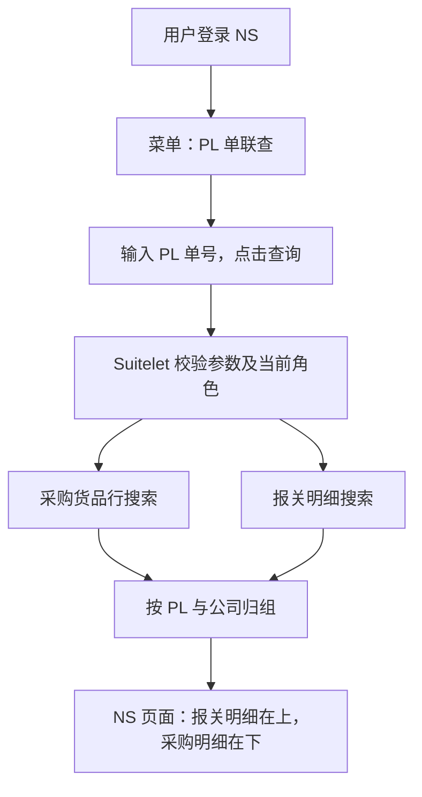

# NS 内部「PL 单联查」搜索页面执行方案

日期：2026-09-14。状态：设计方案；后续已新增本地 SuiteScript 源码及模拟测试，见 [脚本及部署说明](../../SuiteScripts/pl_lookup/README.md)。尚未在 NS 创建搜索、上传脚本或部署，未修改现有业务接口。下文保留设计与验收要求，实际已实现范围和限制以脚本说明为准。

## 1. 要交付的功能

**后续用户确认的实施口径（优先于下文早期明细方案）：** 采购直接使用搜索839的原汇总结果，保留母采购单MAX、金额SUM和全部原GROUP列；报关使用搜索954明细（类型1122关联单头1114）。按PL及公司归组，单价暂统一待确认。当前脚本已适配数字搜索ID和该混合口径，字段映射仍待沙箱核对；下文关于采购去汇总、只用原始明细的建议不再作为当前部署步骤。详见脚本README。

输入一个 PL 单号，点击“实时查询”，NS 按条件执行采购货品行搜索和报关明细搜索，在 NS 脚本中整理为同一份结果，显示用户确认的 15 列：报关明细在上、采购货品行在下。每次主动查询重新读取 NS；查询过程中显示等待状态，完成后统一展示结果。

本方案仅在 NS 内部署和使用：业务人员登录 NS 后从菜单打开页面。每次查询在 NS 内完成两份搜索的读取、归组与页面生成，实时查询不产生业务单据写入。发票不参与本期联查。

这里的“合并”是按业务键归组并上下排列，不是创建一个 NS 原生 Saved Search 去引用另两个搜索，也不是把两侧商品自动认定为同一行。

## 2. 页面入口与布局

建议页面名称为 **PL 单联查（采购／报关）**，菜单位置为 **报关平台 → PL 单联查**；具体可挂载的菜单由目标角色的中心及部署 Links 配置确定。它是一个 NS 内部 Suitelet 搜索页面，底层加载两份 Saved Search。



页面结构示意，行数和耗时均为位置说明，不是实测值：

```text
PL 单联查（采购／报关）

PL 单号 * [                      ]  [查询]  [重置]

查询状态：等待输入 PL 单号
完成后显示：查询时间｜采购行数｜报关行数｜耗时

PL：……    公司：……
┌───────────────────────────────────────────────┐
│ 报关明细                                      │
│ 固定 15 列表头                                │
│ 报关明细 1                                    │
│ 报关明细 2                                    │
├───────────────────────────────────────────────┤
│ 采购货品行                                    │
│ 固定 15 列表头                                │
│ 采购明细 1                                    │
│ 采购明细 2                                    │
│ 采购小计：按币种分别显示                       │
└───────────────────────────────────────────────┘

下一家公司：同样的上下布局
```

第一版只增加 PL 必填条件；公司用于结果归组。每家公司在同一页面显示上下两个只读明细区，两区保持同一套 15 列及列顺序。以 NS 原生表单和列表组件为优先实现，保留 NS 操作习惯，不要求跨两个列表合并单元格。需要完全复刻原图的跨行合并单元格时，再单独评估自定义 HTML 表格。

报关号、子采购单号可提供源单据查看链接，链接通过 NS 内部记录 URL 生成，并由当前角色权限控制访问。重置只清空查询条件和本页结果，不删除业务数据。首版不新增编辑、保存或批量处理按钮。

Suitelet 使用当前 NS 登录会话；部署不勾选 Available Without Login。限定业务角色受众，并检查搜索及底层记录的访问范围；不能用管理员执行权限把当前角色无权查看的数据展示出来。部署内部菜单可使用 Links 配置。[Suitelet 部署与菜单](https://docs.oracle.com/en/cloud/saas/netsuite/ns-online-help/section_0706024425.html)、[Suitelet 无登录设置](https://docs.oracle.com/en/cloud/saas/netsuite/ns-online-help/chapter_N2997713.html)。

## 3. 两份搜索如何准备

### 3.1 采购搜索

以“子采购订单货品行”为根记录，一条结果对应一条真实货品行。通过父子采购订单关联带出单头字段。复用原搜索条件和字段含义；原搜索若是汇总搜索，建议另存为本模块专用明细搜索，去掉 Group、Maximum、Sum 后检查结果粒度，避免影响已有列表。

历史截图出现 `searchid=839`、`customsearch950`，仅作为核对线索，不能直接认定它们是当前沙箱最终可用的搜索。必须在目标账户中确认脚本 ID、类型和实际列。

### 3.2 报关搜索

以“报关明细”为根记录，通过报关单关联带出真实报关号、申报日期；Packing NO.、公司、货源地、规格、数量、单位从明细取值。不能只使用报关单头列表，因为它不能保证每条明细都可读取。

历史 URL 中 `rectype=1114` 是记录类型线索，`searchid=-11114` 是系统列表视图线索；均不能替代经确认的自定义已保存明细搜索 ID。

### 3.3 必须交接的配置

| 配置 | 要确认的内容 |
| --- | --- |
| 两个搜索脚本 ID | 当前目标账户可执行的 `customsearch_*`，由部署参数指定 |
| 唯一行键 | 两侧的明细内部 ID；如根记录不是独立明细，提供经验证的稳定行键 |
| 父单标识 | 子采购单、母采购单、报关单的内部 ID 和显示编号 |
| PL 列与过滤字段 | 字段 ID、join、字段类型、内部 ID、显示单号 |
| 公司列 | 两侧引用的记录类型及内部 ID；不是只交接中文显示名称 |
| 业务列 | 每列的 name、join、summary、formula 和类型，避免靠列序号或标签猜字段 |
| 角色权限 | 搜索可见性、底层记录及字段、公司/子公司范围、脚本部署受众 |
| 样本 | 一个已知 PL，以及一对多、多公司、孤立一侧、空字段样本 |

关联 PL 字段若为 List/Record，先精确解析 PL 唯一内部 ID，再用 `ANYOF` 过滤；若为文本，用精确文本条件。解析无结果返回无数据，多个结果返回歧义提示；禁止取第一条、模糊搜索全库或根据编号后缀猜 ID。解析必要时会增加一次小型查询，“两份搜索”指两个主要业务搜索，并不承诺总共只有两次底层查询。

采购没有结果时仍独立查询报关侧；否则会漏掉没有关联采购单的报关数据。

## 4. 固定 15 列的来源与显示

| 页面列 | 报关行 | 采购行 |
| --- | --- | --- |
| 报关单号 | 真实报关单号 | 留空 |
| 申报日期 | 报关单申报日期 | 留空 |
| 关联 PL 单号 | 明细 Packing NO. | 父单关联 PL 单号 |
| 销售单号 | 报关明细关联销售单号 | 第一版按目标样式留空，可另列来源信息 |
| 母采购单号 | 留空 | 父单关联母采购单号 |
| 子采购单号 | 留空 | 父单 ID 的显示编号 |
| 货源地 | 境内货源地 | 留空 |
| 供应商 | 留空 | 父单供应商 |
| 申报公司抬头 | 明细公司抬头 | 父单公司抬头 |
| 开票品名 | 报关品名 | 货品行报关品名 |
| 型号 | 规格 | 第一版留空；采购型号可留在来源信息 |
| 数量 | 普通数量 | 货品行普通数量 |
| 单位 | 普通数量对应单位 | 按用户样式取报关单位，但须先核对是否与上述数量同口径 |
| 含税单价 | 共享计算口径未确认时显示“待确认” | 有已确认的行含税单价则显示源值，否则显示“待确认” |
| 总金额 | 第一版留空；报关原金额保留在来源详情 | 采购货品行金额，组末按币种汇总 |

注意：原图“普通数量＋报关单位”的组合可能口径不一致。实施前必须核对，不能只因数值相等就混用。真实报关号为空时显示“未填写”，不能用 CD 编号顶替。

第一期保持明细。原搜索的“母采购单号最大值”不能作为多单合并规则：一个展示组若有多个母采购单，要分别保留，不能只取一个最大编号。

采购单头总金额不能重复放入每条货品行求和。汇总使用行金额，每个稳定源行只计入一次，币种不同则分别汇总。金额和数量在结果中用十进制字符串传输；NS 端计算使用经过验证的十进制定点工具，禁止直接用 JavaScript 浮点数累计金额。

如果要实现原图跨上下两行共享的“总金额÷数量”，上线前还需明确：分子是哪几条采购金额，分母是采购数量还是报关数量，以及供应商、商品、规格、计量单位、币种和含税口径是否一致。分母为空或零、口径冲突或税标记不满足时返回 `null` 和原因，不给出误导性单价。这不阻塞明细联查页面。

## 5. 归组规则：避免重复金额

1. NS 运行账户＋PL 稳定标识＋公司记录类型＋公司内部 ID 构成对照组键。查询范围来自当前 NS 账户和角色，用户不能通过页面参数切换账户或扩大权限。
2. 公司字段引用的记录类型必须相同；不同类型需显式主体映射。没有映射时列入“公司待确认”，不能仅凭相同数字 ID 或同名公司合并。
3. 同组内报关行按报关单及行键排序放在上方，采购行按子采购单及行键放在下方。报关单 ID 保留在行级，不作为最外层分组键。
4. 两侧分组键取并集，只有采购或只有报关的组也显示，并标注“缺少另一侧数据”。
5. 不做逐行交叉 JOIN。例如同组 2 条报关、3 条采购，应显示 5 条来源行，不能生成 6 条组合记录。
6. 同一源行多次出现须诊断搜索 join 是否扩增。相同键且内容完全相同可去重并记录告警；同键内容冲突则失败，不能随意保留第一条。
7. 品名、数量相同只作人工核对线索，不代表商品配对已确认。第一期不自动分摊采购金额。

## 6. 每次请求的执行过程

1. 页面初次打开只显示输入框和空状态，不自动执行两份搜索。
2. 点击查询后，入口校验 PL 格式、角色、搜索参数和字段契约，生成 `requestId`，记录起始时间。
3. `search.load` 加载部署参数指定的两个搜索，在内存中添加 PL 精确过滤条件。保留原条件整体括号，使用“原表达式 AND 本次 PL 条件”，不能破坏原有 OR 逻辑，也不调用 `save()` 修改搜索。
4. 两个搜索均配置稳定且唯一的排序；使用 `runPaged` 分页读取本 PL 完整数据。第一期依次执行采购、报关，不把 Promise 包装描述为数据库并行执行。
5. 每页记录耗时、行数及剩余治理额度；校验唯一行键、缺失字段与返回条数，进行字段转换和归组。
6. 完整成功后返回全部组及元数据，页面替换结果。任一侧失败都不宣称合并成功。

`search.load` 支持通过已保存搜索的内部 ID 或脚本 ID 加载；`runPaged` 需要明确唯一排序，单页最多 1,000 行、最多 1,000 页，搜索结果不提供缓存快照。实现不能用只取前几千行的读取方式冒充全量。[加载搜索](https://docs.oracle.com/en/cloud/saas/netsuite/ns-online-help/section_4345775360.html)、[分页搜索](https://docs.oracle.com/en/cloud/saas/netsuite/ns-online-help/section_4486596158.html)。

两份搜索不是同一数据库事务快照。返回 `readStartedAt/readCompletedAt` 及两侧读取时间，注明“数据在该时间段读取”。即使前后读取修改时间，也不能声称彻底解决分页期间的增删变化；审批或回写前仍需单独重新校验源数据。

## 7. 等待、超时和翻页设计

### 7.1 第一版能真实显示哪些状态

第一版采用原生表单提交：GET 显示查询表单，POST 读取两份搜索并返回包含查询条件、状态和完整结果的新页面。配套 Client Script 在提交前提示“正在查询，请稍候”，拦截重复提交；等待时浏览器显示页面加载状态，返回后恢复可操作状态。页面重载过程中不承诺持续刷新秒数；如后续确需原页面内动态计时，再增加内部异步查询交互。

| 时机 | 页面行为 |
| --- | --- |
| 发起请求 | 显示“正在读取 NS 两份搜索并整理数据…”；禁止重复点击 |
| 查询尚未返回 | 浏览器持续加载；提交前提示说明需要等待 NS 完成，不伪造分阶段进度 |
| 返回成功 | 显示查询完成时间、两侧行数、组数及源数据时间范围 |
| 任一侧失败 | 显示“本次查询失败”及中文原因，不把另一侧当完整结果 |
| 两侧均为空 | 显示“该 PL 无符合条件的数据”，区别于接口失败 |
| 重新查询 | 提交前标明正在刷新；POST 完成后返回新页面，失败页不混入上次结果 |
| 页面取消或关闭 | 停止前端等待、忽略迟到结果；不声称已中止 NS 服务端执行 |

单次同步请求无法向浏览器持续回报服务器正在执行哪一步。不要按定时器伪造“采购完成→报关完成→合并完成”或进度百分比。阶段耗时在请求完成后展示；服务端日志用于定位正在执行的步骤。

### 7.2 第一版建议预算（待压测调整）

- 每个 PL 两侧合计最多 2,000 个源行，内部结果数据预算为 2 MiB；读取时逐页检查，生成页面前检查结果体积，页面实际体积另做验收。超限明确提示“该 PL 超出本页查询上限，请联系管理员”，不返回截断的成功结果。
- NS 脚本设 40 秒软预算，每页读取前后检查；这是主动检查点，不能强制中断正在进行的单次搜索调用。
- 原生表单提交不设置虚构的浏览器精确截止时间。查询在软预算检查点超时后返回中文错误页；单次搜索卡住或平台提前终止时，可能由 NS 或浏览器显示超时。第一期不实现客户端取消 NS 执行。
- 页面超时后不自动循环重试。人工重试前提示前一只读请求可能仍在 NS 执行；遇到限流先等待，防止并发请求叠加。
- Suitelet 官方执行上限为 300 秒、治理额度为 1,000 units；这些是平台上限，不能当用户应该等待的目标。[执行时间限制](https://docs.oracle.com/en/cloud/saas/netsuite/ns-online-help/section_161591009480.html)、[治理额度](https://docs.oracle.com/en/cloud/saas/netsuite/ns-online-help/section_N3351480.html)。

第一期完整显示有上限的一次 PL 查询结果，不增加服务器分页或跨请求结果缓存。两份搜索在服务端使用 `runPaged` 读取全部相关页后才展示；这与页面分页是两回事。再次点击查询会重新读取 NS。超过行数或响应体积上限时明确说明原因，不静默截断，也不要求用户用尚未实现的筛选条件解决。上线前按真实 PL 数据量调整上限；超大 PL 后续另行设计分组分页或后台任务。

只有压测证明同步预算无法满足需求时，再另行设计后台任务与真实阶段轮询。它需要任务身份、状态存储、结果保留及清理，不是给现有 Suitelet 加一个 setTimeout 就能实现，第一期不引入。

## 8. NS 脚本与部署落点

以下三个核心文件现已提供本地实现，另增加 `pl_decimal.js` 十进制工具和 `pl_excel.js` Excel 导出模块；尚未部署到 NS。导出作为后续扩展，明确 GET `action=export` 才执行重新读取，普通 GET 仍为空表单，详见脚本说明。

NS 文件建议位于 `SuiteScripts/pl_lookup/`：

| 文件 | 职责 |
| --- | --- |
| `pl_query_service.js` | 加载两搜索、过滤、分页、字段契约、归组、行数及时间预算 |
| `pl_suitelet.js` | GET 表单、POST 参数校验、权限入口、调用查询服务并生成结果页面 |
| `pl_client.js` | 提交提示、重复提交拦截、重置交互；不计算业务金额 |

复用现有部署/文件组织约定；开发时再创建文件，不在方案阶段创建空模块。

页面提交的业务条件只有 PL 单号，例如 `PL2510310001`。表单携带的 NS 系统字段由平台处理。搜索 ID、字段来自受控部署配置，账户来自运行上下文，不接收浏览器提交的任意搜索或表达式。查询服务向 Suitelet 页面生成器返回的内部数据结构：

| 字段 | 含义 |
| --- | --- |
| `schemaVersion`、`requestId` | 契约版本与本次查询追踪标识 |
| `pl`、`account` | 实际查询范围 |
| `complete` | 只有两侧完整读取并校验通过才为 true |
| `groups` | 每组含公司/PL 标识、`customsRows`、`purchaseRows`、按币种采购汇总及对照说明 |
| 每条 row | `rowKey`、父单 ID、来源、固定列值、币种和数量口径；空值为 null |
| `counts` | 采购行数、报关行数、组数、去重次数，由 NS 服务端计算 |
| `timingsMs` | PL 解析、采购搜索、报关搜索、转换归组、序列化前累计耗时 |
| `readStartedAt`、`readCompletedAt` | UTC 数据读取时间范围 |
| `warnings` | 缺失真实报关号、单位口径、孤立一侧等可展示说明 |
| `error` | 失败时稳定 code、中文 message、requestId；不夹带成功的部分金额 |

错误类别至少包括：`INVALID_PL`、`PL_AMBIGUOUS`、`SEARCH_CONFIG_INVALID`、`PERMISSION_DENIED`、`QUERY_TOO_LARGE`、`QUERY_TIMEOUT`、`SOURCE_ROW_CONFLICT`。Suitelet 捕获可处理的错误并输出中文提示及 requestId，保留输入值方便修正；平台在脚本外终止执行时可能无法生成自定义错误页，管理员据执行日志定位。

部署步骤：

1. 在目标沙箱确认两份搜索，记录脚本 ID，并用预期业务角色分别执行核对。
2. 将三个脚本及必要的十进制工具上传 File Cabinet 指定目录，创建 Suitelet 脚本记录并关联 Client Script。
3. 为采购搜索和报关搜索分别设置部署参数；映射列和校验规则跟随脚本版本管理。
4. 创建测试部署，限定测试人员/角色，关闭无登录访问，验证执行角色及搜索权限不会扩大可见范围。
5. 用部署的内部 URL 完成验收，再在 Links 配置业务角色可见的菜单入口；若现有“报关平台”中心暂不支持目标位置，先添加获授权的内部快捷链接。
6. 验收后发布部署并记录脚本版本、搜索版本、参数及角色范围。Sandbox 与正式环境分别配置。

## 9. 性能验证：减少哪里，仍要等哪里

两份搜索和归组都在 NS 服务器执行。查询只取当前 PL 必要字段，避免逐条加载完整单据；归组使用键索引，时间复杂度约为 O(采购行数＋报关行数)。这是设计预期，不能承诺固定秒数。

每次查询总等待约为：页面请求与 NS 排队＋PL 解析＋采购搜索＋报关搜索＋归组＋页面生成与传输。Suitelet 复用当前 NS 登录会话，不需要额外申请 M2M Token；两份搜索本身的执行时间仍然需要等待。

先用单 PL 小样本、百行样本、接近 2,000 行样本分别至少测试 10 次；初步记录中位数、最大值，样本足够后再报告 P95。建议目标：小样本多数请求 5 秒内完成，常用 PL 的 P95 控制在 10 秒内；这只是验收目标，尚无实测数据。比较时使用相同角色、PL、源行覆盖和缓存条件。

日志仅记录 requestId、账户、搜索配置版本、行数、阶段耗时、治理消耗和错误类别；不记录 Token、私钥、完整财务行或带凭证 URL。性能问题先检查搜索 join、汇总、公式和条件是否导致扩增，再决定是否需要异步化。

## 10. 实施顺序与验收

| 阶段 | 具体工作 | 通过条件 |
| --- | --- | --- |
| 1. 搜索核实 | 在目标沙箱确认/另存两份明细搜索，补齐字段与稳定键 | 同一 PL 手工搜索所得两侧行数、金额与源单据一致 |
| 2. NS 查询核心 | 实现加载、过滤、分页、归组、十进制传输、错误与耗时 | 2 条报关＋3 条采购仅产生 5 条来源行，金额没有重复 |
| 3. Suitelet 页面 | 增加内部菜单、PL 输入、15 列、等待和错误状态 | 可实时查到样本；无数据、失败、慢查询可区分 |
| 4. 对照与压测 | 逐组核对源值、权限、异常、耗时 | 通过下面用例后才开放给业务角色 |
| 5. 内部菜单发布 | 配置部署、受众、菜单，交接操作说明 | 业务角色从 NS 菜单直接进入页面并查询 |

必须覆盖：同一 PL 多公司、多采购、多报关；公司同名不同 ID；缺公司；采购为零但有报关；真实报关号为空；普通数量与报关数量不同；跨币种；零分母；重复 join；分页超过一页；源数据读取期间变动；任一搜索权限不足/删除/改列；超时、超限、重复点击；不同 NS 角色的数据可见范围，以及无会话访问不能取得查询结果。

历史样本 PL2510310001 的截图包含数量 10,400 和采购金额 22,880.00，可作为字段理解线索。它来自历史账户页面，不能当当前沙箱必然存在的数据或测试通过证据；实施时重新确认目标账户中的样本。

上线先使用沙箱和少量角色，保存搜索/脚本版本与部署参数清单。回退时停用新菜单/部署，业务人员继续使用原两份搜索。第一期交付完成的定义是“两份明细搜索＋NS 查询服务＋Suitelet 页面及 Client Script＋内部菜单＋验证记录”。

## 11. 交付边界与待交接项

本方案完全在 NS 内运行，不接入现有网站，不需要 RESTlet、外部后端、OAuth M2M 或本地数据库。当前仓库已保存设计文档、独立 NS 脚本、配置模板及本地模拟测试，现有应用代码和接口不参与本次实施。

归组与金额口径参考 [PL 拼表设计](pl-join-design-review.md)，其中本地存储和系统接入部分不属于本方案。

待交接项：两份目标账户搜索脚本 ID、字段/关联列清单、PL 与公司稳定键、角色范围、至少一个有效样本，以及共享单价计算口径。前五项决定查询能否部署；单价口径可后置，页面先展示来源明细和待确认原因。
