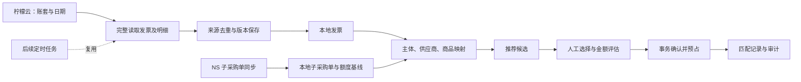
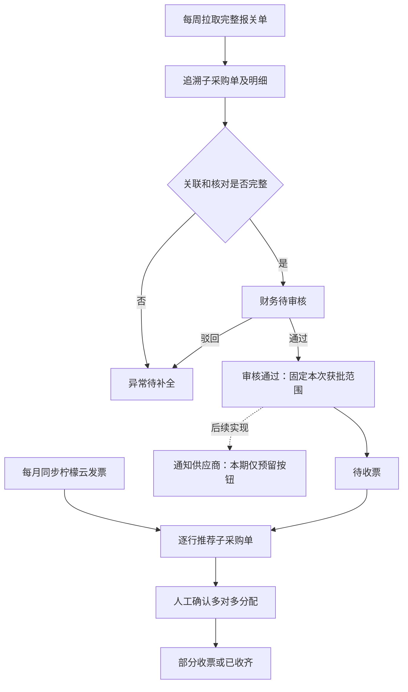

# 导入发票与现有子采购订单匹配方案

状态：当前阶段方案，2026-09-23 修订。现有系统已支持数电进项 XLS / XLSX 预览、确认入库、发票查询、候选展示及按数量逐次保存分配；真实发票与子采购单的端到端验收仍受来源字段和业务规则限制。

用户在 2026-09-23 明确：当前没有柠檬云发票接口，当前工作只针对**已经导入本地的发票**匹配**业务库中现有的 NS 子采购订单**；发票开具依据是**审核通过的报关行**，其品名、单位和数量可能不同于子采购行。本轮执行范围及验收以第 0 节为准。第 1—12 节保留此前的柠檬云 API 同步设想；第 13 节的未来调度、通知和审核流程扩展另行评审，但读取现有审核通过的报关证据属于本轮匹配条件。

本阶段沿用现有 React + TypeScript + Vite、Python + FastAPI + SQLAlchemy 实现及[完整架构方案](history/architecture-plan.md)的业务边界。下文旧章节中的拟议接口、表名和“尚未实现”状态以当前模块代码及 README 为准，不能据此重建平行的发票或分配链路。

## 0. 当前执行范围：本地导入发票匹配已存子采购单

### 0.1 已有能力和数据来源

| 范围 | 当前实现 | 本轮用途 |
| --- | --- | --- |
| 发票 | `/sync/lemon` 的 XLS / XLSX 预览、确认入库；`/invoices` 查询真实业务库发票和商品行 | 使用已导入的本地 `invoices`、`invoice_lines`，不发起柠檬云 API 请求 |
| 子采购单 | NS 单据已可按页完整读取并保存；匹配公开读取从业务库取 `purchase_orders`、`purchase_order_lines` | 只比较当前身份下已经存在且明细完整的子采购行；缺单时单独提示需要先保存 NS 数据 |
| 候选与确认 | `GET /api/matching/invoices/{invoice_id}` 返回候选、差异和已分配记录；`POST /api/matching/invoices/{invoice_id}/confirm` 按数量逐次确认 | 保留原有接口及 `invoice_purchase_allocations` 台账，将确认依据改为审核通过的报关证据及其关联子采购行，不另建第二套有效占用 |
| 审核证据 | 财务核对在应用库保存报关单审核快照，NS v3 结果可明确关联报关行和子采购行 | 只使用当前有效、审核通过且能定位稳定来源行的快照；当前匹配接口尚未读取该审核结果 |
| 身份与数据库 | 当前发票和子采购使用同一业务 MySQL，并按认证 owner 派生的数据范围查询 | 核实目标发票与子采购确实属于同一范围；不能为匹配修改前端传入租户 |

这些属于代码能力，不代表当前导入的每张发票都能确认。XLS 来源标记为 `excel/lemon-excel`，它是文件导入命名空间，不代表已授权柠檬云账套。现有导入仅筛选业务类型“采购固定资产”的数电进项发票；其他票不能被本轮匹配流程悄悄纳入。

本阶段不需要柠檬云账号、账套参数或日期范围拉取接口。发票列表中的日期只筛选本地已导入记录，不触发外部同步。

### 0.2 业务匹配依据与当前实现差距

**目标规则尚未在匹配接口实现。** 现有代码直接比较发票行与子采购行的品名、单位及“发票行金额＝发票行数量×采购含税单价”；品名或计量口径不同就不能确认。发票实际按已审核报关行开具，因此这些直接相等条件应由下列三方证据链替代：

```text
已导入发票行
  ↕ 核对审核通过的开票品名／型号／数量／单位／批准金额
已审核报关行（固定审核快照与版本）
  ↕ NS v3 的显式行关联及经核实的稳定来源身份
业务库中现有的子采购行（归属、供应商、开票额度）
```

1. 从已导入发票打开匹配页，按同一授权范围查找**当前有效且审核通过**的报关单快照。审核结果需保留报关行及其显式关联的子采购行；`customsRowId` 只在对应的 NS 查询结果内解释，还要核实 `sourceKey` 与本地来源行键的映射，不能凭 PL、显示行号、相似品名或列表位置推断关系。找不到审核证据时展示待审核／待关联，不允许直接按子采购品名确认。
2. 发票的开票品名、型号、数量和单位与**获批报关行**核对；发票销售方与关联子采购供应商、购方与获批申报主体分别核实，币种按发票及已核实的采购结算口径检查。商品名称只做安全的格式归一化；来源确有不同名称或单位时必须依赖获批证据或经确认的换算关系，不能用子采购原始字段强制相等，也不能模糊猜配。
3. 数量和金额分开控额：每次分配占用获批报关行的剩余**开票单位数量**及获批含税金额，同时占用其关联子采购行获批的对应份额；一票多单、一单多票继续逐次保存。子采购行原单位与开票单位不同且无已核实换算时，不直接相减两个数量。显示为两位小数的单价仅供阅读；用审核快照保留的来源金额及原始精度核对，不把显示价×数量作为唯一合格条件。报关货值若与开票金额币种或含税口径不同，也不能直接充当开票额度。
4. 每条分配至少绑定发票行、获批报关行及审核版本、关联子采购行，并记录本次开票数量／单位、含税金额、来源快照和幂等标识。优先扩展现有 `invoice_purchase_allocations`，已有分配继续计入占用；不能再建一套从零计算余额的台账。正式确认时在同一业务库事务核对有效审核版本和两端剩余额度。现有审核存在应用库，而分配存在业务库；实施前需建立可锁定的业务库批准范围及其与现有审核快照的版本衔接，不能以跨两个数据库的一次普通读取代替原子校验。
5. 审核来源或报关—采购关联变化后，旧分配保留历史证据及占用并标记待复核，不自动移到新行或清零。缺少购方、币种、获批行身份、开票金额口径或历史外部开票基线时禁止确认。当前 XLS 导入可能缺购方和币种；有来源证据的受控核实需保留操作者及版本，不填写默认值凑成成功。

截图中的“开票品名、型号、数量、单位、含税单价、总金额”是发票应参考的已审字段。NS 查询脚本将总金额除以数量后把含税单价显示为两位小数：示例 `48331.33 ÷ 3960.6 ≈ 12.203032`，显示为 `12.20`，所以用展示价乘回数量得到 `48319.32`，与原总金额相差 `12.01` 是正常的展示舍入，并非金额来源异常的证据。校验应以固定的获批金额及原始来源证据为准，不自行把展示总金额改成乘积；报关与子采购两侧总金额是否一致须作为另一项来源及币种口径核查。

2026-09-23 对沙箱 CD000620 的只读核对复现了该行：NS 报关明细 1661 的 `custrecord_swc_grossamount=48331.33`，两条关联子采购展示金额分别为 `29512` 和 `16000`，合计 `45512`，数量合计正好 `3960.6`。`45512 ÷ 1.13 × 1.20` 四舍五入到分恰为 `48331.33`，且该报关行与两张子采购的明细税项均显示 `13%`；这表明差额符合“去 13% 税后乘 1.20”的数值关系，但当前只读记录未提供 1.20 的业务来源或计算脚本，不能把它写成已确认的统一计价规则，也不能将两侧金额强制要求相等。

### 0.3 最小实施与验收顺序

| 顺序 | 工作 | 验收 |
| --- | --- | --- |
| 1 | 只读核对一张已导入发票、其审核通过的报关行和已存子采购行；验证 NS v3 显式行关联与稳定身份 | 三方来源与当前身份可追溯，开票字段及采购字段差异逐项列明；歧义关联阻止确认 |
| 2 | 核实审核快照中的开票金额、数量、单位及子采购获批份额；对有依据的发票缺失字段提供受控核实 | 不修改原始快照；两位展示价不能替代原始金额；未核实字段仍阻止确认 |
| 3 | 将审核批准范围与业务库现有分配台账接通，改造候选及确认规则 | 发票行对照获批报关行，一票多单／一单多票沿用同一台账；子采购原单位或品名不同不误拦 |
| 4 | 在隔离业务 MySQL 验证重复确认、两票争同一获批范围、重审或来源刷新、提交结果不明与重启后余额 | 不重复占用、不超获批数量和金额；待复核的旧占用保留；刷新后仍能查看证据及分配 |

本轮验收出口是“**文件导入并查询发票 → 对照审核通过的报关行 → 关联已存子采购行 → 人工逐次确认分配 → 刷新后获批剩余量／额一致**”。已有发票导入及分配能力优先复用；当前匹配接口尚未完成审核证据联动，不能把旧六项直接比较视为本轮验收通过。新的报关审核流程、供应商通知及定时任务在其他阶段另行设计与验收。

## 历史扩展设计（第 1—12 节，本轮不执行）

以下保留此前按柠檬云 API、账套及日期同步发票的设计背景。其“第一期”、整票确认、拟议 `/api/v1/*` 接口和实施顺序均不适用于第 0 节的当前范围；未来取得接口能力后再核实并修订。

## 1. 目标与第一期边界

先完成一个可核验的业务闭环：**选择账套和日期 → 获取完整发票并去重入库 → 推荐本地子采购单 → 人工分配并确认 → 刷新后可查到匹配及剩余额度**。闭环验证后，再让定时任务调用同一套同步服务。

| 项目 | 第一期建议 |
| --- | --- |
| 发票范围 | 先接一个已授权账套，匹配该主体的采购进项发票；销售发票不进入采购匹配 |
| 币种与状态 | 先支持人民币、正常蓝字发票；其他币种、红字、作废、未知状态保留来源并转待核实 |
| 匹配粒度 | 发票明细行 ↔ 子采购明细行，支持一票多单、一单多票 |
| 部分分配 | 子采购行可分次分配；一张发票正式确认时须全部分配完。未分完可保存评估，不占额度 |
| 确认效果 | 在本系统保存匹配并预占额度；不表示财务审批通过，也不表示 NS 已生成应付单 |
| 后续范围 | 定时同步排在人工闭环之后；实时推送、自动确认、NS 写入不作为本期前提 |

“发票也允许分多次确认”属于另一种流程，本方案沿用现有架构的整票确认规则，避免同一张票长期处于多份有效匹配之间。以下表名 `purchase_orders` 在当前项目中表示**子采购订单**，不能与 NS 标准 `purchaseOrder` 混用。



## 2. 当前基础与需要补齐的部分

| 现状 | 本方案处理方式 |
| --- | --- |
| 已有 `/sync`、`/sync/ns`、`/sync/lemon` | 保留原同步中心，分别进入平台工作区；只补齐柠檬云业务能力 |
| NS 子采购单、报关单已有完整读取后保存流程 | 复用业务库连接、完整快照和来源去重原则；增加匹配所需的版本与额度口径 |
| 六表 SQL 已定义 `invoices`、`invoice_lines`，XLS 导入已实现 | 复用现有发票表及导入规则；API 同步和正式匹配能力尚未实现 |
| 采购行有商品、数量、`amount`、含税单价 | 先确认 `amount` 的业务含义，不能默认等于“剩余可开票金额” |
| 采购行没有完整净额、税率、税额字段 | 第一期检查发票自身金额守恒；取得真实采购税额前，不展示“采购税额核对一致” |
| 现有匹配界面属于 `/demo` 原型 | 可复用布局思路；正式页面必须从后端读取真实数据，不能沿用模拟置信度和成功状态 |
| 业务 MySQL 与应用数据库分离 | 发票、匹配、占用、确认幂等及本次审计在同一个业务 MySQL 事务中提交 |

现状依据：[业务库说明](mysql/README.md)、[六表结构](mysql/business-schema.sql)、[NS 同步模块](../backend/modules/sync/README.md)、[业务模块](../backend/modules/business/README.md)。这些代码和文档不等于已经核验实际数据库结构，实施前还需只读检查目标业务库。

## 3. 第一步：核实柠檬云接口与真实样例

本系统需要的是“读取已在柠檬云账套中的发票及商品明细”。优先核实用户现有账号对应的记账开放接口，不能把税务采集、进销存、页面嵌入的接口混用。

已查到的官方[接入说明](https://open2.ningmengyun.com/Home/Introduction)将 `https://open2.ningmengyun.com` 列为生产记账接口地址，并说明授权和业务响应状态；[接口目录](https://open2.ningmengyun.com/)列有账套管理与发票。**这只能确认候选平台，尚不能证明当前账号可调用哪些发票接口、是否包含完整商品明细。** 最终使用已获授权、经样例验证的接口版本，不仅按域名判断“最新”。

实施前形成一份脱敏接口契约，至少核实：

| 必查能力 | 需要确认的内容 | 不满足时的处理 |
| --- | --- | --- |
| 认证及权限 | 应用申请方式、已有账号授权、Token 获取/刷新/有效期、授权账套列表 | 显示未授权，不伪造已连接；不复用 NS 的 M2M 凭证 |
| 账套隔离 | 上游账套 ID、账套购买方税号、查询如何指定账套，是否依赖会话切换 | 若有会话账套状态，必须按授权上下文串行或隔离会话，防止并行串账 |
| 日期条件 | 开票日期还是更新时间、起止是否包含、时区、最大跨度 | 本地明确标注口径；无法确认的条件不开放 |
| 列表及翻页 | 唯一记录 ID、分页方式、总数、最大页大小、稳定排序 | 分页数量和上限以实测契约为准，不能套用 NS 的每页 20 张 |
| 完整明细 | 商品/规格/单位/数量、净额/税额/含税额、税率、稳定行 ID；是否需单独详情接口 | 只有票头时保留待补全记录，不开放正式匹配 |
| 状态变化 | 正常/红字/作废枚举、修改时间、旧票重查、删除或撤回如何识别 | 未知状态阻止确认；不能把本次列表未出现当作删除 |
| 调用限制 | QPS、日额度、并发数、限流错误、允许的重试方式 | 首次联调低并发；生产阈值在合同或实测确认后配置 |
| 业务响应 | HTTP 状态之外的成功码、错误码、授权失效表现 | 按最终接口契约判断成功；HTTP 200 本身不代表业务成功 |

验收样例覆盖正常多行票、重复拉取、跨页、含折扣或特殊明细的票、历史状态变化。附件接口是独立能力：能拿到结构化商品明细可先推进匹配，拿不到原票时明确显示附件未获取。

**阶段出口：**用已授权账套和一小段日期读到真实发票，人工对照柠檬云页面确认票号、购销方、金额和全部明细一致。若商品明细或稳定身份无法取得，先解决接口能力或定义独立人工导入流程，不把只拉到票头称为闭环完成。

## 4. 手动同步与去重入库

### 4.1 账套绑定与权限范围

新增受控的账套绑定，记录本地绑定 ID、数据归属、来源平台及环境、外部账号标识、上游账套 ID、已核实购买方税号、NS 账户与公司映射、授权状态。接口只接收本地 `sourceBindingId`，后端校验访问权限；前端不能指定任意租户或通过更换账套参数越权。

每个绑定采用稳定的来源命名空间：`平台 + 环境 + 外部账号 + 账套`。建议将本地不可变命名空间 ID 写入现有 `external_account`，另增 `external_book_id` 保存可追溯的上游账套 ID，保留现有唯一键：

```text
发票来源唯一：tenant_id + external_system + external_account + external_record_id
发票行唯一：tenant_id + invoice_id + source_line_key
```

凭证轮换不能改变命名空间；不同账套的相同上游记录 ID 必须区分。已有数据若使用其他 `external_account` 语义，先制定映射迁移，不能直接改值或缩小唯一范围。缺少上游记录 ID 时，只有经验证可稳定复现的 `import_key` 才能使用。

### 4.2 同步过程

1. 用户选择账套、日期范围和采购进项范围，点击“同步发票”；后端校验参数、授权及范围上限，持久化任务并返回任务 ID。
2. 执行器分页读列表，再读取每张票的全部明细；外部 HTTP 在数据库事务之外执行。
3. 校验返回身份、账套、日期、状态、必需字段及明细完整性；将来源小数按精确字符串解析为 Decimal。
4. 每张完整发票使用一个短事务，锁定或创建来源记录，更新票头、完整明细、版本和该任务处理结果。一个任务可部分成功，但不能出现“票头已更新、明细只更新一半”。
5. 完全相同的来源内容记为未变化；变化内容更新当前快照并递增本地版本；重复页和失败重试不增加重复发票。
6. 前端查询持久任务，展示新增、更新、未变化、待补全、失败数量及可重试原因。全部遍历并入库才显示同步成功。

手动阶段就要防止旧快照晚提交覆盖新版本：来源提供可比较的版本或修改时间时拒绝回退；缺少可靠版本时，按账套命名空间串行执行读取至保存，可复用现有 NS 保存的 MySQL 命名锁原则，提交前验证仍持锁。此锁不等于长时间行锁事务；外部 HTTP 仍在事务外执行。失锁或进程恢复后需重新读取，不能直接提交此前缓存的响应。后续多 worker 使用持久领取版本提供同等保护。

首次读详情失败时，可保存待补全的票头及错误，不进入匹配。已有完整发票读详情失败时保留上次完整版本，另存本次失败状态；旧完整快照不代表“本次同步成功”，也不能在已发现来源变更而未补全时继续确认。

只有确认取得完整明细后，才能停用确已消失的旧行。明细主键不能使用数组下标；没有稳定行 ID 时需先验证来源提供的稳定组合键。重排、同名商品重复行等无法无歧义识别时，阻止自动覆盖已匹配明细。

### 4.3 来源去重与同票识别分开处理

- **来源去重**解决同一账套反复同步；依赖数据库唯一约束与事务更新。
- **业务同票识别**解决同一张票被不同账套或渠道重复导入。按已验证的票种及号码规则，结合购买方主体等建立业务身份；不能只按金额、日期或名称去重。
- 同票多来源先保留来源证据并标记冲突，人工确认哪个记录代表可匹配发票。确认端也要锁定唯一业务票身份，防止两个并发导入副本各自完成分配。
- 数电票、传统票及缺少代码的情形按实际契约分别规范化；不得将缺失字段随意填成固定值后合并。

同步批次还需保存查询参数、范围口径、执行身份、最后完整处理页/游标、失败项及摘要。失败项未修复前不能推进会跳过它的成功水位。首次执行器可随单 API 进程运行，但任务状态必须持久化；进程退出后的未完成任务标为中断并可重试，不能只依赖内存任务。

## 5. 数据结构与模块归属

以下为逻辑增量设计；实施时根据实际表结构生成迁移，不在本方案内直接执行 SQL。

| 模块/对象 | 需要保存的内容 |
| --- | --- |
| sync：`sync_source_bindings`、`sync_jobs`、`sync_job_items` | 授权账套绑定、稳定数据范围、查询条件、执行进度、错误及逐票处理结果；密钥仅保存安全引用 |
| invoice：扩展 `invoices` | 上游账套 ID、票种、购销方向、来源业务状态、主体映射、来源摘要、本地 `source_version`、最近校验状态 |
| invoice：扩展 `invoice_lines` | 保留已有净额/税额/含税额；按接口实际能力补商品编码、税收分类、折扣/特殊行类型等，不能拿分类编码直接当 SKU |
| invoice：业务票身份登记 | 已验证的业务身份唯一键、代表记录及来源冲突状态，防止跨来源重复确认 |
| business：主体/供应商/商品映射 | 作用租户、来源账号、法律主体、税号、NS 引用、确认人、状态与映射版本 |
| business：采购来源与额度基线 | 本地来源版本、有效业务状态、已确认含税可开票基数、历史已开票基线及其证据/截止时间；不能默认基线为零 |
| matching：`match_evaluation` | 不可变分配方案、来源及映射版本、额度版本、规则版本、计算结果、身份、有效期 |
| matching：`match_record`、`match_allocation` | 匹配状态及版本；发票行到采购行的分配净额、税额、含税额及占用状态 |
| matching：`allocation_guard` | 按租户及资源唯一的并发控制行，维护额度版本和有效占用；分配记录是审计和核验依据 |
| matching / audit：幂等结果与业务审计 | 幂等作用范围、请求摘要、已提交结果；操作者、动作、前后版本、原因与追踪 ID |

`allocation_guard` 与分配台账在同一个事务更新；缓存占用与台账不一致时阻止继续确认并核实，不通过重算清零“修复”。来源金额更新不能直接覆盖匹配占用。

新增 `invoice`、`matching` 的最小业务实现；集成客户端放入 `backend/integrations/lemon/`。沿用 Controller → Service → DAO 和纯 Mapper；前端对应 `web/modules/invoice/`、`web/modules/matching/`。`sync` 负责任务编排，发票与采购的校验保存归所属模块。

`matching` 通过 `invoice/public.py`、`business/public.py` 读取并锁定数据，公开方法接受调用方 Connection；不导入其他模块 DAO。来源模块负责版本递增，匹配模块在读取、评估和确认时比较保存版本，判定“需复核”；可由后台检查补记审计状态，不能依赖后台检查完成后才阻止操作。这样无需让 `business` 反向依赖 `matching`。

**数据库边界：**以上本地确认链路都使用独立业务 MySQL。现有应用库中的 NS 预览、回写、锁及审计保持原样；本次业务审计需扩展同一 audit 模块的业务库写入接口。未来如要跨库生成 NS 回写任务，应另设持久 outbox 和消费幂等，不能假设两个 Engine 的提交具有原子性。

六表 SQL 只用于新空库初始化；已有业务库采用独立目标的 Alembic 增量迁移及版本记录，不重跑建库脚本、不删除应用库迁移。先加可空字段与新表，核验/回填历史身份和基线，再按数据条件启用约束与匹配功能。

## 6. 推荐候选：先满足条件，再排序

### 6.1 主体与供应商

需要核实以下两条关系：

```text
账套 + 发票购买方税号 → 本系统法律主体 → NS 账户内的公司引用
发票销售方税号       → 已确认供应商映射 → NS 账户内的供应商引用
```

现有 NS `supplier_identifier` 不是销售方税号；`company_identifier` 也可能是分类等业务维度，不能自动当作法律主体。名称相同仅作辅助提示。映射缺失显示具体原因并进入映射核实，不能用模糊名称直接开放确认。

### 6.2 候选筛选与解释

| 层次 | 后端处理 |
| --- | --- |
| 数据范围 | 同授权租户、法律主体及允许的 NS 账户；完整、有效、来源状态可用 |
| 必要条件 | 供应商映射一致、币种一致、额度口径已确认、剩余可分配金额大于零 |
| 商品关系 | 优先已确认 SKU 映射，再检查规格与单位；品名相似仅作待核实建议 |
| 额度条件 | 候选行允许只分配部分金额；小于整票金额的行也应入选，用于组合匹配 |
| 排序 | 已核实商品关系、可覆盖金额、业务日期接近程度；固定日期窗不是未经核实的硬规则 |
| 解释 | 返回“供应商一致”“规格待核实”“可分配 ¥…”，以及 `allowed/reason` 和数据时间 |

不直接沿用演示中的“98% 置信度”“15 天”“0.5% 容差”。第一期采用可解释的规则和分页候选，不承诺自动找到唯一组合，也不对大量订单进行无限组合穷举。

商品没有编码映射时，人工可在有权限的映射流程中核实并保存关系，再重新评估。单位无法转换时不能声称数量一致；若业务批准仅按金额匹配，需要独立规则标识和审计，默认不自动放行。

### 6.3 剩余可分配金额

```text
采购行剩余额度
= 已核实的含税可开票基数
− 未被本系统分配台账重复计入的历史已开票金额
− 本系统 RESERVED 分配
− 本系统 CONSUMED 分配
```

历史基线必须有截止时间和来源证据；未来 NS 已开票信息包含本系统结果时，应按关联身份消重，不能同时扣“外部历史”和本系统 CONSUMED。第一期可选经财务核实、无历史占用的样例订单闭环；不能因暂时查不到历史就将所有订单余额视为全额。

本期 NS 外部仍可能有其他开票流程。可用额度需展示最近核实时间，并设置后端确认所需的新鲜度；无法及时取得外部余额时，应限制参与范围或建立明确的人工核实规则。**本地锁只能防止本系统内重复占用，不能锁住其他系统的独立开票。**

标准 PO、子采购单、Item Receipt 若对应同一义务，不能各算一份可用额度。本期只以已核实的子采购行作为分配资源；报关单用于追溯和核对，不额外贡献可分配金额。

## 7. 人工分配、评估与确认

### 7.1 操作及金额规则

用户在发票明细上选择采购行，输入拟分配含税金额。后端返回发票总额、已分配、未分配、分配后的采购余额、净额/税额拆分和可确认原因。前端仅展示后端结果，金额以十进制字符串传输，不用 JavaScript 浮点计算合计。

示例仅说明业务：一张含税 12,000 元的票，分给子采购 A 7,000 元、B 5,000 元；B 原可用 8,000 元，确认后仍可用于其他发票 3,000 元。实际仍须逐条商品对应并通过后端校验，不能仅凭合计相等确认。

- 使用 Decimal 和数据库 DECIMAL，沿用来源存储精度；人民币分配结果按明确的两位金额规则校验。
- 单张发票各行的净额、税额、含税额分别守恒；整票合计也要与来源一致。折扣、免税、零税率及负数特殊行必须有明确规则，首期无法解释的票转待核实。
- 一条发票行拆给多个采购行时，后端依据该行来源金额按确认比例拆分净额和税额，最后一份承接有界的舍入尾差；每份净额加税额须等于含税额。不能改写来源税额来凑平。
- 采购侧先校验经核实的含税额度。没有真实采购税率/税额时，界面明确“已校验发票内金额；采购税额未核验”。若业务要求采购税额一致作为准入，则先补来源映射，不能降级为假通过。
- 正式确认要求每条发票行全部分完；采购行的有效分配之和不得超额度。不能用跨商品、跨主体或跨币种的正负金额抵消差额。

### 7.2 两步提交

**评估：**保存不可变方案，绑定发票/采购来源版本、映射版本、额度版本、规则版本和当前身份。有效期建议 15 分钟，由后端控制。评估不占额度，未分完时返回不可确认及原因。

**确认：**前端只提交 `evaluationId` 和 `Idempotency-Key`。后端在同一业务库事务内重新检查当前身份、来源状态、版本和余额；有变化返回 409 并要求重新评估，不能静默调整用户刚看到的分配。

确认事务按固定顺序处理：

1. 校验幂等键作用范围；同键同请求已完成则返回原结果，同键不同请求返回 409。
2. 先按固定顺序锁相关主体、供应商、商品映射版本行，再锁业务票身份与发票、按主键排序的采购头和相关行，最后锁额度控制行及评估/匹配记录。映射编辑/停用必须锁同一版本行；若规则支持动态启停，也锁对应的规则版本状态。所有确认、取消和来源更新遵循兼容的锁顺序。
3. 采用锁定后的当前版本重新读取额度；不能依赖事务早期的普通快照查询或一次未锁定的 `SUM` 来判断余额。
4. 核实整票无其他有效匹配、来源仍可用、映射未变、评估未过期、金额与权限全部符合规则。
5. 原子保存匹配单、行分配、RESERVED 占用、审计和幂等结果后提交；任一步失败全部回滚。

现有 NS 同步命名锁只保护同步操作，不构成匹配并发控制。来源保存、确认和取消需要共用来源行/额度控制规则；死锁等数据库错误可有限重试整个本地事务，但只能在版本和幂等保证下执行，不能吞掉冲突。

### 7.3 来源变化与取消

| 情况 | 行为 |
| --- | --- |
| 未确认评估对应的来源或映射变化 | 评估失效，重新计算 |
| 已确认票作废、红冲或明细变更 | 展示需复核；保留原方案快照、分配和占用，不自动取消或重绑 |
| 采购额度减少且低于占用 | 展示来源额度冲突并停止新增分配，不展示可继续使用的负余额 |
| 用户取消本期有效匹配 | 按权限在同一事务作废匹配版本、释放对应 RESERVED、记录原因；重复取消不重复释放 |
| 未来接入回写 | QUEUED、EXECUTING、UNKNOWN、SUCCEEDED 等关联任务阻止普通取消；CONSUMED 不当作可释放预占 |

本期不产生 CONSUMED；该状态为后续经确认的 NS 执行结果预留。确认时保存的来源与计算快照不可变；后续同步更新的是当前来源视图，不能覆盖历史确认依据。

## 8. 拟议接口与页面

### 8.1 本系统接口

以下为本系统新增 `/api/v1` 契约，**不是柠檬云的上游 URL，也不是当前已经存在的 API**。现有 `/api/ns/*` 保持兼容。

| 方法与路径 | 用途 |
| --- | --- |
| GET `/api/v1/sync/lemon/account-sets` | 返回当前身份可用的账套绑定、主体、授权及 `allowed/reason` |
| POST `/api/v1/sync/lemon/jobs` | 按绑定、日期和采购进项范围创建持久同步任务，返回 202 与 jobId |
| GET `/api/v1/sync/jobs/{id}` | 任务状态、查询口径、真实处理计数与失败项 |
| POST `/api/v1/sync/jobs/{id}/retry` | 对可重试的失败或中断任务创建关联重试，继承原授权范围 |
| GET `/api/v1/invoices` | 后端搜索、过滤和分页，返回同步及匹配状态 |
| GET `/api/v1/invoices/{id}` | 完整发票、明细、来源与操作能力 |
| GET `/api/v1/invoices/{id}/candidates` | 分页推荐采购行、剩余额度与依据 |
| POST `/api/v1/matching/evaluations` | 接收发票行/采购行和拟分配金额，返回不可变评估 |
| POST `/api/v1/matching/matches` | 基于评估幂等确认匹配 |
| GET `/api/v1/matching/matches/{id}` | 匹配详情、分配、审计摘要及当前有效性 |
| POST `/api/v1/matching/matches/{id}/cancel` | 校验状态和权限后取消并释放可释放的预占 |

评估请求示例（仅为格式示例）：

```json
{
  "invoiceId": "101",
  "allocations": [
    { "invoiceLineId": "1001", "purchaseLineId": "2001", "amount": "7000.00" },
    { "invoiceLineId": "1001", "purchaseLineId": "2002", "amount": "5000.00" }
  ]
}
```

`amount` 仅是用户拟分配输入，不是可信结果。后端应返回各项净额/税额/含税额、未分配额、余额、有效期和 `confirm.allowed/reason`；确认请求只含 `evaluationId`。ID 使用字符串，避免前端大整数精度问题。

沿用目标统一响应 `{data, traceId}` / `{error: {code, message, fieldErrors}, traceId}`。参数问题返回 422；授权问题返回 401/403；不可见资源按约定返回 404；过期评估、来源变化、额度争用和幂等冲突返回 409。失败码应能区分授权失效、缺少明细、缺少映射、历史基线未知、来源过期和额度不足。

### 8.2 页面交互

保留[设计基准](../design.md)与[前端统一规范](frontend-conventions.md)，复用 AppFrame、Sidebar、Button 和既有样式变量，不重设计无关页面。

| 页面 | 设计内容 |
| --- | --- |
| 数据同步中心 `/sync` | 保留原平台卡片与任务记录；点击 NS / 柠檬云分别进入对应工作区 |
| 柠檬云 `/sync/lemon` | 顶部返回同步中心；显示账套、绑定主体、日期口径与范围、“同步发票”；下方真实任务记录及失败明细 |
| 正式发票列表 | 发票号、购销方、账套、开票日期、金额、来源状态、明细完整性及匹配状态；筛选分页走后端 |
| 正式匹配页 | 左侧发票及商品行，右侧候选子采购行和匹配理由；底部显示后端计算的分配结果，先评估再确认 |
| 已确认匹配详情 | 显示具体分配、剩余额度、来源版本、确认人和需复核原因；提供受后端能力控制的取消入口 |

候选页不混入其他平台的同步操作；NS 页面保持只展示 NS 单据选择。正式发票/匹配页面上线时再迁移对应导航，演示入口继续清楚标注模拟。

加载、空结果、失败、正常数据四种状态都要有明确表现。切换账套或发票时取消旧请求，防止迟到响应覆盖当前页面；输入分配变化后使旧评估不可提交。确认按钮防连点只是体验措施，真正防重复依赖后端幂等。状态同时使用文字，不仅依赖颜色。

## 9. 定时同步的后续设计

满足人工闭环、查询语义、配额及历史状态重查条件后再启用。定时任务只负责产生同步任务，复用相同客户端、同步 Service、去重和任务台账，不另写一套入库逻辑。

| 条件 | 处理方式 |
| --- | --- |
| 提供可靠更新时间/游标 | 按更新时间增量，并设置有依据的重叠窗口；全部保存成功后推进水位 |
| 仅提供开票日期 | 周期回扫近期范围，另行复查历史票及已匹配票状态；近期窗口不能保证发现旧票变化 |
| 无法可靠获取历史状态变化 | 保留手动复查和待核实提示，不能宣称已实现完整增量同步 |
| 限流、临时网络错误 | 按契约限流、指数退避并有限重试；记录失败项 |
| Token 失效 | 仅在契约允许时有限刷新重试；授权撤销则停止并提示重新授权 |
| 调度重叠/进程重启 | 持久领取状态、租约与领取版本；旧 worker 提交前核验领取权，避免重复推进水位 |

同步频率在明确 QPS 和账套规模后配置，不预先把“每 10 分钟”当成已具备的能力。日期展示使用 Asia/Shanghai；存储时间戳统一 UTC，业务日期单独保存。上游按日期闭区间查询时由适配器转换，覆盖首尾日且避免午夜漏票。

当前 NS 存储以身份 `owner` 的摘要生成租户；浏览器身份与服务密钥身份不同。后台任务必须保存创建时经授权的数据范围，worker 以该范围执行，执行者另记审计；不能换成服务身份后重新计算租户，导致定时数据与手动数据分离。正式多用户、多主体模型另行逐步落地，不无迁移说明改变旧数据归属。

## 10. 实施顺序与验收

| 阶段 | 交付内容 | 通过条件 |
| --- | --- | --- |
| A：接口核实 | 授权账套、脱敏请求/响应、字段映射及能力清单 | 真实发票及全部商品明细可读，与页面一致；限制与未知项明确 |
| B：手动同步 | 业务库增量迁移、发票存储、持久任务、账套日期表单与列表 | 重复同步不增票；不同账套不串账；详情失败不损坏完整快照；重启可查任务 |
| C：候选推荐 | 主体/供应商/商品映射、采购历史基线、后端候选接口 | 已知样例出现正确候选；缺映射、缺基线、无额度准确解释；越权查不到 |
| D：人工确认 | 不可变评估、多对多行分配、事务占用、幂等、取消和审计 | 一票多单、一单多票、部分采购分配可用；并发不超占；来源变化阻止旧确认 |
| E：定时同步 | 配额控制、领取/恢复、水位、历史状态复查 | 与手动服务一致；不会遗漏失败项；后台身份范围一致；旧票变更能被识别或明确提示限制 |

**首个业务里程碑为 A 至 D：**一组真实、已核实历史额度的子采购单和一个授权账套，完成同步、匹配、确认、刷新和取消验证。生产开放范围随映射和基线完成度扩大，不把所有历史数据一次性默认可匹配。

关键验证用例：

| 分类 | 必须覆盖 |
| --- | --- |
| 接口与存储 | 同页重试、跨页重复、不同账套同 ID、缺少明细、明细重排、旧页未出现不当作删除、HTTP 成功但业务失败 |
| 金额与映射 | 同税号不同名称、同名不同主体、缺少 SKU、单位不同、发票尾差、零税额、特殊行、采购历史额度未知、跨币种阻断 |
| 幂等与同票 | 双击确认、响应丢失后同键重放、同键异请求、同票跨来源副本并发确认 |
| 并发 | 两张票争同一采购行、同票重复确认、确认与同步竞争、确认与取消竞争、取消重复执行 |
| 来源变化 | 作废/红字、源行删除、金额降低、映射变更、完整读取失败、已确认快照保持不变 |
| 权限与恢复 | 跨账套/主体越权、失效授权、进程退出后任务与占用保留、手动与后台归属一致 |
| 前端 | 桌面及小屏、键盘操作、表格溢出、四类数据状态、迟到请求、评估后修改输入、后端冲突提示 |

金额规则可用单元测试；锁、并发和事务回滚必须在隔离 MySQL 多连接环境验证，不能以 SQLite 通过替代 MySQL 并发验收。后端实施后运行 `npm.cmd run test:api`、`npm.cmd run lint:api`；前端实施后运行 build、lint、typecheck 及相关行为测试。

## 11. 实施前需要确认的业务输入

1. **接口授权和样例：**现有柠檬云产品、已获授权接口版本、一个账套及多行采购发票的脱敏响应。
2. **主体与供应商：**账套对应的购买方税号、NS 公司引用的真正含义、销售方税号到 NS Vendor 的对应表。
3. **采购额度：**采购行金额是否含税、取消/关闭等状态规则、历史已开票信息来源、是否还有系统外并行开票。
4. **金额与商品：**第一期是否接受仅核对采购含税额度；需要哪些商品/规格/单位映射；特殊票种和折扣票如何处理。
5. **流程范围：**建议沿用整票确认、子采购部分分配；确认权限沿用当前授权范围，不将匹配确认包装为审批。

这些输入影响正式接入和确认开放，不影响先按上述阶段准备接口适配、模型及隔离样例验证。本方案未假定这些条件已满足。

## 12. 本次方案验证范围

已依据仓库 README、架构方案、同步/业务/身份模块及六表 SQL 进行只读核对，并核对官方开放平台说明。本文未连接真实业务数据库，未调用真实柠檬云发票接口，未执行迁移或业务代码变更；实现测试和生产接口验收均属于后续阶段。

## 13. 后续扩展：报关驱动的审核、开票通知与收票闭环

本节记录此前提出的报关审核及通知流程。当前“已导入发票匹配已存子采购单”的实施与验收按第 0 节执行；本节涉及的定时拉取、审批额度和通知联动需另行明确实施范围及与现有数据的迁移方式。

### 13.1 已明确需求与待定口径

用户已明确：每周拉取报关单并定位子采购单；财务审核通过后，采购部门才可通知供应商按子采购单开票；每月同步柠檬云发票，按供应商、商品品名、单位、数量和总金额匹配，支持一票多单、一单多票。

用户已进一步确认：报关单和采购单都从 NS 拉取，沿用现有 PL 关联定位子采购单；财务通过后显示“审核通过”，通知对应供应商；开票范围仅为本次已报关且审核通过的数量和金额，不能扩大为子采购整单。

用户最新确认：本期暂不实现供应商通知，仅预留接口按钮，后期接入。通知渠道、联系人和发送能力不再作为本期前置条件；不要求采购登记通知结果。

以下仍待落实：每周和每月的具体运行时间、首次回溯范围及月度同步的期间。柠檬云可用接口和授权尚未验证，当前 XLS 导入只能用于前期人工收票验证。



### 13.2 报关定位与财务审核

报关单是待审业务的发现入口，子采购单及其明细是开票对象。优先沿用 NS 已有来源追溯和明确关联 ID，PL 用作辅助联查；不能仅凭相同 PL、相同供应商或相同金额就认定唯一对应。缺单、缺行、多个候选和来源不完整进入异常列表，不能默认为核对通过。

周任务必须遍历完整范围、补齐全部明细，再按来源身份去重保存。当前只有按页拉取保存能力，定时调用第一页不能满足每周同步。现有创建日期筛选也不能保证发现历史单据修改，需核实更新时间能力或增加历史重查。

财务审批以“子采购单 + 本次审核版本”为单位，展示关联报关证据、商品、规格、单位、数量、金额、差异及来源时间。允许一份报关关联多份子采购单，也要保留同一采购行分批报关的证据。现有单头 `customs_declaration_id` 不能独自表达所有分批关系，需增加行级证据关联，保留原字段兼容用途。

审批快照保存具体采购行、报关行、批准数量、批准含税金额、来源版本、核对结论、审核人和时间。报关金额与采购金额的币种及业务含义可能不同，不直接用报关金额当可开票金额；金额口径未核实前阻止通过。同一报关证据不能被重复用于增加审批额度。

审批状态至少包含待审核、审核通过、已驳回、需重新审核。源单商品、供应商、数量、金额、关联或有效状态变化后，旧快照保留并要求重新审核；已经分配发票的部分进入影响核实，不能静默覆盖或自动释放额度。后续通知接入时同样校验审核版本。

### 13.3 通知按钮预留与身份

采购审核页的子采购单操作区预留“通知供应商”按钮，复用公共 Button，保持禁用并在相邻位置显示“暂未开放，后续接入”。按钮与对应子采购单关联，不以整份报关单作为通知对象。财务通过后真实显示“审核通过”，通知按钮仍保持未开放，不阻止进入待收票或匹配流程。

本期不创建通知任务、通知台账、发送适配器或返回假成功的空 API；不显示“已通知”，不提供模拟成功交互。预留的是页面操作入口与后续业务接入位置，后续发送接口再按实际渠道定义。接入时以子采购单 ID 和审核版本定位获批明细，由后端读取供应商、购方和数量金额并重新校验权限与版本，不能信任浏览器提交的发送内容。发送幂等、回执、结果未知核实和通知审计届时实施。

当前身份只有管理员／本机会话，不能区分真实财务和采购。正式审核前需增加服务端用户、角色与主体授权，并让同主体成员访问同一业务数据范围；不得以每个人的 owner 摘要另建孤立租户。旧 owner 数据归属需明确迁移或绑定，不直接改写。审批、通知权限不能依靠前端下拉角色；定时任务保存授权数据范围和独立执行身份。

### 13.4 一票多单、一单多票的分配依据

分配关系为“发票明细行 ↔ 子采购明细行 ↔ 获批开票范围”，每条分配保存数量、单位、净额、税额、含税金额和审核版本。只在票头存一个采购单号无法满足本需求。

供应商先核实税号或稳定映射，商品同时核对品名、规格或商品编码，单位不一致需有经确认的换算关系。数量和金额必须分别守恒；整票金额相同不能掩盖某种商品数量不一致。多个组合都能满足条件时显示候选和依据，由人工确定；不自动采用第一个组合。

数量需补入第 5、7 节的分配台账、评估和确认校验。来源数量缺失时标记待核实，不能用零代替或只按金额宣称完全匹配。金额默认使用已核实的同币种含税口径，净额与税额继续独立保存校验。

有效剩余量／额等于有效批准范围减去不重复计入的历史已开票、有效预占及已消耗。通知只引用批准范围，不额外扣减一份开票额度；发票分配引用获批范围扣减，不能重复扣“已通知”和“已匹配”。批准累计量／额也不能超过采购业务上限。后端同事务锁定批准范围和采购分配资源，防止两张票同时超占。

例如同一供应商、同一商品、同一单位，A 获批 100 件／10,000 元，B 获批 50 件／5,000 元：第一张票 120 件／12,000 元可分配给 A 100 件和 B 20 件；第二张票 30 件／3,000 元分配给 B 剩余部分。此时第一张票对应两张采购单，B 对应两张发票。示例假设金额口径、税务明细和其他准入条件均已核实。

已收齐仅指有效获批范围的数量和金额均已覆盖。界面同时展示子采购整单范围、累计获批范围和本次获批范围，避免部分报关收齐被误认为整单完成。红字、作废、来源变更进入异常核实，保留原分配历史。本期通知未接入，不因没有通知记录而阻止收票、匹配或提示顺序异常。

### 13.5 页面、模块与实施顺序

采购工作区围绕待关联、待财务审核、审核通过、待收票、部分收票、已收齐及异常提供筛选。审批与收票是独立维度，页面分类由后端按明确规则聚合，不能压成一个含义混杂的状态字段。本期不提供待通知／已通知筛选。

列表以子采购单为主，详情依次展示报关依据、审核快照和发票分配，操作区预留通知按钮。复用现有 PL 核对内容及统一外壳，不把审批按钮直接挂在未经版本固定的实时查询结果上。正式入口待页面实现后接入；用户提供的 `http://127.0.0.1:5188/#purchase` 在本次检查中连接被拒绝，尚未核验其布局和路由归属。

| 顺序 | 所属模块与交付 | 验证重点 |
| --- | --- | --- |
| 1 | identity 共享主体与角色；business 来源关联；reconciliation 审核快照和批准范围 | 跨主体隔离、财务权限、部分报关、重复证据、版本变化、累计额度 |
| 2 | reconciliation 采购审核页面和通知预留按钮；audit 审核业务审计 | 审核状态真实持久化；通知按钮禁用且原因可见，不发送请求、不生成通知记录，不阻断收票 |
| 3 | sync 周报关任务、全分页与恢复，复用 business 保存用例 | 失败页不跳过、重启恢复、去重、历史修改、定时与人工数据范围一致 |
| 4 | invoice／matching 使用现有 XLS 导入完成逐行多对多匹配，再接 API | 一票多单、一单多票、数量金额分别守恒、历史基线、同票多来源、并发超占 |
| 5 | sync 柠檬云月任务及历史状态重查，复用发票同步 Service | 授权账套、完整明细、跨月晚到、作废红字、失败项恢复 |

所有新业务用例遵循 Controller／Service／DAO／Mapper 分层，审批、分配和业务审计落在同一业务库事务。后续迁移采用增量方式；不重建六表、不修改历史 NS 写入锁和未知结果恢复规则。本流程不以 NS 写回作为前提。

周／月调度属于部署后端的持久业务任务，不使用浏览器计时器或 Codex 提醒替代。运行时间、时区、期间和首次回溯范围需配置；启用前支持人工执行同一用例验证。月度运行不意味着只查当月新票，需按接口能力处理晚到发票和旧票状态变化。

### 13.6 本次检查边界

本次补充仅更新方案，核对了业务、同步、发票、身份模块说明及当前六表结构定义，并修正了“XLS 导入尚未实现”的过时描述。用户已确认 NS／PL 关联、本次报关范围审批口径，以及通知仅预留按钮、后期实现。未修改业务代码、执行数据库迁移、启用定时任务或发送通知；按钮尚未落到页面。真实柠檬云授权、身份配置及页面预览仍待落实，通知渠道不再阻塞本期。
