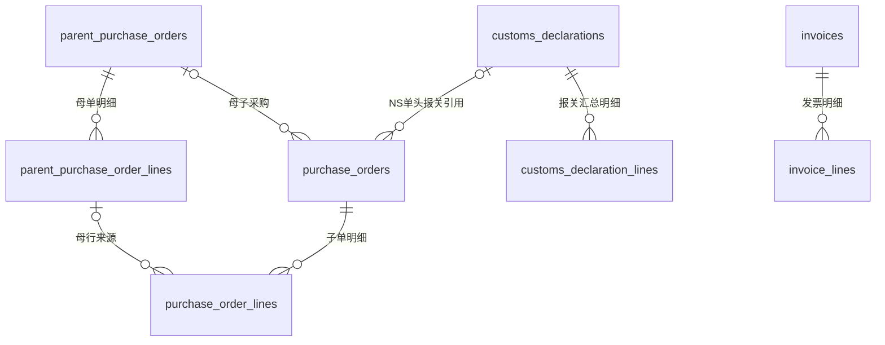

# 八张基础业务表与关联

状态：2026-09-23 当前业务库版本为 `0003_customs_price_precision`。已完成八张来源表结构及约束，以及最近一个月正式环境手动关联导入；网页自动母单拉取、定时同步尚未接入。

本次按 NS 创建日期查询 2026-08-23 至 2026-09-23 截至查询时的数据：86 张报关、194 张子采购；补齐34张更早报关及173张母采购。实际入库120张报关／304行、194张子采购／670行、173张母采购／665行；重复来源更新原记录。187张子单关联母采购，7张经REST与独立SQL核实后标记no_parent。

XN-002050、XN-002051、XN-002100 共5条明细在NS缺少单价与金额；来源空值保存NULL，source_data.amountValidation.status为source_missing，并返回待核实警告，不能当成金额核对通过。另1张报关缺申报主体、17条汇总行缺规格，均有独立空值证据。报关单价通过[精度增量迁移](../../backend/business_migrations/versions/0003_customs_price_precision.py)扩为DECIMAL(38,18)，保留10条超过原8位小数的源值，不舍入、不改写NS。

## 表和关系

| 表 | 用途 | 本期处理 |
| --- | --- | --- |
| parent_purchase_orders | 一张母采购单 | 新建 |
| parent_purchase_order_lines | 一条母采购来源明细 | 新建，归属母单 |
| purchase_orders | 一张子采购单 | 增加母单外键和关联状态；保留原报关引用 |
| purchase_order_lines | 一条子采购来源明细 | 增加母单、母行关联及 NS 母行原始标识，数据库约束来源归属一致 |
| customs_declarations | 一张报关单 | 保留现有结构 |
| customs_declaration_lines | 一条 NS 报关汇总明细，当前来源为 customrecord_swc_delare_detail | 保留所属报关单外键；单价扩为DECIMAL(38,18)；不等同于逐条采购来源明细 |
| invoices | 一份来源发票 | 保留现有结构及 Excel 扩展 |
| invoice_lines | 一条发票票面商品明细 | 保留所属发票外键；不等同于 NS 账单开票关联明细 |



母单关联允许为空，通过 `parent_relation_status` 区分“待核实”和“已核实无母单”；NS 允许合法的无母采购子单。母行尚未解析时也允许为空。已关联的母行只能属于子单所引用的母单；跨租户、跨 NS 账户的母单关联被数据库拒绝。外键使用 RESTRICT，不级联删除历史数据。

**发票暂未与采购直接挂外键。** 原需求支持一票多单、一单多票，正确实现需要后续独立分配表；在八张来源表内添加单个 purchase_order_id 会错误限制关系，因此本期不添加。也不使用 JSON ID 数组冒充分配台账。NS 开票关联明细保存供应商账单、母采购、子采购、账单金额及本次开票金额，不能作为票面商品行导入 `invoice_lines`。后续对接 NS 财务链路时，分配关系还须保留 NS 账户及 Vendor Bill 内部 ID，本期不新增该层。

报关到采购保留现有单头引用，并通过两侧 `pl_no` 辅助查询追溯。PL 不具备唯一性，不创建 PL 外键。`customrecord_swc_delare_detail` 是汇总行；已核查样本中，一行可覆盖两张母采购，但汇总行的母采购字段只记录一张。因此不能仅凭 PL 或汇总行上的母采购引用，确定逐行对应关系、分摊数量或金额。当前单头引用也不代表支持一条采购明细分批关联多个报关明细；具体来源追溯、分批份额与审核仍待后续实现。

## 新增关联字段及约束

| 表 | 字段 | 类型 | 用途 |
| --- | --- | --- | --- |
| purchase_orders | parent_purchase_order_id | BIGINT UNSIGNED NULL | 关联母单本地主键；原 parent_order_no 保留显示快照 |
| purchase_orders | parent_relation_status | VARCHAR(16) NOT NULL DEFAULT 'unknown' | unknown／no_parent／linked，含义见下表 |
| purchase_order_lines | parent_purchase_order_id | BIGINT UNSIGNED NULL | 冗余母单主键，仅用于组合外键校验，不是另一套可独立修改的关联 |
| purchase_order_lines | parent_purchase_order_line_id | BIGINT UNSIGNED NULL | 关联母采购来源明细 |
| purchase_order_lines | ns_parent_line_ref | VARCHAR(190) NULL | 保存 NS 母行原始标识；本次关联导入已写入，不是本地主键 |

- 子单 `(tenant_id,ns_account,parent_purchase_order_id)` → 母单 `(tenant_id,ns_account,id)`。
- 子行 `(tenant_id,purchase_order_id,parent_purchase_order_id)` → 子单 `(tenant_id,id,parent_purchase_order_id)`。
- 子行 `(tenant_id,parent_purchase_order_id,parent_purchase_order_line_id)` → 母行 `(tenant_id,parent_purchase_order_id,id)`。
- 子行两个新增 ID 必须同时为空或同时非空，CHECK 防止通过部分 NULL 绕过关联。
- `ck_purchase_parent_relation` 强制状态与母单外键一致：unknown／no_parent 时外键必须为空，linked 时必须非空；其他状态被拒绝。
- 母行 `(tenant_id,parent_purchase_order_id)` → 母单 `(tenant_id,id)`。

母单按 `(tenant_id,ns_account,ns_record_type,ns_internal_id)` 唯一；母行按 `(tenant_id,parent_purchase_order_id,source_line_key)` 唯一。显示单号、显示行号和数组下标不代替来源身份。

### 母单状态与同步接入规则

| parent_relation_status | 含义 | parent_purchase_order_id |
| --- | --- | --- |
| unknown | 尚未核实，或来源有母单但本地尚未完成导入、关联 | NULL |
| no_parent | 已完整读取并核实 NS 明确没有母采购 | NULL |
| linked | 已有本地母采购且关联成立 | 非 NULL |

这次迁移只将已有非空母单外键标为 linked；其余历史记录及后续未显式设置状态的新记录默认 unknown，不生成 no_parent。数据库只检查状态与引用一致，不能代替 NS 来源核实。后续同步服务只有在完整、可信的读取明确证明没有母单时，才能设置 no_parent；字段省略、权限不足、读取失败、只有显示单号或母单尚未入库，都不能推断为无母单。

建立或解除关系时，在同一事务中同时维护状态与母单 ID；已有母行关联先解除旧子行组合外键，再更新单头和行，失败整体回滚。原 PL／分页保存仍保留既有关联字段；服务端快照导入入口核实完整母单及母行证据后写入linked和关联ID，双重证据确认空引用后写入no_parent，没有新增网页状态修改接口。

### NS 母行原始标识

`ns_parent_line_ref` 保存 `custrecord_swc_subpo_item_mainpo_lineid` 的原始值。创建脚本中，该值来自 `line.poline`，其来源是关联采购交易的原生 `line`，不同于显示行号字段。按字符串保存，保留前导零，不直接转换为本地 ID 或数组下标。

本次正式样本通过 REST `item[].line` 与 SuiteQL `transactionline.id`、商品、数量、单位和金额交叉核实；母行 `source_line_key` 保存 `transactionline:<uniquekey>`。结合租户、NS 账户、母单内部 ID 和原始行标识定位本地母行，18 条新子采购明细均已关联。当前服务端关联导入遇到歧义会拒绝整批保存；后续一般同步如需保留待核实单据，应保留原始值和空外键，不能猜配。结构迁移前原有 8 条子采购行仍未猜测回填。

## 母采购字段

新表沿用现有来源表的轻量结构，完整 DDL 以[母采购建表迁移](../../backend/business_migrations/versions/0001_parent_purchase.py)和[关联状态增量迁移](../../backend/business_migrations/versions/0002_parent_relation_status.py)为准，已执行的历史迁移不改写。

| 母单字段 | 类型 | 用途 |
| --- | --- | --- |
| id | BIGINT UNSIGNED | 本地主键自增 |
| tenant_id | VARCHAR(100) | 数据归属，必填 |
| ns_account / ns_record_type | VARCHAR(100) | NS账户／记录类型，必填 |
| ns_internal_id | VARCHAR(190) | NS内部ID，必填 |
| order_no | VARCHAR(150) | 来源单号 |
| order_date | DATE | 业务日期 |
| supplier_identifier / supplier_name | VARCHAR(100) / VARCHAR(255) | 供应商引用／名称 |
| company_identifier / company_name | VARCHAR(100) / VARCHAR(255) | 公司引用／名称 |
| currency_code | VARCHAR(20) | 币种 |
| total_amount | DECIMAL(24,6) | 母单总金额，不能再与子单金额相加 |
| source_status | VARCHAR(100) | NS原始状态 |
| source_data | JSON | 完整来源快照，必填 |
| source_modified_at | DATETIME(6) | 来源修改时间UTC |
| synced_at / last_complete_sync_at | DATETIME(6) | 保存／最近完整同步时间UTC |
| detail_sync_status | VARCHAR(16) | pending／complete／failed，默认pending |
| is_active | BOOLEAN | 来源有效标识，默认1 |

| 母行字段 | 类型 | 用途 |
| --- | --- | --- |
| id | BIGINT UNSIGNED | 本地主键自增 |
| tenant_id | VARCHAR(100) | 数据归属，必填 |
| parent_purchase_order_id | BIGINT UNSIGNED | 所属母单，必填 |
| source_line_key | VARCHAR(190) | 稳定来源行键，必填 |
| line_no | VARCHAR(40) | 本次保存 NS 原生行 ID 用于追溯；稳定键仍为 source_line_key |
| item_code | VARCHAR(150) | 商品编码 |
| item_name / declaration_name / specification | VARCHAR(500) | 商品名称／报关品名／规格 |
| quantity | DECIMAL(26,8) | 原始订购数量 |
| unit_name | VARCHAR(50) | 单位 |
| tax_inclusive_price | DECIMAL(24,8) | 核实来源含税口径后的单价 |
| amount | DECIMAL(24,6) | 原始行金额 |
| source_data | JSON | 原始行快照，必填 |
| synced_at | DATETIME(6) | 保存时间UTC |
| is_active | BOOLEAN | 来源有效标识，默认1 |

除明确必填及有默认值字段外均可空，不用零补缺失。暂不增加未被同步代码维护的来源版本／摘要，也不增加依赖其他表的发票绑定、业务票身份字段。完整方案中的这些字段属于后续阶段，不能将完整方案直接当作当前DDL。

## 执行和验证

```powershell
# 输出增量SQL供审阅，不连接业务库
npm.cmd run db:business:sql

# 使用已配置的 BUSINESS_MYSQL_* 或 BUSINESS_DATABASE_URL 执行
npm.cmd run db:business:upgrade
```

业务迁移使用 `backend/business_alembic.ini`、`backend/business_migrations/` 及独立版本表 `business_alembic_version`；原 `db:upgrade` 仍只处理应用库。此增量要求六张基础表已存在，不对空库重跑初始化、不修改其他表。原六表连接检查继续兼容旧部署，只表示基础能力可用，不代表母采购功能已接入。

MySQL DDL不是整批事务：中途失败应先检查实际结构及版本表，不删除业务表后重试、不盲目stamp。未登记但已存在母表／关联字段，或新状态／原始行标识字段时，对应迁移主动停止；同一已完成版本再次执行为空操作。没有自动删除母表或新字段的downgrade。迁移命令的命名锁只协调迁移进程，不能代替部署期间的业务写入协调。

2026-09-23 验证结果：独立新建并清理的隔离 MySQL 8.4.9 库中，23 项迁移相关测试通过，包括从上一版本升级、已有母单关联回填、待核实默认值、状态与外键一致性、原始行标识保留、现有同步重复保存兼容性，以及原有外键和去重约束。测试未向真实业务库插入测试数据。全后端 271 项通过、36 项需独立数据库配置的测试跳过；其中本次 21 项 MySQL 用例已在上述单独运行中通过。后端 lint 及修改文件格式检查通过。

结构迁移完成时，9 张既存表的原有字段数据摘要均与迁移前一致：5 张子采购单、8 条子采购明细、2 张报关单、4 条报关明细；当时发票两表与母采购两表为空；unit_dictionary 的 163 条记录未修改。5 张旧子单状态均为 unknown，母单关联未猜测回填。八张指本期业务来源表，库内另有辅助表及迁移版本表，不删除它们来凑表数。

## 正式来源首批入库

以下为月度导入之前的首批验收记录；当前累计及本月批次结果见本文开头。月度扩展后，隔离MySQL迁移及关联测试共45项通过；全后端285项通过、58项需专用配置跳过，其中43项已在独立MySQL运行中通过，后端lint通过。

2026-09-23 06:50:26 UTC 已通过 `StorageService.save_related_snapshot` 在同一事务新增以下记录，来源账户为 `5939865`，归属当前本机管理员对应租户；与原沙箱账户隔离。

| 表 | 本次新增 | 入库后全库总数 |
| --- | ---: | ---: |
| parent_purchase_orders | 3 | 3 |
| parent_purchase_order_lines | 18 | 18 |
| purchase_orders | 3 | 8 |
| purchase_order_lines | 18 | 26 |
| customs_declarations | 2 | 4 |
| customs_declaration_lines | 6 | 10 |

报关单为 CD000879、CD000870；前者尚未查到子采购，后者对应三组母子采购：YE-MK20260728-P217／YE-MK20260728-P217-1、YE-AY20260728-Z060／YE-AY20260728-Z060-1、YE-X20260728-F209／YE-X20260728-F209-1。3 张新子单状态均为 linked，18 条子行外键核对通过。各母单与子单分别核对明细含税金额合计，不累加母子金额。原有行数据摘要未变化，发票和单位字典未修改。

母行金额映射 NS `grossAmt`，原未税金额、税额与全部原始行留在 `source_data`；含税单价尚未核实专用来源字段时留空。母单及报关币种保留 NS 来源名称，未声称已统一成 ISO 代码。单位按本次正式环境 NS 字典解析；子采购的采购单位字段未返回，因此 `unit_name` 留空，报关单位单独保存，未用千克冒充瓶／包／袋。

本次关联保存及迁移测试共 31 项在隔离 MySQL 通过，包含重复导入和整批回滚；后端 271 项通过，44 项需专用配置跳过，其中本次 29 项 MySQL 测试已单独通过。新增入口是服务器内部完整快照导入，尚未提供自动调度或新的网页同步按钮；原有 API 保持兼容。CD000620 本次未导入，金额审批、发票分配和 NS 回写均未执行。
