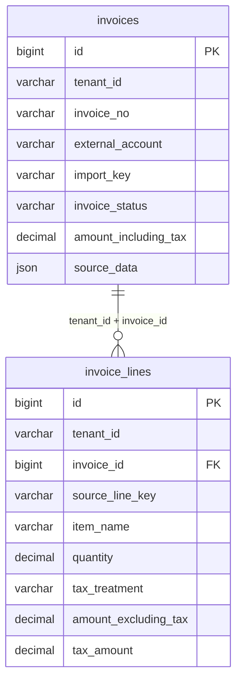

# 进项发票 Excel 数据库表设计

状态：设计草案，尚未执行 SQL、开发导入接口或写入数据。2026-09-22。

## 1. 范围与结构

针对 `进项发票_20260801-20260826_上海绎视数码科技有限公司_20260826.xls`，复用[现有六表结构](business-schema.sql)中的 `invoices` 和 `invoice_lines`，保持一票多行。本次只设计文件导入存储，不扩展采购、报关、匹配、审批或 NS 回写，不提前加入同步队列表。

配套[增量 SQL 草案](invoice-excel-design.sql)只列出相对现有结构的新增、修改字段和索引；完整目标结构为原有两表加本草案，不是另一套发票表。现有建库脚本保持不变。实际库尚未检查，不能直接执行草案。



## 2. 文件核对依据

文件含四个工作表：只导入“发票信息”的113张票及“货物信息”的141行。票头末尾“合计”行排除；“发票明细（合并表头）”及“发票明细（不合并表头）”属于重复展示，不重复入库。

- 文件内113张票的号码无重复，141行均能关联票头，逐票行净额和税额汇总与票头一致。
- 不含税合计3,336,915.40，税额348,764.70，价税合计3,685,680.10；这是全文件带符号合计，不是可抵扣或可匹配金额。
- 正常107张、已红冲6张；负金额明细8行。状态和金额符号分别保存。
- 发票代码全部为空；号码为文本。22行数量为空，1行数量为29.24937028。
- 存在13%、9%、6%、1%、免税、不征税，以及票头混合税率。
- 文件未提供购买方税号、币种和原始单价，不能猜测补齐。

## 3. 主表 invoices：一张发票一条记录

下表覆盖“发票信息”全部23列；标记“已有”的字段沿用原定义，其余由配套 SQL 新增。原有主键、租户、来源、同步字段继续保留。

| Excel 列 | 数据库字段 | 类型 | 说明 |
| --- | --- | --- | --- |
| 发票种类 | invoice_type_name | VARCHAR(100) | 保留中文票种原文 |
| 录入日期 | entry_date | DATE | 来源录入时间，不是本地创建时间 |
| 开票日期 | invoice_date（已有） | DATE | 业务日期 |
| 发票代码 | invoice_code（已有） | VARCHAR(50) | 本文件全部NULL |
| 发票号码 | invoice_no（已有） | VARCHAR(100) | 文本保存，不转整数或浮点 |
| 发票状态 | invoice_status_raw | VARCHAR(100) | 原文；另存标准状态invoice_status |
| 认证日期 | certification_date | DATE | 空值保持NULL |
| 税款所属期 | tax_period | VARCHAR(7) | 确认格式后转YYYY-MM |
| 供应商名称 | seller_name（已有） | VARCHAR(255) | 本文件为进项，供应商对应销售方 |
| 项目 | project_name | VARCHAR(255) | 原文，不伪造项目ID |
| 部门 | department_name | VARCHAR(255) | 原文 |
| 职员 | employee_name | VARCHAR(255) | 原文 |
| 纳税人识别号 | seller_tax_no（已有） | VARCHAR(100) | 供应商税号，不是本公司税号 |
| 地址及电话 | seller_address_phone | VARCHAR(1000) | 保留合并字段，不按空格猜拆分 |
| 开户行及账号 | seller_bank_account | VARCHAR(1000) | 保留原文；受控访问 |
| 业务类型 | business_type_name | VARCHAR(100) | 费用类型不等同于采购类别 |
| 合计金额 | amount_excluding_tax（已有） | DECIMAL(24,6) | 整票不含税金额 |
| 税率 | tax_rate_summary | VARCHAR(255) | 可含多个税率，不参与行税计算 |
| 合计税额 | tax_amount（已有） | DECIMAL(24,6) | 整票税额 |
| 价税合计 | amount_including_tax（已有） | DECIMAL(24,6) | 使用源值并校验守恒 |
| 记账期间 | accounting_period | VARCHAR(7) | 确认格式后转YYYY-MM |
| 关联凭证 | voucher_reference | TEXT | 保留原文，不假定单一凭证 |
| 备注 | remark | TEXT | 不根据备注自动关联采购单 |

新增管理字段：`invoice_direction`（本文件为input）、`validation_status`、`validation_errors`、`content_hash`、`source_version`、`created_at`、`updated_at`。状态默认unknown／pending，避免旧记录未经核实就视为正常。

标准业务状态为normal、red_offset、void、unknown。“已红冲”映射red_offset，不自行推断它是红字票或已作废；金额保留原符号。业务状态、`detail_sync_status`、校验状态及`is_active`各司其职：已红冲记录仍保留，不靠停用或删除表达红冲。

现有`buyer_name`、`buyer_tax_no`、`currency_code`保持可空。文件名中的公司名称仅供核实，不能直接作为受信任身份。后端授权账套配置补充购买方和币种时，原始快照注明补充来源；未核实则标记review。`passed`仅表示约定导入校验通过，不等于可以匹配或抵扣。

## 4. 明细表 invoice_lines：一行货物或服务一条记录

“货物信息”的前4列（票种、开票日期、代码、号码）用于定位和校验父票，不重复作为可独立修改的明细业务字段；原值保存在source_data。其余11列映射如下。

| Excel 列 | 数据库字段 | 类型 | 说明 |
| --- | --- | --- | --- |
| 商品名称 | item_name（已有） | VARCHAR(500) | 包含星号分类前缀的完整原文 |
| 规格型号 | specification（已有） | VARCHAR(500) | 不强行分词 |
| 单位 | unit_name（已有） | VARCHAR(50) | 空值不补“个” |
| 数量 | quantity（修改） | DECIMAL(26,8) | 保留18位整数容量及8位小数；允许NULL和负数 |
| 金额 | amount_excluding_tax（已有） | DECIMAL(24,6) | 行净额，保留符号 |
| 税率 | tax_rate_raw | VARCHAR(100) | 完整原文；另存tax_rate及tax_treatment |
| 税额 | tax_amount（已有） | DECIMAL(24,6) | 行税额，保留符号 |
| 进项类型 | input_type_name | VARCHAR(100) | 保留货物／应税劳务等原文 |
| 计税方法 | taxation_method_name | VARCHAR(255) | 保留原文 |
| 印花税税目 | stamp_tax_category | VARCHAR(255) | 仅保存，不据此自动计算印花税 |
| 印花税子目 | stamp_tax_subcategory | VARCHAR(255) | 空值保持NULL |

税率转换：13% → `tax_rate=0.13, tax_treatment=rate`；免税 → `NULL, exempt`；不征税 → `NULL, non_taxable`；明确的0% → `0, rate`。无法识别时为`NULL, unknown`并要求核实，不能都转成零。

原有`unit_price`保留NULL，因为文件没有单价；不使用金额除以数量伪造源单价。`amount_including_tax`由后端Decimal计算“行金额＋行税额”，在快照中注明派生字段。不按数量、税率反推覆盖源金额，避免尾差及特殊税收处理被改写。

## 5. 来源、重复导入和明细身份

本次仍使用已有来源字段：`external_system=excel`；`external_account`为后端配置的固定账套命名空间，不能使用文件名；`external_record_id=NULL`。`tenant_id`来自认证身份。

对已核实为数电票的本文件，`import_key`建议采用版本化规则的SHA256（固定账套命名空间＋数电票标识＋原始文本票号），不要把状态、金额或文件摘要加入票身份。识别规则不确定或票号缺失时不自动入正式表。传统发票后续使用已验证的票种／代码／号码组合，不能无条件套用数电票规则。

保留现有来源唯一约束；同一键且业务内容相同为未变化，同一键但供应商、日期、金额等矛盾则报告冲突。现有来源键只保证同账套同渠道幂等，不声称解决跨账套、Excel与API同票合并。未来接API时按[同步方案](../lemon-invoice-matching-plan.md)补充来源关联及同票登记，不能直接把excel字段改成lemon。

文件没有稳定明细ID：首次导入时按规范化行内容摘要＋同内容重复次数生成`source_line_key`，保留相同商品的重复行，不能仅按商品名称或表格行号去重。同票整份内容一致时直接跳过。内容变化先标记冲突，保留原完整记录；本期不自动覆盖或重建明细。未来实现版本快照与匹配引用核实后，再允许受控更新，不能把内容摘要当成永久商品行身份。

## 6. 原始快照与导入事务

复用主表`source_data`，保存本次被采用的完整票头及全部明细，结构建议：

```json
{
  "schema_version": 1,
  "parser_version": "lemon_excel_v1",
  "file_name": "原文件名.xls",
  "file_sha256": "文件摘要",
  "import_batch_id": "本次导入追踪号",
  "imported_by": "后端认证操作者标识",
  "imported_at": "UTC时间",
  "header": {"sheet": "发票信息", "row": 2, "values": {}},
  "lines": [{"sheet": "货物信息", "row": 2, "values": {}}],
  "supplemented_fields": {},
  "derived_fields": ["invoice_lines.amount_including_tax"]
}
```

示例是结构说明，不是真实业务数据。`values`保存列名及源值，小数用十进制字符串，行号用于追溯。该字段是采用版本的证据，不是所有失败、重复尝试的完整审计日志；本次未设计持久导入任务和版本历史表。未来允许更新时需先补不可变历史，不覆盖掉已被匹配引用的证据。

先在事务外解析，检查表头、票号、孤立明细、重复票头、日期、长度、数值精度及票头／行合计，再由invoice Service在短事务内保存票头和全部明细，DAO复用同一Connection。首次来源唯一键竞争由Service捕获并重新核对，不用无条件upsert覆盖冲突。失败不留半张票，不提前返回成功计数。

金额使用Decimal；Excel数值单元格读取时按源格式及精度规则转为十进制，避免将二进制浮点直接构造Decimal。原始数量文本完整保留。没有确认的舍入规则时金额不平不得自动修正。

## 7. 约束、索引与交付边界

- 保留`(tenant_id, id)`父表唯一键和`(tenant_id, invoice_id)`明细外键，阻止跨租户挂靠；不添加级联删除。
- 保留票号索引和明细父单索引；新增账套日期及账套供应商日期索引。状态索引是否需要，待真实查询和EXPLAIN决定，不对所有字段建索引。
- DB负责枚举、唯一性、父子归属；Service负责金额守恒、主体权限、期间格式、字段必填及状态映射。不得设置金额或数量必须非负的约束。
- SQL为相对仓库原始结构的设计草案。实施前只读核对实际库、冲突数据和已有字段，制作独立业务库的版本化迁移；DDL不能假定整体事务回滚。
- 本次未连接业务库、未执行DDL、未新增业务代码，不运行前后端业务测试。交付检查仅覆盖字段映射、文档链接、SQL静态内容和变更范围，不代表MySQL执行或导入验收通过。
- 后续验收应在隔离MySQL验证：113票141行、逐票与总额一致、重复导入不增行、红冲／负数／特殊税率／八位数量／NULL保持、冲突不覆盖、跨租户外键拒绝及事务回滚。
