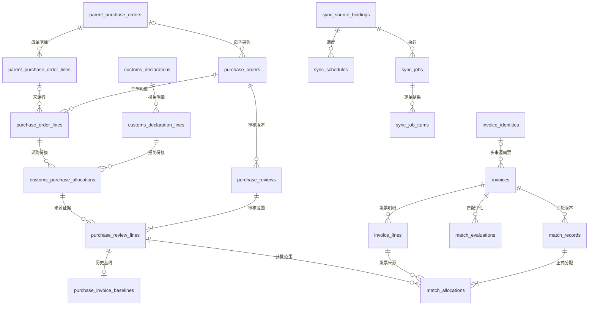

# 母子采购、报关审核与发票匹配数据库设计

版本：2026-09-22。状态：设计文档，不是可直接执行的建表或迁移脚本。

后续范围已收敛：本期只实现[八张基础表及母子关联](eight-table-relations.md)，2026-09-23 当前业务库已升级到 `0003_customs_price_precision`，包含母单关联状态、NS母行原始标识及报关单价精度扩展；已完成本月正式来源的手动关联入库。本文六表143字段是迁移前的历史结构快照，22表及版本、审核、分配等是目标草案；当前实际DDL以简化说明和迁移为准，不代表本文全部实施。NS 供应商账单（Vendor Bill）及开票分配身份尚未纳入下方完整字段设计，后续对接时须补齐，不能把票面商品行当作 NS 账单关联行。

2026-09-23 已完成正式来源 CD000879、CD000870 及关联的 3 张母采购、3 张子采购入库，母子行关系共 18 条；具体快照导入规则、数据边界及数量以八表说明为准。此进展不表示下述全部同步和财务流程已实现。

## 1. 范围与已确认规则

本设计覆盖母采购单、子采购单、报关单、发票及其明细，补充报关分配、财务审核、发票分配、同步与审计。沿用独立业务 MySQL，不替换现有应用数据库，不修改 NS 写回任务与未知结果锁。

- 母单、子单、报关单从 NS 获取，沿用现有 PL 追溯规则定位；真实关联落到来源 ID 和行 ID。
- 每周拉取报关单及相关采购单；财务只批准本次已报关且核对通过的数量和采购含税金额。
- 审核通过后显示“审核通过”。通知供应商本期只预留禁用按钮，不建立通知任务、发送记录或假成功接口。
- 每月同步柠檬云发票；按主体、供应商、商品、规格、单位、数量和金额推荐候选，人工确认明细分配。
- 支持分批报关、一票多单、一单多票；本期整票确认，子采购行可部分分配。
- 母单金额、子单金额、报关金额是不同口径，不能累加为同一应开票金额。可匹配额度来自有效审核范围，并扣除不重复的历史开票和本系统占用。

依据：[业务模块](../../backend/modules/business/README.md)、[同步模块](../../backend/modules/sync/README.md)、[发票导入](../../backend/modules/invoice/README.md)、[完整匹配方案](../lemon-invoice-matching-plan.md)、[架构方案](../architecture-plan.md)。

### 1.1 现状与目标

2026-09-22 只读反射当前配置的业务库，确认六张现有表及字段。下文第 4 节来自实际结构；其余新增表、字段、约束均为计划，未执行迁移。现有六表共 143 个字段，其中发票主表 46 个、发票行 22 个，不能再用原初始化脚本的 114 字段描述当前库。

在该历史快照时，母采购单两表尚不存在；现已由独立业务库迁移创建。CD000620 此前只读查询得到 7 行报关展示数据、8 行子采购展示数据，涉及 PL2606180005；此前未入业务库，本次结构迁移也不拉取该单据。展示行不等于稳定来源明细，不能将展示数组下标作为入库行键。

## 2. 表清单与分期

| 表 | 状态 | 所属模块 | 一条记录表示什么 |
| --- | --- | --- | --- |
| parent_purchase_orders | 新增，第一阶段 | business | 一张母采购单 |
| parent_purchase_order_lines | 新增，第一阶段 | business | 一条母采购来源明细 |
| purchase_orders | 现有，需扩展 | business | 一张子采购单 |
| purchase_order_lines | 现有，需扩展 | business | 一条子采购来源明细 |
| customs_declarations | 现有，需扩展版本字段 | business | 一张报关单 |
| customs_declaration_lines | 现有 | business | 一条报关汇总明细，当前来源 customrecord_swc_delare_detail |
| invoices | 现有，需扩展绑定与业务票身份 | invoice | 一份来源发票 |
| invoice_lines | 现有 | invoice | 一条来源发票商品明细 |
| customs_purchase_allocations | 新增，审核阶段 | reconciliation | 一条报关行到一条子采购行的关联份额 |
| purchase_reviews | 新增，审核阶段 | reconciliation | 一张子采购单的一次审核版本 |
| purchase_review_lines | 新增，审核阶段 | reconciliation | 审核版本中一条获批或待审份额 |
| purchase_invoice_baselines | 新增，匹配阶段 | matching | 一条获批份额的历史已开票基线 |
| match_evaluations | 新增，匹配阶段 | matching | 一次不可变匹配评估 |
| match_records | 新增，匹配阶段 | matching | 一张发票的一次正式匹配版本 |
| match_allocations | 新增，匹配阶段 | matching | 一条发票行分配到一条获批采购份额 |
| invoice_identities | 新增，匹配阶段 | invoice | 同一主体下的一张业务发票身份 |
| sync_source_bindings | 新增，定时前 | sync | 一项授权数据源及其固定数据范围 |
| sync_schedules | 新增，定时阶段 | sync | 一项周／月调度配置 |
| sync_jobs | 新增，定时阶段 | sync | 一次持久同步执行 |
| sync_job_items | 新增，定时阶段 | sync | 一次同步中一个来源对象的处理结果 |
| business_idempotency_records | 新增，审批／确认前 | 各用例复用 | 一次幂等命令及已提交结果 |
| business_audit_logs | 新增，审批前 | audit | 一次业务操作的审计事件 |

用户／角色／主体授权复用 identity 模块的后续建设，不在本文另造一套登录表；主体、供应商、商品映射的完整字典设计沿用匹配方案。它们是正式匹配准入依赖，缺少映射时必须阻止确认，不能以名称近似自动放行。本文明确它们在各业务表中的引用和快照，但不声称上述外部依赖已落地。

## 3. 关联总览与统一约定



母单到子单按一对多设计，子单也可以合法地没有母单，通过 parent_relation_status 区分待核实、确认无母单与已关联。子行到母行按最多一个来源设计，须核实 NS 行标识的对应关系。若 NS 允许子行合并多个母行，应改成带分配数量的关系表，不把多个 ID 塞进字符串或 JSON。当前报关汇总行可能覆盖多张母采购，不能仅凭 PL 或汇总行的母采购字段建立下图中的分配份额。

### 3.1 字段类型与公共字段

- 主键采用 `BIGINT UNSIGNED`；来源 ID、订单号、票号均按字符串保存。接口将大整数 ID 和 Decimal 传为字符串。
- 新增表默认包含 `id BIGINT UNSIGNED NOT NULL`（主键自增）、`tenant_id VARCHAR(100) NOT NULL`、`created_at DATETIME(6) NOT NULL`、`updated_at DATETIME(6) NOT NULL`，以下字段表不重复列出。审计表仅保留 created_at，不设 updated_at；其内容不可变。
- `ID` 下文表示 `BIGINT UNSIGNED`；`金额` 表示 `DECIMAL(24,6)`；新增分配数量为 `DECIMAL(26,8)`，与现有发票数量兼容；单价为 `DECIMAL(24,8)`。金额提交遵循币种精度，不用数据库默默舍入。
- 下文必填“是”表示 NOT NULL；“否”表示允许 NULL；“条件”须在状态转换时由 Service 校验，DDL 允许 NULL。
- 时间点统一 UTC `DATETIME(6)`，业务日期 `DATE`，运行时区独立保存。空值与零不同；同步缺失值不能猜测补齐。
- 新增业务表设 `UNIQUE(tenant_id,id)` 供组合外键引用。跨表外键至少包含 tenant_id；涉及 NS 两张主表还包含 ns_account。子行跨单据绑定须验证所属单头，必要时增加包含父 ID 的唯一键及组合外键。
- 不级联删除来源、审批、分配和审计。失效保留历史；主表来源内容变化递增版本，不覆盖不可变审核快照。
- `is_active` 表示来源记录有效性，不表示财务通过。`detail_sync_status=complete` 仅表示完整拉取，不表示业务核对完成。

## 4. 现有六张表：实际完整字段

以下列出实际数据库中的全部字段；中文用途根据数据库 COMMENT 展示。默认值“—”表示没有声明默认值，不代表字段可空。本节包含公共字段，不使用上一节的省略约定。

### 4.1 customs_declarations（报关单主表）

作用与关联：一张报关单保存一次；由 customs_declaration_lines.customs_declaration_id 引用。record_no 是 CD 编号，declaration_no 是真实报关号。

| 字段 | 实际类型 | 可空 | 默认值 | 用途 |
| --- | --- | --- | --- | --- |
| `id` | BIGINT | 否 | — | 本地自增主键，不使用来源系统内部ID |
| `tenant_id` | VARCHAR(100) | 否 | — | 本系统数据归属标识，由后端身份配置确定 |
| `record_no` | VARCHAR(150) | 是 | — | 来源显示编号，例如NS的CD编号，不是真实报关单号 |
| `declaration_no` | VARCHAR(150) | 是 | — | 真实报关单号，暂不设全局唯一 |
| `declaration_date` | DATE | 是 | — | 申报日期，保留来源业务日期 |
| `declarant_identifier` | VARCHAR(100) | 是 | — | 申报主体业务标识，不能直接用来源公司ID跨平台比较 |
| `declarant_name` | VARCHAR(255) | 是 | — | 报关单申报主体名称 |
| `detail_sync_status` | VARCHAR(16) | 否 | 'pending' | 明细同步状态：pending待同步；complete完整；failed失败 |
| `last_complete_sync_at` | DATETIME | 是 | — | 最近一次完整同步成功时间，UTC |
| `synced_at` | DATETIME | 是 | — | 当前采用的完整报关单版本保存时间，UTC |
| `is_active` | TINYINT | 否 | '1' | 是否有效：1有效；0已确认停用或源明细已移除 |
| `ns_account` | VARCHAR(100) | 否 | — | NS账户标识，由服务器连接配置确定 |
| `ns_internal_id` | VARCHAR(190) | 否 | — | NS来源单据内部ID，仅用于来源去重，不是本地主键 |
| `source_data` | JSON | 否 | — | 本次完整单头和全部明细原始快照，精确小数按约定编码为字符串 |
| `source_modified_at` | DATETIME | 是 | — | 来源记录最后修改时间，统一转换为UTC，来源未提供时为空 |

现有主键：`id`。

- 唯一约束：`tenant_id,ns_account,id`。
- 唯一约束：`tenant_id,ns_account,ns_internal_id`。
- 唯一约束：`tenant_id,id`。

### 4.2 customs_declaration_lines（报关单明细）

作用与关联：通过 customs_declaration_id 归属报关主表；pl_no 用于 PL 追溯，目标多对多关系通过 customs_purchase_allocations 保存。

| 字段 | 实际类型 | 可空 | 默认值 | 用途 |
| --- | --- | --- | --- | --- |
| `id` | BIGINT | 否 | — | 本地自增主键，不使用来源系统内部ID |
| `tenant_id` | VARCHAR(100) | 否 | — | 本系统数据归属标识，由后端身份配置确定 |
| `customs_declaration_id` | BIGINT | 否 | — | 所属报关单的本地主键 |
| `source_line_key` | VARCHAR(190) | 否 | — | 本单据内稳定来源明细标识，用于重复拉取去重，不能用数组下标 |
| `line_no` | VARCHAR(40) | 是 | — | 来源显示行号，不作为明细唯一标识 |
| `pl_no` | VARCHAR(100) | 是 | — | 报关明细的Packing NO.，用于与采购侧PL单号关联 |
| `sales_order_no` | VARCHAR(150) | 是 | — | 报关明细对应的销售订单编号 |
| `company_identifier` | VARCHAR(100) | 是 | — | NS公司引用类型及内部ID，在同一NS账户内比较 |
| `company_name` | VARCHAR(255) | 是 | — | 报关明细公司抬头名称，用于拼表展示 |
| `origin_place` | VARCHAR(255) | 是 | — | 境内货源地，保留来源地区或城市名称 |
| `item_code` | VARCHAR(150) | 是 | — | 来源货品编码 |
| `declaration_name` | VARCHAR(500) | 是 | — | 报关品名 |
| `specification` | VARCHAR(500) | 是 | — | 规格或型号，保留来源原值 |
| `quantity` | DECIMAL(24, 6) | 是 | — | 报关明细原数量，与unit_name配套，区别于本次报关数量 |
| `unit_name` | VARCHAR(50) | 是 | — | 报关明细原数量单位，与quantity配套 |
| `declared_quantity` | DECIMAL(24, 6) | 是 | — | 本次报关数量，与declared_unit配套 |
| `declared_unit` | VARCHAR(50) | 是 | — | 本次报关数量单位 |
| `unit_price` | DECIMAL(24, 8) | 是 | — | 来源明细单价，含税口径按来源字段确认 |
| `amount` | DECIMAL(24, 6) | 是 | — | 来源报关明细行金额，按本行币种保存 |
| `currency_code` | VARCHAR(20) | 是 | — | 来源币种代码，金额按此币种保存 |
| `synced_at` | DATETIME | 是 | — | 当前记录成功同步保存时间，UTC |
| `is_active` | TINYINT | 否 | '1' | 是否有效：1有效；0已确认停用或源明细已移除 |

现有主键：`id`。

- 唯一约束：`tenant_id,customs_declaration_id,source_line_key`。
- 外键：`tenant_id,customs_declaration_id` → `customs_declarations(tenant_id,id)`。

### 4.3 purchase_orders（子采购单主表）

作用与关联：保存子单来源及整单金额；现有 customs_declaration_id 仅表示单头来源引用，不能表示完整分批报关。目标新增 parent_purchase_order_id 关联母单。

| 字段 | 实际类型 | 可空 | 默认值 | 用途 |
| --- | --- | --- | --- | --- |
| `id` | BIGINT | 否 | — | 本地自增主键，不使用来源系统内部ID |
| `tenant_id` | VARCHAR(100) | 否 | — | 本系统数据归属标识，由后端身份配置确定 |
| `order_no` | VARCHAR(150) | 是 | — | 子采购订单显示单号，不是本地主键 |
| `order_date` | DATE | 是 | — | 子采购订单业务日期 |
| `parent_order_no` | VARCHAR(150) | 是 | — | 关联母采购订单单号 |
| `pl_no` | VARCHAR(100) | 是 | — | 关联PL单号，用于按PL联查 |
| `customs_declaration_id` | BIGINT | 是 | — | 解析完成后的关联报关单本地主键，尚未解析时为空 |
| `supplier_identifier` | VARCHAR(100) | 是 | — | NS供应商引用标识，仅在所属NS账户内解释 |
| `supplier_name` | VARCHAR(255) | 是 | — | 供应商名称 |
| `company_identifier` | VARCHAR(100) | 是 | — | NS公司引用类型及内部ID，在同一NS账户内比较 |
| `company_name` | VARCHAR(255) | 是 | — | 子采购订单公司抬头名称 |
| `currency_code` | VARCHAR(20) | 是 | — | 来源币种代码，金额按此币种保存 |
| `total_amount` | DECIMAL(24, 6) | 是 | — | 来源子采购订单总金额，不可按货品行重复累计 |
| `detail_sync_status` | VARCHAR(16) | 否 | 'pending' | 明细同步状态：pending待同步；complete完整；failed失败 |
| `last_complete_sync_at` | DATETIME | 是 | — | 最近一次完整同步成功时间，UTC |
| `synced_at` | DATETIME | 是 | — | 当前采用的完整子采购订单版本保存时间，UTC |
| `is_active` | TINYINT | 否 | '1' | 是否有效：1有效；0已确认停用或源明细已移除 |
| `ns_account` | VARCHAR(100) | 否 | — | NS账户标识，由服务器连接配置确定 |
| `ns_internal_id` | VARCHAR(190) | 否 | — | NS来源单据内部ID，仅用于来源去重，不是本地主键 |
| `source_data` | JSON | 否 | — | 本次完整单头和全部明细原始快照，精确小数按约定编码为字符串 |
| `source_modified_at` | DATETIME | 是 | — | 来源记录最后修改时间，统一转换为UTC，来源未提供时为空 |

现有主键：`id`。

- 唯一约束：`tenant_id,ns_account,ns_internal_id`。
- 唯一约束：`tenant_id,id`。
- 外键：`tenant_id,ns_account,customs_declaration_id` → `customs_declarations(tenant_id,ns_account,id)`。

### 4.4 purchase_order_lines（子采购单明细）

作用与关联：通过 purchase_order_id 归属子单；保存采购数量与报关数量两组口径，是后续审核和收票追溯对象。

| 字段 | 实际类型 | 可空 | 默认值 | 用途 |
| --- | --- | --- | --- | --- |
| `id` | BIGINT | 否 | — | 本地自增主键，不使用来源系统内部ID |
| `tenant_id` | VARCHAR(100) | 否 | — | 本系统数据归属标识，由后端身份配置确定 |
| `purchase_order_id` | BIGINT | 否 | — | 所属子采购订单的本地主键 |
| `source_line_key` | VARCHAR(190) | 否 | — | 本单据内稳定来源明细标识，用于重复拉取去重，不能用数组下标 |
| `line_no` | VARCHAR(40) | 是 | — | 来源显示行号，不作为明细唯一标识 |
| `item_code` | VARCHAR(150) | 是 | — | 来源货品编码 |
| `item_name` | VARCHAR(500) | 是 | — | 货品名称 |
| `declaration_name` | VARCHAR(500) | 是 | — | 报关品名 |
| `specification` | VARCHAR(500) | 是 | — | 规格或型号，保留来源原值 |
| `quantity` | DECIMAL(24, 6) | 是 | — | 采购货品数量，与unit_name配套 |
| `unit_name` | VARCHAR(50) | 是 | — | 采购货品数量单位 |
| `declaration_quantity` | DECIMAL(24, 6) | 是 | — | 采购行报关数量，与declaration_unit配套 |
| `declaration_unit` | VARCHAR(50) | 是 | — | 采购行报关数量单位 |
| `tax_inclusive_price` | DECIMAL(24, 8) | 是 | — | 采购货品行含税单价 |
| `amount` | DECIMAL(24, 6) | 是 | — | 采购货品行总金额，不能填入重复的整单金额 |
| `synced_at` | DATETIME | 是 | — | 当前记录成功同步保存时间，UTC |
| `is_active` | TINYINT | 否 | '1' | 是否有效：1有效；0已确认停用或源明细已移除 |

现有主键：`id`。

- 唯一约束：`tenant_id,purchase_order_id,source_line_key`。
- 外键：`tenant_id,purchase_order_id` → `purchase_orders(tenant_id,id)`。

### 4.5 invoices（发票主表）

作用与关联：每条记录属于一个来源命名空间；通过 invoice_lines 保存完整明细。票头金额不能复制到每一行累计。

| 字段 | 实际类型 | 可空 | 默认值 | 用途 |
| --- | --- | --- | --- | --- |
| `id` | BIGINT | 否 | — | 本地自增主键，不使用来源系统内部ID |
| `tenant_id` | VARCHAR(100) | 否 | — | 本系统数据归属标识，由后端身份配置确定 |
| `invoice_code` | VARCHAR(50) | 是 | — | 发票代码，来源未提供时为空 |
| `invoice_no` | VARCHAR(100) | 是 | — | 发票号码，不单独作为跨平台唯一键 |
| `invoice_date` | DATE | 是 | — | 发票开具日期 |
| `seller_name` | VARCHAR(255) | 是 | — | 销售方名称 |
| `seller_tax_no` | VARCHAR(100) | 是 | — | 销售方纳税人识别号 |
| `buyer_name` | VARCHAR(255) | 是 | — | 购买方名称 |
| `buyer_tax_no` | VARCHAR(100) | 是 | — | 购买方纳税人识别号 |
| `currency_code` | VARCHAR(20) | 是 | — | 来源币种代码，金额按此币种保存 |
| `amount_excluding_tax` | DECIMAL(24, 6) | 是 | — | 不含税金额 |
| `tax_amount` | DECIMAL(24, 6) | 是 | — | 税额 |
| `amount_including_tax` | DECIMAL(24, 6) | 是 | — | 价税合计金额 |
| `detail_sync_status` | VARCHAR(16) | 否 | 'pending' | 明细同步状态：pending待同步；complete完整；failed失败 |
| `last_complete_sync_at` | DATETIME | 是 | — | 最近一次完整同步成功时间，UTC |
| `synced_at` | DATETIME | 是 | — | 当前采用的完整发票版本保存时间，UTC |
| `is_active` | TINYINT | 否 | '1' | 是否有效：1有效；0已确认停用或源明细已移除 |
| `external_system` | VARCHAR(50) | 否 | — | 当前接入的外部发票平台或导入渠道编码 |
| `external_account` | VARCHAR(100) | 否 | — | 外部平台账户或固定导入命名空间，由服务器配置 |
| `external_record_id` | VARCHAR(190) | 是 | — | 外部发票稳定记录ID，无此ID时必须提供import_key |
| `import_key` | VARCHAR(190) | 是 | — | 无外部记录ID时使用的稳定导入键，重复导入必须复用 |
| `source_data` | JSON | 否 | — | 本次完整单头和全部明细原始快照，精确小数按约定编码为字符串 |
| `source_modified_at` | DATETIME | 是 | — | 来源记录最后修改时间，统一转换为UTC，来源未提供时为空 |
| `invoice_type_name` | VARCHAR(100) | 是 | — | 发票种类原文，保留数电专票、普票、航空行程单等 |
| `invoice_direction` | VARCHAR(16) | 否 | 'unknown' | 进销项方向：input进项；output销项；unknown未核实 |
| `entry_date` | DATE | 是 | — | 来源录入日期，不是本地创建时间 |
| `invoice_status_raw` | VARCHAR(100) | 是 | — | 来源发票状态原文，例如正常、已红冲 |
| `invoice_status` | VARCHAR(24) | 否 | 'unknown' | 标准状态：normal正常；red_offset已红冲；void作废；unknown未知 |
| `certification_date` | DATE | 是 | — | 认证日期，空值不代表未认证结论 |
| `tax_period` | VARCHAR(7) | 是 | — | 税款所属期，核实后规范为YYYY-MM；原值留在source_data |
| `project_name` | VARCHAR(255) | 是 | — | 项目名称原文 |
| `department_name` | VARCHAR(255) | 是 | — | 部门名称原文 |
| `employee_name` | VARCHAR(255) | 是 | — | 职员名称原文 |
| `seller_address_phone` | VARCHAR(1000) | 是 | — | 供应商地址及电话合并原文，不强行拆分 |
| `seller_bank_account` | VARCHAR(1000) | 是 | — | 供应商开户行及账号合并原文，展示及日志按权限脱敏 |
| `business_type_name` | VARCHAR(100) | 是 | — | 业务类型原文，例如修理费、办公费、采购固定资产 |
| `tax_rate_summary` | VARCHAR(255) | 是 | — | 票头税率展示原文，例如不征税,9%；不能作为单一数值税率 |
| `accounting_period` | VARCHAR(7) | 是 | — | 记账期间，核实后规范为YYYY-MM；原值留在source_data |
| `voucher_reference` | TEXT | 是 | — | 关联凭证原文，不假定只有一个凭证或可解析为本地ID |
| `remark` | TEXT | 是 | — | 发票备注原文，不用作默认采购单关联键 |
| `validation_status` | VARCHAR(16) | 否 | 'pending' | 校验状态：pending待校验；passed通过；review需核实；failed失败 |
| `validation_errors` | JSON | 是 | — | 结构化校验问题，包含字段、代码和中文原因 |
| `content_hash` | CHAR(64) | 是 | — | 标准业务内容SHA256摘要，不是发票唯一身份 |
| `source_version` | BIGINT | 否 | '1' | 本地来源内容版本，内容变化后由服务递增 |
| `created_at` | DATETIME | 是 | — | 本地首次保存时间UTC；旧数据未知时不伪造 |
| `updated_at` | DATETIME | 是 | — | 本地最近内容更新时间UTC |

现有主键：`id`。

- 唯一约束：`tenant_id,external_system,external_account,external_record_id`。
- 唯一约束：`tenant_id,external_system,external_account,import_key`。
- 唯一约束：`tenant_id,id`。

### 4.6 invoice_lines（发票明细）

作用与关联：通过 invoice_id 归属发票；目标通过 match_allocations 分配到获批采购范围，支持多对多。

| 字段 | 实际类型 | 可空 | 默认值 | 用途 |
| --- | --- | --- | --- | --- |
| `id` | BIGINT | 否 | — | 本地自增主键，不使用来源系统内部ID |
| `tenant_id` | VARCHAR(100) | 否 | — | 本系统数据归属标识，由后端身份配置确定 |
| `invoice_id` | BIGINT | 否 | — | 所属发票的本地主键 |
| `source_line_key` | VARCHAR(190) | 否 | — | 本单据内稳定来源明细标识，用于重复拉取去重，不能用数组下标 |
| `line_no` | VARCHAR(40) | 是 | — | 来源显示行号，不作为明细唯一标识 |
| `item_name` | VARCHAR(500) | 是 | — | 发票货物或应税劳务、服务名称 |
| `specification` | VARCHAR(500) | 是 | — | 规格或型号，保留来源原值 |
| `quantity` | DECIMAL(26, 8) | 是 | — | 数量；保留18位整数及8位小数，空值区别于零 |
| `unit_name` | VARCHAR(50) | 是 | — | 货品数量单位 |
| `unit_price` | DECIMAL(24, 8) | 是 | — | 来源明细单价，含税口径按来源字段确认 |
| `amount_excluding_tax` | DECIMAL(24, 6) | 是 | — | 不含税金额 |
| `tax_rate` | DECIMAL(12, 8) | 是 | — | 税率，按小数比例保存，例如13%保存为0.13 |
| `tax_amount` | DECIMAL(24, 6) | 是 | — | 税额 |
| `amount_including_tax` | DECIMAL(24, 6) | 是 | — | 价税合计金额 |
| `synced_at` | DATETIME | 是 | — | 当前记录成功同步保存时间，UTC |
| `is_active` | TINYINT | 否 | '1' | 是否有效：1有效；0已确认停用或源明细已移除 |
| `tax_rate_raw` | VARCHAR(100) | 是 | — | 行税率原文，例如13%、免税、不征税 |
| `tax_treatment` | VARCHAR(24) | 否 | 'unknown' | 税收处理：rate数值税率；exempt免税；non_taxable不征税；unknown未知 |
| `input_type_name` | VARCHAR(100) | 是 | — | 进项类型原文，例如货物、应税劳务 |
| `taxation_method_name` | VARCHAR(255) | 是 | — | 计税方法原文 |
| `stamp_tax_category` | VARCHAR(255) | 是 | — | 印花税税目原文，仅保存来源不自动计算税款 |
| `stamp_tax_subcategory` | VARCHAR(255) | 是 | — | 印花税子目原文 |

现有主键：`id`。

- 唯一约束：`tenant_id,invoice_id,source_line_key`。
- 外键：`tenant_id,invoice_id` → `invoices(tenant_id,id)`。

## 5. 母采购单两张新增表与现有表扩展

### 5.1 parent_purchase_orders（母采购单主表）

作用：保存 NS 母采购单完整单头。一个母单有多条母单明细，可拆成多张子单。包含第 3.1 节公共字段。

| 字段 | 类型 | 必填 | 用途 |
| --- | --- | --- | --- |
| ns_account | VARCHAR(100) | 是 | NS 账户，由服务端配置 |
| ns_record_type | VARCHAR(100) | 是 | 经核实的母单记录类型；不能先假设一定是 purchaseOrder |
| ns_internal_id | VARCHAR(190) | 是 | NS 母单内部 ID |
| order_no | VARCHAR(150) | 是 | 显示单号 |
| order_date | DATE | 否 | 母单业务日期 |
| supplier_identifier | VARCHAR(100) | 否 | NS 供应商引用 |
| supplier_name | VARCHAR(255) | 否 | 来源供应商名称 |
| company_identifier | VARCHAR(100) | 否 | NS 公司引用，须核实是否法律主体 |
| company_name | VARCHAR(255) | 否 | 公司抬头 |
| currency_code | VARCHAR(20) | 否 | 币种 |
| total_amount | 金额 | 否 | 母单来源总金额，口径另核实 |
| source_status | VARCHAR(100) | 否 | NS 原始业务状态 |
| detail_sync_status | VARCHAR(16) | 是 | pending／complete／failed，默认 pending |
| source_version | BIGINT UNSIGNED | 是 | 内容版本，初始 1 |
| content_hash | CHAR(64) | 是 | 标准来源内容摘要 |
| source_data | JSON | 是 | 原始单头和完整明细快照 |
| source_modified_at | DATETIME(6) | 否 | 来源最后修改时间 |
| synced_at | DATETIME(6) | 是 | 当前快照成功保存时间 |
| last_complete_sync_at | DATETIME(6) | 条件 | 完整保存时间 |
| is_active | BOOLEAN | 是 | 来源是否有效，默认 1 |

约束：唯一 `(tenant_id,ns_account,ns_record_type,ns_internal_id)`；增加唯一 `(tenant_id,ns_account,id)` 供子单引用。索引 `(tenant_id,ns_account,order_no)`、`(tenant_id,ns_account,supplier_identifier,order_date,id)`。单号不设跨账户全局唯一。初期应限定一个已核实母单记录类型；扩大类型前明确身份规则。

### 5.2 parent_purchase_order_lines（母采购单明细）

作用：保存母单商品来源行，支持追溯拆单数量。包含公共字段。

| 字段 | 类型 | 必填 | 用途 |
| --- | --- | --- | --- |
| parent_purchase_order_id | ID | 是 | 母单 FK |
| source_line_key | VARCHAR(190) | 是 | NS 稳定来源行键 |
| line_no | VARCHAR(40) | 否 | 显示行号 |
| item_code | VARCHAR(150) | 否 | 商品编码 |
| item_name | VARCHAR(500) | 否 | 来源品名 |
| declaration_name | VARCHAR(500) | 否 | 报关品名（来源提供时） |
| specification | VARCHAR(500) | 否 | 规格型号 |
| quantity | DECIMAL(26,8) | 否 | 订购数量 |
| unit_name | VARCHAR(50) | 否 | 数量单位 |
| tax_inclusive_price | DECIMAL(24,8) | 否 | 核实来源含税口径后保存 |
| amount | 金额 | 否 | 来源行金额 |
| source_data | JSON | 是 | 原始行证据 |
| synced_at | DATETIME(6) | 是 | 成功同步时间 |
| is_active | BOOLEAN | 是 | 来源行有效性 |

唯一 `(tenant_id,parent_purchase_order_id,source_line_key)`。外键 `(tenant_id,parent_purchase_order_id)` 指向母单；增加唯一 `(tenant_id,parent_purchase_order_id,id)` 支持子行与母行所属关系检查。币种继承母单；若实际支持行币种，需要经样例确认后扩展，不能混算。

### 5.3 现有表拟增加字段

| 表 | 新增字段 | 类型／可空 | 用途 |
| --- | --- | --- | --- |
| purchase_orders | parent_purchase_order_id | ID，可空 | FK 到母单；历史先可空，来源核实后回填 |
| purchase_orders | parent_relation_status | VARCHAR(16)，非空默认 unknown | 已由 0002 迁移增加；unknown／no_parent／linked 区分母单关联状态 |
| purchase_orders | source_version | BIGINT UNSIGNED，非空默认 1 | 采购内容版本 |
| purchase_orders | content_hash | CHAR(64)，迁移先可空 | 检测内容变化，回填完成后新快照必填 |
| purchase_orders | source_status | VARCHAR(100)，可空 | NS 原始状态 |
| purchase_orders | legal_entity_key | VARCHAR(100)，可空 | 已核实的法律主体稳定键；不是直接复制 company_identifier |
| purchase_order_lines | parent_purchase_order_line_id | ID，可空 | 母单稳定行来源 |
| purchase_order_lines | ns_parent_line_ref | VARCHAR(190)，可空 | 已由 0002 迁移增加；NS 母行原始标识，不直接作为本地主键 |
| customs_declarations | source_version | BIGINT UNSIGNED，非空默认 1 | 报关内容版本 |
| customs_declarations | content_hash | CHAR(64)，迁移先可空 | 报关内容摘要 |
| customs_declarations | source_status | VARCHAR(100)，可空 | 来源状态 |
| invoices | source_binding_id | ID，可空 | FK 到 sync_source_bindings，Excel 历史可暂空 |
| invoices | external_book_id | VARCHAR(100)，可空 | 柠檬云账套 ID |
| invoices | legal_entity_key | VARCHAR(100)，可空 | 已核实购方法律主体 |
| invoices | invoice_identity_id | ID，可空 | FK 到业务票身份，确认匹配前必须解析 |
| invoices | line_kind_status | VARCHAR(16)，非空默认 unknown | 普通／折扣等行语义是否已核实：unknown／verified／review |

母单 FK 使用 `(tenant_id,ns_account,parent_purchase_order_id)` → 母单 `(tenant_id,ns_account,id)`。当前八表实现已选择在子行冗余 `parent_purchase_order_id` 并增加组合外键，由数据库保证“母行所属母单等于子单关联母单”；两个母单引用不能独立修改。母单关联状态与外键也由 CHECK 约束，详见八表说明；其余版本、身份等拟增字段尚未实施。

`parent_order_no` 保留来源单号快照，关联以 ID 为准；已有 `customs_declaration_id` 保留 NS 单头直接引用，退出条件是所有调用方改用行级关系后再评估移除，不用它统计本次报关额度。原始品名、规格和单位不被标准化结果覆盖。

## 6. 报关对应范围与财务审核

### 6.1 customs_purchase_allocations（报关与子采购行对应份额）

作用：表达报关行与子采购行的多对多关系；一条记录是一对来源行在一个版本下的对应范围。包含公共字段。

| 字段 | 类型 | 必填 | 用途 |
| --- | --- | --- | --- |
| customs_declaration_line_id | ID | 是 | FK 到报关明细 |
| purchase_order_line_id | ID | 是 | FK 到子采购明细 |
| relation_version | BIGINT UNSIGNED | 是 | 同一行对的关系版本 |
| customs_source_version | BIGINT UNSIGNED | 是 | 当时的报关主表版本 |
| purchase_source_version | BIGINT UNSIGNED | 是 | 当时的子采购主表版本 |
| customs_quantity | DECIMAL(26,8) | 是 | 占用报关侧数量 |
| customs_unit | VARCHAR(50) | 是 | 报关侧单位 |
| purchase_quantity | DECIMAL(26,8) | 是 | 对应采购侧数量 |
| purchase_unit | VARCHAR(50) | 是 | 采购侧单位 |
| purchase_amount | 金额 | 是 | 对应采购含税金额，不直接复制报关金额 |
| currency_code | VARCHAR(20) | 是 | 采购金额币种 |
| evidence_method | VARCHAR(24) | 是 | ns_trace／manual_confirmed；单纯同 PL 不构成已确认关系 |
| mapping_snapshot | JSON | 是 | 商品、单位换算及追溯规则版本和依据 |
| status | VARCHAR(24) | 是 | candidate／verified／superseded／needs_review |
| verified_by | VARCHAR(190) | 条件 | 关系确认人／受控服务身份 |
| verified_at | DATETIME(6) | 条件 | 确认时间 |
| source_snapshot | JSON | 是 | 来源 ID、当时字段及追溯证据 |

唯一 `(tenant_id,customs_declaration_line_id,purchase_order_line_id,relation_version)`；按两侧行 ID 分别建索引。两侧 FK 带 tenant_id，Service 验证同 NS 账户、法律主体和有效来源。首次普通正向分配要求数量、金额大于零；不能把红冲作为负份额冲掉超占。

同一行对最多一个有效版本：在报关行、采购行上按固定顺序加锁，再将旧关系设为 superseded、新关系设为 verified，在一个事务内提交。有效报关份额总量不超过该来源行本次可分配数量；有效采购份额不超过采购可报关范围。已被批准或匹配引用的版本保留，来源变化转需复核，不能直接替换后继续沿用旧批准。

### 6.2 purchase_reviews（子采购单审核主表）

作用：一张子采购单的一次财务审核，绑定特定报关范围和不可变明细快照。包含公共字段。

| 字段 | 类型 | 必填 | 用途 |
| --- | --- | --- | --- |
| purchase_order_id | ID | 是 | FK 到子采购单 |
| review_no | VARCHAR(80) | 是 | 本地审核单号 |
| review_version | BIGINT UNSIGNED | 是 | 子采购单内递增版本 |
| status | VARCHAR(24) | 是 | pending／approved／rejected／needs_review／superseded |
| legal_entity_key | VARCHAR(100) | 是 | 审核主体 |
| purchase_source_version | BIGINT UNSIGNED | 是 | 采购来源版本 |
| currency_code | VARCHAR(20) | 是 | 本次审核采购币种 |
| approved_amount | 金额 | 条件 | 通过时的明细含税额合计，由后端产生 |
| snapshot_hash | CHAR(64) | 是 | 审核快照摘要 |
| rule_version | VARCHAR(50) | 是 | 本次审核规则版本 |
| submitted_by | VARCHAR(190) | 是 | 提交身份 |
| submitted_at | DATETIME(6) | 是 | 提交时间 |
| reviewed_by | VARCHAR(190) | 条件 | 真实财务身份 |
| reviewed_at | DATETIME(6) | 条件 | 审核时间 |
| decision_reason | TEXT | 条件 | 驳回或重新审核原因 |
| replaces_review_id | ID | 否 | 被替代审核版本 FK |
| revision | BIGINT UNSIGNED | 是 | 乐观并发版本，初始 1 |

唯一 `(tenant_id,review_no)`、`(tenant_id,purchase_order_id,review_version)`；索引 `(tenant_id,status,submitted_at,id)`。父单、替代审核均为租户内 FK，替代对象还必须属于同一子单。只有 approved 对应界面“审核通过”。审批与快照、审计、幂等结果同事务提交。

总数量不存主表：同一张子单可能含不同商品、不同单位，不能混合累加。多份批准可覆盖同一子单不同报关份额；同一份额不能重复有效批准。

### 6.3 purchase_review_lines（审核范围及获批额度）

作用：绑定报关对应份额，保存本次获批数量、金额与证据；是发票分配的直接额度资源。包含公共字段。

| 字段 | 类型 | 必填 | 用途 |
| --- | --- | --- | --- |
| review_id | ID | 是 | FK 到审核主表 |
| customs_purchase_allocation_id | ID | 是 | FK 到报关对应份额及其固定版本 |
| purchase_order_line_id | ID | 是 | FK 到子采购行，便于查额度 |
| review_quantity | DECIMAL(26,8) | 是 | 本次申请数量，按采购单位 |
| approved_quantity | DECIMAL(26,8) | 条件 | 审批通过时固定的批准数量 |
| unit_name | VARCHAR(50) | 是 | 采购计量单位 |
| review_amount | 金额 | 是 | 本次申请采购含税金额 |
| approved_amount | 金额 | 条件 | 审核通过时固定的批准含税金额 |
| eligibility_status | VARCHAR(24) | 是 | pending／available／frozen／superseded |
| source_snapshot | JSON | 是 | 商品、规格、主体、供应商、来源版本及关联依据 |
| balance_version | BIGINT UNSIGNED | 是 | 基线／分配／冻结改变时递增，用于评估过期校验 |

唯一 `(tenant_id,review_id,customs_purchase_allocation_id)`；索引 `(tenant_id,purchase_order_line_id,eligibility_status,id)`。Service 验证所有 FK 指向同一子单，币种继承 review。approved 数量、金额大于零且不超过申请量及对应报关范围；全部审批行合计不能超采购业务上限。

批准时锁子采购主单、涉及采购行及报关份额，检查该份额没有其他有效批准；同一事务失效被替代批准、激活新批准。已被发票占用的批准不允许普通替代，先进入人工影响核实。本设计直接锁本表行作为额度互斥点，不另建重复的 allocation_guard 缓存表；余额从基线和有效分配台账计算。后续若增加缓存，必须与台账同事务维护并检测不一致。

## 7. 发票多对多分配

### 7.1 purchase_invoice_baselines（历史已开票基线）

作用：记录系统启用前、一条获批份额已有的开票占用，避免新系统将历史开票当作零。包含公共字段。

| 字段 | 类型 | 必填 | 用途 |
| --- | --- | --- | --- |
| review_line_id | ID | 是 | FK 到获批范围；每份额最多一条当前基线 |
| status | VARCHAR(16) | 是 | unknown／verified／needs_review |
| cutoff_at | DATETIME(6) | 条件 | 历史基线截止时间 |
| historical_quantity | DECIMAL(26,8) | 条件 | 历史已开票数量，获批采购单位 |
| historical_amount | 金额 | 条件 | 历史已开票含税金额，审核币种 |
| evidence | JSON | 条件 | 已核实历史票身份与分配份额、来源和消重依据 |
| verified_by | VARCHAR(190) | 条件 | 核实身份 |
| verified_at | DATETIME(6) | 条件 | 核实时间 |
| version | BIGINT UNSIGNED | 是 | 基线版本 |

唯一 `(tenant_id,review_line_id)`；数量、金额不得为负且不得超获批范围。unknown 时数量／金额为空，不默认为零。若历史票随后导入，必须按 evidence 中的稳定票身份识别重叠；识别不清进入待核实。将历史占用转为本系统分配时，在同一锁及事务下扣减基线、增加分配并审计，禁止双扣。

### 7.2 match_evaluations（不可变匹配评估）

作用：保存用户拟分配方案及后端校验结果；不占额度。包含公共字段，创建后业务内容不可改。

| 字段 | 类型 | 必填 | 用途 |
| --- | --- | --- | --- |
| invoice_id | ID | 是 | FK 到发票 |
| actor_id | VARCHAR(190) | 是 | 本次评估身份 |
| request_hash | CHAR(64) | 是 | 规范化输入摘要 |
| allocation_plan | JSON | 是 | 拟分配的票行、审核行、两侧数量、单位、净额／税额／含税额 |
| version_snapshot | JSON | 是 | 发票、采购、报关、审核、余额、基线与映射版本 |
| rule_version | VARCHAR(50) | 是 | 规则版本 |
| allowed | BOOLEAN | 是 | 当时是否满足确认条件 |
| reasons | JSON | 是 | 不可确认或需核实原因 |
| result_snapshot | JSON | 是 | 后端计算的余额、守恒与验证结果 |
| expires_at | DATETIME(6) | 是 | 过期时间 |

索引 `(tenant_id,invoice_id,created_at,id)`、`(tenant_id,expires_at)`。确认仍须重新检查身份、版本及额度，allowed=true 不是永久授权。禁止向 JSON 中塞进不校验的跨租户 ID。

### 7.3 match_records（正式匹配主表）

作用：一张发票的一次正式确认版本，可含多个采购对象。包含公共字段。

| 字段 | 类型 | 必填 | 用途 |
| --- | --- | --- | --- |
| invoice_id | ID | 是 | 来源发票 FK |
| invoice_identity_id | ID | 是 | 业务票身份 FK，防多来源重复确认 |
| evaluation_id | ID | 是 | 已使用的不可变评估 FK |
| match_version | BIGINT UNSIGNED | 是 | 发票内版本 |
| status | VARCHAR(24) | 是 | confirmed／needs_review／cancelled |
| invoice_source_version | BIGINT UNSIGNED | 是 | 确认时发票版本 |
| confirmed_by | VARCHAR(190) | 是 | 操作身份 |
| confirmed_at | DATETIME(6) | 是 | 确认时间 |
| cancelled_by | VARCHAR(190) | 否 | 取消身份 |
| cancelled_at | DATETIME(6) | 否 | 取消时间 |
| cancellation_reason | TEXT | 否 | 取消原因 |
| snapshot_hash | CHAR(64) | 是 | 完整匹配证据摘要 |
| source_snapshot | JSON | 是 | 确认时完整来源和校验结果 |

唯一 `(tenant_id,invoice_id,match_version)` 和 `(tenant_id,evaluation_id)`。同一业务票最多一个有效匹配，确认和取消均先锁 invoice_identities 行；confirmed／needs_review 都阻止另一次有效确认，后者不会自动释放额度。不存在多来源票时也使用相同互斥路径。

### 7.4 match_allocations（发票到获批采购范围的分配台账）

作用：真正承载一票多单、一单多票；一行只连接一条发票明细和一条获批明细。包含公共字段。

| 字段 | 类型 | 必填 | 用途 |
| --- | --- | --- | --- |
| match_record_id | ID | 是 | 正式匹配 FK |
| invoice_line_id | ID | 是 | 发票来源行 FK |
| review_line_id | ID | 是 | 获批范围 FK；经此可追溯子单和母单 |
| invoice_quantity | DECIMAL(26,8) | 是 | 分配的发票侧数量 |
| invoice_unit | VARCHAR(50) | 是 | 发票侧单位 |
| purchase_quantity | DECIMAL(26,8) | 是 | 按已核实换算关系对应的采购数量 |
| purchase_unit | VARCHAR(50) | 是 | 采购侧单位 |
| amount_excluding_tax | 金额 | 是 | 分配净额 |
| tax_amount | 金额 | 是 | 分配税额 |
| amount_including_tax | 金额 | 是 | 分配含税额 |
| currency_code | VARCHAR(20) | 是 | 两侧一致的币种 |
| mapping_snapshot | JSON | 是 | 商品、单位换算和映射版本证据 |
| occupancy_status | VARCHAR(16) | 是 | RESERVED／CONSUMED／RELEASED |
| released_at | DATETIME(6) | 否 | 安全取消后释放时间 |

唯一 `(tenant_id,match_record_id,invoice_line_id,review_line_id)`；索引 `(tenant_id,review_line_id,occupancy_status,id)`、`(tenant_id,invoice_line_id,occupancy_status,id)`。Service 校验票行属于主匹配的发票，审核行属于有效批准，供应商、法律主体、商品关系及币种一致。

数量逐票行守恒，净额／税额／含税额分别守恒；每份净额加税额等于含税额。两侧单位不同必须有可追溯换算，缺数量不写零。一个票行拆分多份时仅允许按明确规则分摊税额和有界尾差。折扣、红字、作废及无法解释的特殊行首期保存来源、转待核实，不自动确认。

确认建立 RESERVED，仍计入已收票覆盖和额度占用；CONSUMED 仅留给后续已核实的 NS 执行结果，本期不产生。RELEASED 保留历史但不再占用。取消只在后端判定安全时释放；有 executing／unknown／已成功回写关联时不得普通取消。

剩余数量／金额分别计算：批准范围 − 经消重的历史基线 − RESERVED − CONSUMED。不存在“已通知”扣减项。剩余数量和金额都归零才称该获批范围收齐；整单是否完成另外判断。

### 7.5 invoice_identities（业务发票唯一身份）

作用：区分“来源去重”和“同一张票不同来源”，并提供并发确认锁。包含公共字段。

| 字段 | 类型 | 必填 | 用途 |
| --- | --- | --- | --- |
| legal_entity_key | VARCHAR(100) | 是 | 已核实购买方法律主体 |
| identity_rule_version | VARCHAR(50) | 是 | 票种身份规范化规则版本 |
| business_key | VARCHAR(255) | 是 | 经规则生成的稳定业务票键 |
| status | VARCHAR(24) | 是 | verified／conflict／needs_review |
| representative_invoice_id | ID | 否 | 选定可匹配来源发票 FK |
| verified_by | VARCHAR(190) | 条件 | 核实身份 |
| verified_at | DATETIME(6) | 条件 | 核实时间 |
| evidence | JSON | 是 | 票种、号码、代码、主体等识别证据 |

唯一 `(tenant_id,legal_entity_key,business_key)`；规则升级先做身份迁移，不把规则版本放进唯一键后允许同票重复。票号缺失或身份未核实，不建立假的统一身份。代表发票必须引用本身份；允许先插身份、再插／更新来源发票、最后设置代表，均在同一事务完成。多个来源内容冲突时禁止确认，不覆盖原来源记录。
## 8. 数据源与周／月同步

### 8.1 sync_source_bindings（授权数据源绑定）

作用：固定来源账号、环境、账套和本地数据归属，使后台同步与人工操作进入同一数据范围。包含公共字段。

| 字段 | 类型 | 必填 | 用途 |
| --- | --- | --- | --- |
| namespace_key | VARCHAR(190) | 是 | 本地不可变来源命名空间，唯一 |
| source_system | VARCHAR(24) | 是 | netsuite／lemon |
| environment | VARCHAR(24) | 是 | sandbox／production |
| external_account | VARCHAR(100) | 是 | 外部账号 |
| external_book_id | VARCHAR(100) | 条件 | 柠檬云账套 ID；NS 不适用为 NULL |
| ns_account | VARCHAR(100) | 条件 | 对应 NS 账户 |
| legal_entity_key | VARCHAR(100) | 条件 | 已核实法律主体；正式发票匹配前必填 |
| buyer_tax_no | VARCHAR(100) | 条件 | 已核实购方税号 |
| credential_reference | VARCHAR(255) | 是 | 密钥保管位置的引用，不存明文凭证 |
| authorization_status | VARCHAR(24) | 是 | pending／authorized／expired／revoked |
| authorized_by | VARCHAR(190) | 条件 | 授权身份 |
| authorized_at | DATETIME(6) | 条件 | 授权时间 |
| scope_snapshot | JSON | 是 | 允许主体、数据范围、接口及上限 |
| configuration_version | BIGINT UNSIGNED | 是 | 绑定配置版本 |
| is_enabled | BOOLEAN | 是 | 是否允许执行，默认 0 |

唯一 `(tenant_id,namespace_key)`。namespace_key 在创建前按平台、环境、账号、账套规范化，Service 在租户锁下防止同一来源重复绑定；不同账套不能因 source ID 相同合并。变更凭证不改变命名空间；变更主体或来源身份要另行迁移，不能改配置就把旧数据归属换掉。

已有 Excel external_account=lemon-excel 不自动改为 API 命名空间，先通过业务票身份识别重复来源。现有 owner 摘要租户必须有明确共享主体迁移方案，不能让后台服务以自身 owner 创建新租户。

### 8.2 sync_schedules（调度配置与成功水位）

作用：一项周报关或月发票调度配置；计划触发只生成任务，不直接执行同步 SQL。包含公共字段。

| 字段 | 类型 | 必填 | 用途 |
| --- | --- | --- | --- |
| source_binding_id | ID | 是 | 来源绑定 FK |
| job_kind | VARCHAR(32) | 是 | customs_with_purchases／purchase／invoice |
| frequency | VARCHAR(16) | 是 | weekly／monthly |
| timezone | VARCHAR(64) | 是 | 如 Asia/Shanghai |
| weekday | TINYINT UNSIGNED | 条件 | 周任务星期，1～7 |
| month_day | TINYINT UNSIGNED | 条件 | 月任务日期，首期1～28避免短月歧义 |
| local_time | TIME | 是 | 当地执行时间 |
| range_policy | JSON | 是 | 首次起点、增量口径、重叠窗口、旧单复查范围 |
| successful_watermark | JSON | 否 | 已完整成功范围的来源水位，不能用执行时间代替 |
| watermark_version | BIGINT UNSIGNED | 是 | 防旧任务覆盖新水位 |
| next_run_at | DATETIME(6) | 条件 | 下一执行时刻UTC |
| last_job_id | ID | 否 | 最近生成的同步任务 FK |
| is_enabled | BOOLEAN | 是 | 默认0，真实联调通过后启用 |

唯一 `(tenant_id,source_binding_id,job_kind)`，本期每来源每类型一套计划；索引 `(is_enabled,next_run_at,id)`。weekly 只填写 weekday，monthly 只填写 month_day，Service及CHECK约束二选一。停机后追赶策略写入 range_policy，不无限产生重叠历史任务。启用日期、期间由业务配置，不在文档中假定已确认。

### 8.3 sync_jobs（持久同步任务）

作用：保存一次手动或定时执行、查询范围、分页进度和恢复状态。包含公共字段。

| 字段 | 类型 | 必填 | 用途 |
| --- | --- | --- | --- |
| source_binding_id | ID | 是 | 来源绑定 FK |
| schedule_id | ID | 否 | 调度 FK，手动任务可空 |
| job_kind | VARCHAR(32) | 是 | 对象类型，与计划一致 |
| trigger_type | VARCHAR(16) | 是 | manual／scheduled／recovery |
| trigger_key | VARCHAR(190) | 是 | 幂等触发键；定时用计划ID＋应触发时刻 |
| scope_snapshot | JSON | 是 | 固定租户、账号、主体及授权版本 |
| query_snapshot | JSON | 是 | 查询条件、日期口径、初始水位 |
| cursor | JSON | 否 | 已完整入库页之后的可恢复游标 |
| expected_watermark_version | BIGINT UNSIGNED | 否 | 计划水位的读取版本 |
| status | VARCHAR(24) | 是 | queued／running／succeeded／partial_failed／failed／interrupted |
| created_by | VARCHAR(190) | 是 | 原请求身份／计划授权身份 |
| worker_id | VARCHAR(190) | 否 | 当前执行者 |
| lease_until | DATETIME(6) | 否 | 当前领取租约 |
| claim_version | BIGINT UNSIGNED | 是 | 领取版本，旧worker提交必须比对 |
| attempt_count | INT UNSIGNED | 是 | 执行尝试次数 |
| counters | JSON | 是 | 新增、更新、未变化、待核实及失败数量 |
| started_at | DATETIME(6) | 否 | 开始时间 |
| finished_at | DATETIME(6) | 否 | 结束时间 |
| error_code | VARCHAR(80) | 否 | 安全错误码 |
| error_message | VARCHAR(1000) | 否 | 脱敏中文原因 |

唯一 `(tenant_id,source_binding_id,trigger_key)`；索引 `(status,lease_until,id)` 和 `(tenant_id,source_binding_id,created_at,id)`。任务必须保存业务归属，不根据 worker 登录身份重新推导租户。若要覆盖命名锁的现有保护，必须先实现相同来源范围的持久互斥和领取校验，不能仅靠本表不同任务各自租约防并发。

### 8.4 sync_job_items（逐单处理记录）

作用：记录每个上游单据的真实入库结果及失败信息，避免部分失败被整批成功掩盖。包含公共字段。

| 字段 | 类型 | 必填 | 用途 |
| --- | --- | --- | --- |
| sync_job_id | ID | 是 | 任务 FK |
| source_object_type | VARCHAR(100) | 是 | 母单／子单／报关／发票来源类型 |
| source_object_id | VARCHAR(190) | 是 | 上游稳定单据 ID |
| source_version_hint | VARCHAR(190) | 否 | 上游版本／修改时间，原样留证 |
| page_key | VARCHAR(190) | 否 | 所在页／游标摘要 |
| local_object_type | VARCHAR(50) | 否 | 入库对象类型，后端白名单 |
| local_object_id | ID | 否 | 本地目标 ID，由类型确定表 |
| status | VARCHAR(24) | 是 | pending／created／updated／unchanged／needs_review／failed |
| attempt_count | INT UNSIGNED | 是 | 尝试次数 |
| processed_at | DATETIME(6) | 否 | 成功或失败处理时间 |
| error_code | VARCHAR(80) | 否 | 错误类型 |
| error_message | VARCHAR(1000) | 否 | 脱敏错误原因 |
| result_snapshot | JSON | 否 | 入库版本、计数及问题摘要 |

唯一 `(tenant_id,sync_job_id,source_object_type,source_object_id)`；索引 `(tenant_id,sync_job_id,status,id)`。local_object_id 是有白名单类型的多态引用，不存在一个能跨四类主表的普通 FK；Service 必须检查目标归属。业务单据更新和本条成功记录同事务提交。

完整遍历且所有应保存对象成功才推进成功水位；某页失败不能跳页后宣称成功。缺可靠更新时间时按日期回扫加历史复查，不能承诺捕获全部历史变化。读取可有限重试，数据库提交结果不确定先核实任务项与来源唯一键；NS写入未知结果继续使用原有策略，不能套用本同步重试。

## 9. 幂等与业务审计

### 9.1 business_idempotency_records（命令幂等结果）

作用：保证重复审批、确认、取消不会重复生效。包含公共字段。

| 字段 | 类型 | 必填 | 用途 |
| --- | --- | --- | --- |
| actor_id | VARCHAR(190) | 是 | 请求身份 |
| operation | VARCHAR(64) | 是 | approve_review／confirm_match／cancel_match等 |
| idempotency_key | VARCHAR(100) | 是 | 客户端为逻辑命令生成的稳定键 |
| request_hash | CHAR(64) | 是 | 操作与规范化请求摘要 |
| resource_type | VARCHAR(50) | 是 | 目标类型白名单 |
| resource_id | ID | 是 | 目标 ID |
| result_snapshot | JSON | 是 | 已提交的安全业务结果 |
| http_status | SMALLINT UNSIGNED | 是 | 可重放响应状态 |

唯一 `(tenant_id,actor_id,operation,idempotency_key)`；MySQL采用utf8mb4时需在DDL阶段验证组合键字节长度，当前190+64+100+100字符合计454字符在3072字节范围内。身份中不得包含凭证。

幂等结果、业务变更、审计在同一事务提交；同键不同请求返回冲突，同键同请求重放既有结果。并发首次插入冲突须回滚本次事务并读取已提交结果，不能捕获唯一键错误后继续业务写入。不能过早删除结果导致旧命令重新执行。

### 9.2 business_audit_logs（业务库审计）

作用：在同一业务库保留审批、匹配、取消、映射核实、来源变化的追溯证据。公共字段只使用 id、tenant_id、created_at，无 updated_at。

| 字段 | 类型 | 必填 | 用途 |
| --- | --- | --- | --- |
| actor_id | VARCHAR(190) | 是 | 真实操作者／后台服务身份 |
| delegated_by | VARCHAR(190) | 否 | 后台执行的原授权身份 |
| action | VARCHAR(64) | 是 | 明确业务动作 |
| object_type | VARCHAR(50) | 是 | 对象类型白名单 |
| object_id | ID | 是 | 被操作对象 |
| object_version | BIGINT UNSIGNED | 否 | 关联审核／来源／匹配版本 |
| trace_id | VARCHAR(100) | 是 | 请求追踪 ID |
| before_snapshot | JSON | 否 | 变更前关键字段，敏感数据脱敏 |
| after_snapshot | JSON | 否 | 变更后关键字段 |
| reason | TEXT | 否 | 操作或规则原因 |
| outcome | VARCHAR(24) | 是 | succeeded／rejected／needs_review |

索引 `(tenant_id,object_type,object_id,created_at,id)`、`(tenant_id,actor_id,created_at,id)`。多态对象归属由 Service 校验，不构造虚假的跨表 FK。普通业务账户不提供审计更新和删除接口。成功事件与业务变更同事务提交；失败事务回滚后的拒绝事件如需保存，在独立事务写入并明确未产生业务变更，不伪装原事务成功。凭证、完整银行账号不进入日志。

## 10. 关键事务、约束与状态转换

### 10.1 NS来源入库

1. 验证范围与读权限，按来源范围获得现有保存互斥锁，在行锁事务外读取完整母单、子单和报关。
2. 校验来源 ID、稳定行键、明细完整性、精度、母子归属和来源版本；来源显示行经过合并时必须额外读取原始行。
3. 短事务按“母单 → 母行 → 报关主单／明细 → 子单／明细”的外键顺序写入；去重使用来源唯一键，版本变化才递增。
4. 只在完整读取成功后停用消失的来源行；不删除被审核或分配引用的行。原始快照、主从记录、任务项一起提交。
5. 关联关系和审核是后续用例，不将成功入库自动解释为关联正确或审批通过。

### 10.2 审批与分配

- 提交待审后固定明细快照。批准／驳回必须校验真实服务端身份和主体范围；当前本机管理员会话不能伪装财务与采购两个角色。
- 统一锁顺序：业务票身份／发票（涉及匹配时）→ 采购主单按ID → 采购行按ID → 报关行及关系按ID → 审核主单／审核行按ID → 基线；同一操作涉及的同类资源按ID升序。同步、替代、取消等竞争路径遵守兼容顺序，死锁重试只用于已明确回滚的事务。
- 批准后才可占用额度。来源变化或批准冻结时阻止新匹配；已存在 RESERVED 不自动释放。
- 确认锁定全部相关资源，重新比较来源、映射、审核、基线与余额版本，按Decimal重算守恒；成功后插入匹配与分配、增加余额版本、写审计及幂等结果。
- 整票确认要求每条发票行全额全量分完；候选推荐和评估不占额度。取消在同一事务转 RELEASED、增加余额版本并保存审计。
- 审批状态、通知能力、收票覆盖状态分别表达。收票统计由后端从有效批准和台账派生，不在多个主表维护可独立编辑的重复状态。

### 10.3 CD000620的关联示意

```text
母采购单（根据真实NS内部ID去重，数量待查）
  └─ 子采购单（上次查询展示8张）
      └─ 子采购来源明细（完整数量和稳定行键待读取）
          ↕ customs_purchase_allocations
CD000620 → 报关来源明细（上次展示7行，不等于已核实原始行数）
          ↓ purchase_review_lines 固定本次审核份额
          ↕ match_allocations
      发票商品明细 → 发票主表
```

PL2606180005作为现有追溯入口保留，但单独一个PL不能区分同商品多行或多次报关。最终关联必须由NS已有规则的来源证据及稳定行身份确定。母采购单真实记录类型、内部ID与母行来源需拉取核实后才能补全关联。

## 11. 迁移与实施顺序

| 阶段 | 涉及表 | 完成条件 |
| --- | --- | --- |
| 1：来源存储 | 母采购两表、现有采购报关四表扩展 | CD000620相关完整来源入库；母子行可追溯；重复保存不重复建单 |
| 2：审核 | customs_purchase_allocations、purchase_reviews、purchase_review_lines、幂等和审计 | 仅本次报关范围可批准；来源变更和重复审批受控；通知按钮只占位 |
| 3：匹配 | 发票身份、历史基线、评估、匹配主从表 | 主体与供应商映射完成；数量金额分别守恒；多对多与并发不超占 |
| 4：定时 | 来源绑定、计划、任务、任务项 | 周／月参数明确；全分页、恢复、水位、历史状态复查经过验收 |

迁移必须针对独立业务库建立专用 Alembic 版本记录；不能将业务库DDL混入当前应用库迁移。母单外键、版本摘要、法律主体先按可空方式增量增加，读取真实来源回填；冲突记录保留待核实，不能靠伪造值满足约束。验证外键和历史数据后再启用功能及必要非空约束。

现有发票扩展已在本次实际库反射中确认，但旧 invoice-excel-design.sql 仍是一次性设计草案；不要再次执行。business-schema.sql 是历史六表初始化脚本，不包含本设计全部目标结构，不可重跑初始化来升级已有库。

## 12. 验收清单与本次文档检查

- 来源：母单去重、子单母行归属、稳定行键、重复拉取、完整明细、跨租户／跨NS账户拒绝、旧版本不覆盖新版本。
- 审批：分批报关、同份额重复审批、驳回后重提、来源变化、审批替代与已有发票占用冲突。
- 匹配：一票多单、一单多票、同供应商同名不同规格、单位换算、空数量、舍入尾差、历史基线重叠、重复来源发票、红字作废冻结。
- 并发：两张票争同一获批范围、同票跨来源并发确认、确认与取消／审批冻结竞争、同幂等键同时提交，使用隔离MySQL多连接验证。
- 同步：第一页不是全量、跨页重复、失败页恢复、旧worker失去领取权、数据归属一致、停机恢复、跨月晚到及旧票变化。
- 迁移：已有单据与主键保留、缺字段时阻止操作、回填不能推测关联、不清除原NS executing／unknown任务和锁。

本次只读取实际库结构并编写文档，没有建表、ALTER、数据导入、审批或通知。文档检查包括实际六表字段逐项覆盖、目标表字段和关系一致性、相对链接可用性；业务测试、DDL执行和并发验收属于后续实施，不在本次声称通过。
