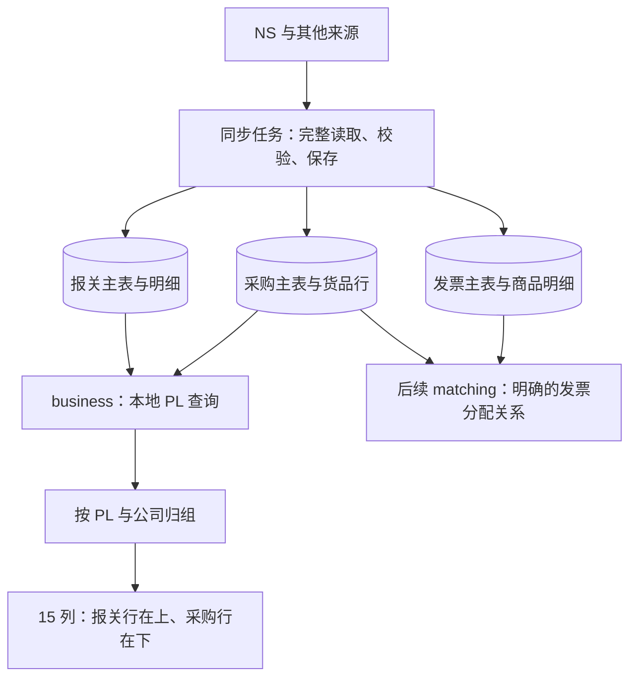

# PL 拼表：代码审查与实施设计

审查日期：2026-09-14。状态：设计建议，尚未实施本地拼表。审查对象为当前工作区的实时联查代码、独立 MySQL 建表 SQL、已有 NS 样本及供应商发票平台保存脚本。

本次只新增本文档，没有修改并行任务的建表文件、业务代码、项目配置或 NS 数据。建表任务的范围以 [存储执行方案](document-storage-execution-plan.md) 和 [MySQL 说明](mysql/README.md) 为准。

存储范围后续已简化：采购、报关仅来源 NS，发票来源外部；当前 SQL 只保留六张业务表，来源信息在主表中。本文第 2 节保留原审查发现；涉及 NS 发票关联或多来源的建议暂不属于当前实施范围。下方字段约定已按六表结构更新。

## 1. 推荐方案

保留采购、报关、发票各自的主表和明细表。拼表属于 `business` 模块的本地只读查询：每侧先关联自己的主表，再按“PL＋公司抬头”归组，上方展示报关明细，下方展示采购明细。前端采用用户图片中的 15 列。

`PL＋公司` 只说明两侧属于同一个对照范围，不证明两行商品相同、数量一致或已经匹配。第一期不增加一张反复复制所有字段的“拼表大表”；查询结果由现有业务表组合生成。以后确认、审批或回写需要固定结果时，再保存对应业务操作的不可变快照。

## 2. 审查发现

### 2.1 建表前应明确：发票商品行与 NS 收票关联行是不同粒度

位置：[invoice_lines 草案](mysql/business-schema.sql)、[已核实的 NS 保存字段](netsuite-vendor-invoice-permissions.md)。

当前 `invoice_lines` 草案保存品名、数量、单价、税率等商品字段。但用户提供的 `SWC_SS_VendorInvoice.js` 第 28—34 行向 NS 发票明细写入的是账单、母采购单、子采购单、应收/此前已收金额和本次实收金额。这些字段代表发票与订单/账单的关联，不能直接解释成税务发票商品行。

如果将两类行混存，后续无法判断哪一行可按商品和数量匹配，也无法用结构化字段查询 NS 已经关联的采购单。原始 JSON 可以留证，但不能代替明确的业务关系。

建议 `invoice_lines` 保持税务发票商品粒度；如果本期要结构化保存 NS 既有收票关系，增加职责明确的 `invoice_order_links`，至少保留本地发票 ID、可空的本地子采购单 ID、带命名空间的源订单/账单引用、源明细稳定 ID、本次收票金额及币种。它属于 `invoice` 模块，表示导入的既有关系，不表示本系统已批准的匹配。尚未解析的采购单引用保留为待解析，不伪造本地外键。

如果本期只保留原始 NS 发票关系 JSON，需明确“采购关联尚不可本地结构化查询”，不能宣称发票与采购已打通。无需为了保存账单引用另外建一整套供应商账单业务表。

### 2.2 接本地查询时应调整：当前分组多加了报关单 ID

位置：[pl_service.py](../backend/modules/business/pl_service.py#L73)、[报关侧分组](../backend/modules/business/pl_service.py#L99)。

当前分组为“报关单 ID / PL 单号 / 公司”。使用现有假数据扩展出同一 PL、同一公司下的两张报关单，实际返回 `20 / PL001 / 3` 和 `21 / PL001 / 3` 两组。它符合现有实时联查说明，但不符合图片中只以 PL 和公司归组的目标。

本地接口应把报关单 ID 留在行的来源信息中，不再放进业务分组键。原始实时接口保持已有契约，避免把分组改变冒充已兼容的改动。

### 2.3 接本地查询时应调整：先读完 NS 再分页会重复请求并切开分组

位置：[逐条详情读取](../backend/modules/business/pl_service.py#L26)、[内存分页](../backend/modules/business/pl_service.py#L114)。

当前缓存只存在于单次请求内。假数据构造 58 条展示行后，第 1 页显示 50 行，第 2 页显示 8 行；两次请求各读取 62 次 NS 详情，同一个分组出现在两页。每次还会执行各类 ID 查询。超过 300 次详情读取时直接拒绝返回。

本地拼表页面应只查询数据库；“更新该 PL”单独提交同步任务。按业务组分页，组内明细较大时使用明确的“展开更多/分段加载”，不能把只加载了一部分的行集标记为完整对照。

### 2.4 接本地查询时应补齐：仅有报关数据也要显示

位置：[沿采购单找报关单](../backend/modules/business/pl_service.py#L47)、[当前限制提示](../backend/modules/business/pl_service.py#L110)。

当前实时实现只能发现采购单引用的报关单。假数据中报关记录仍存在，但移除采购单查询结果后，返回 0 行并附带限制提示。这是代码已经说明的限制，不是静默报错。

本地接口必须独立查询两侧，再取分组键的并集。只有报关或只有采购的组都应保留。同步任务也要说明覆盖范围：若仍沿采购引用拉取，没有找到数据不能推断 NS 没有报关记录；独立报关同步或其他平台导入负责补充另一侧。

### 2.5 建表与查询交接时应明确：同名、同数字 ID 不等于同一个主体

位置：[采购 PL 与公司列](mysql/business-schema.sql)、[报关明细 PL 与公司列](mysql/business-schema.sql)。

草案有 `pl_no`、`company_identifier`、`company_name`，但代码尚无共同标识的解析实现。不能直接用公司名称拼接，也不能把不同来源、不同账号中的数字 `3` 视为同一家公司。

当前样本中采购公司与报关明细公司均指向 `classification/3`；报关主表的申报主体则可能不同。因此图片里的“申报公司抬头”应按已确认的**报关明细公司**与采购单公司对照，不能自动改用报关主表主体或 `subsidiary`。

## 3. 与建表任务的字段约定

| 约定 | 采购侧 | 报关侧 | 查询使用方式 |
| --- | --- | --- | --- |
| 本地记录身份 | 订单、货品行各自的 `id` | 报关单、明细各自的 `id` | 操作和追溯使用本地 ID；API 建议传字符串，避免 BIGINT 在浏览器中丢失精度 |
| 数据归属 | `tenant_id` | `tenant_id` | 后端从身份取得，所有查询和关联都带该条件 |
| PL 显示号码 | `purchase_orders.pl_no` | `customs_declaration_lines.pl_no` | 用于输入、筛选和显示；同号歧义需提示选择，不自动合并 |
| PL 稳定身份 | 建议补充 `pl_identifier` | 建议补充 `pl_identifier` | 保存共同识别键，避免只用显示号码作为身份 |
| 公司稳定身份 | 明确 `company_identifier` 的格式 | 使用相同语义和解析规则 | 用于归组；名称只显示，不参与自动同一性判断 |
| 父子关系 | `purchase_order_id` | `customs_declaration_id` | 主从关联必须带租户；采购到报关的外键用于追溯，不作为组存在的前提 |
| 当前来源 | 主表 `ns_account + ns_internal_id` | 主表 `ns_account + ns_internal_id` | 每单只有一个NS来源，按本地父单读取当前完整快照 |
| 行身份 | `purchase_order_id + source_line_key` | `customs_declaration_id + source_line_key` | 唯一键还包含租户；同单重拉不重复，两侧同一数字行号不建立关系 |
| 同步完整性 | `last_complete_sync_at` 等 | 同左 | 首次未完整同步不显示为完整单据；刷新失败可继续显示上次完整数据并提示过期 |
| 数值口径 | 采购数量/单位、报关数量/单位、行金额、币种分别保存 | 普通数量/单位、本次报关数量/单位、原始价格/金额/币种分别保存 | 缺失不当作零，不把“数量 A”与“单位 B”拼成一组 |

稳定身份第一期可由服务端根据来源平台、账号、引用类型和引用 ID 构造，并检查长度；接入第二来源时必须通过显式映射解析到同一个本地标识。映射前保持两组且提示待核对，不能靠两个平台内部 ID 相同自动合并。来源记录全部存在并不意味着映射已经完成。

如果本轮建表暂不新增 `pl_identifier`，第一期只在同一 NS 来源账号内使用“租户＋来源平台＋来源账号＋PL 单号＋公司引用类型/ID”归组，并明确此限制。跨平台拼表上线前再补共同身份，不能提前声称仅凭当前两列即可支持。

公司或 PL 未解析时，不统一归到一个可比较的“未填写”组；保留来源记录身份区分异常组，返回不可对照原因。显示分组仍只有 PL、公司两个业务信息，租户和来源命名空间属于隐藏的隔离条件。

索引优先与实际查询一致：采购主表按租户、PL 身份、公司、活动状态；报关明细按租户、PL 身份、公司、活动状态；两侧明细按租户、父单、来源、活动状态读取。现有草案已有部分索引，建表任务应检查可复用部分，最终用目标 MySQL 上的真实查询计划决定是否增加或替换。

## 4. 查询与页面结构

### 4.1 查询粒度

1. 查询当前租户下符合条件的采购行，每行只关联自己的采购单头。
2. 独立查询符合条件的报关明细，每行只关联自己的报关单头。
3. 两个分支统一输出 `row_kind`、本地父单/行 ID、PL/公司稳定身份及各自业务字段，使用 `UNION ALL` 合并来源行，或在后端按相同键组织两个集合。
4. 先选本页分组键，再批量取所需两侧行；按公司、PL、来源顺序、单号和稳定行键确定排序。不要对每个组再发一轮数据库请求。
5. 每组上方报关行、下方采购行，允许一对多、多对一或只有一侧。固定 15 列取值见 [既有版式约定](document-storage-execution-plan.md#61-用户确认的拼表版式待实现)。

所有分支同时约束主表和明细活动状态、租户一致、本地父单关系及NS账户范围，并确认曾保存完整快照。仅检查 `line.is_active` 不够；仅按最新同步状态等于 `complete` 查询也会错误隐藏刷新失败后保留的上次完整数据。

不能直接把采购行、报关行按 PL 和公司做横向多对多 JOIN：假设一组有 2 条采购行、3 条报关行，横向 JOIN 得到 6 行，采购金额累计 3 次、报关数量累计 2 次；上下排列应是 5 条来源行。增加 `DISTINCT` 或 `SUM(DISTINCT 金额)` 无法修正粒度，还可能误删金额相同的合法明细。

### 4.2 一次响应与翻页的一致性

当前 [MySQL 连接工厂](../backend/core/database.py) 使用 `READ COMMITTED`。因此，“先查分组、再查明细、再查总数”即使放在普通事务中，也不能直接宣称来自同一读取快照。

实施时选择单条 SQL 读取所需内容，或只为本地查询开启短暂、明确的可重复读取事务，使组键、明细和统计一致；不全局更改写入流程的隔离级别，不在该事务内访问 NS。

不同 HTTP 页请求不天然共享数据库快照。响应带同步批次/来源版本信息；翻页发现数据版本变化时提示重新查询。需要跨页固定结果的导出或确认功能以后另做快照，不能用查询时间冒充版本锁。大组分段时返回完整性标识，确认操作依然由后端检查覆盖范围。

### 4.3 拟定接口契约

复用存储方案已提出的 `GET /api/business/pl-documents`，无需再创建一套同职责路由。请求包含 PL 查询条件、可选公司及分组分页参数；租户、可见范围由后端注入。响应建议：

| 字段 | 含义 |
| --- | --- |
| `dataSource` | 固定说明为本地快照 |
| `groups[]` | PL/公司身份与显示值、`customsRows`、`purchaseRows` |
| `groupCount / rowCount` | 明确区分业务组数和两侧来源行数 |
| `purchaseSummaries[]` | 按币种、数量单位及实际汇总范围分开的采购统计；不能无条件只给一个总数 |
| `comparison` | 后端给出 `allowed/reason`，仅表示是否具备对照条件，不能命名成已经匹配成功 |
| `priceDisplay` | 后端确定单价数值、口径、作用行及可否跨行展示；未确定时给原因 |
| `completeness` | 分组是否完整、两侧是否存在、是否有未解析关联 |
| `sync` | 完整同步时间、来源版本/批次、刷新失败或部分成功信息 |
| `pagination` | 分组游标或页码、是否有下一组、组内是否还有未加载明细 |

以上是契约设计，不是当前 `PlResult` 已实现字段。具体 VO 用显式类型，金额和数量用十进制字符串，不继续用任意 `values` 字典承载全部业务含义。前端只展示，不能自行归组、算合计或决定允许确认。

## 5. 数量、金额及单价的取值规则

首版建议保留源明细粒度。采购下方每行的“总金额”显示该采购货品行金额，组的小计另行明确标注；不能把采购主表总额复制到每条货品行后求和。后续透视必须保留参与汇总的行 ID 和版本，保证可展开追溯。

| 字段 | 实施规则 |
| --- | --- |
| 报关单号、申报日期 | 取真实报关号和申报日期；源值缺失显示未提供，不能用 CD 显示编号、销售单号或同步日期替代 |
| 母采购单号 | 明细先显示所属母采购单号。组内有多个母单就分别列出，不能直接取字符串 `MAX` 隐藏其他母单；图片中的“最大值”需确认原搜索实际分组范围 |
| 供应商、子采购单 | 取采购头的业务信息；子采购单号显示 `order_no`，本地自增 ID 和 NS Internal ID 只用于追溯 |
| 数量、单位 | 成对选择。图片要求采购数量配报关单位时，必须验证二者同一计量口径，或有已确认的换算；不直接将两个不同口径字段组合 |
| 品名、型号 | 来源有值才显示。报关品名相同不能证明采购 SKU 相同；没有可靠对应关系时不从另一侧自动补空 |
| 总金额 | 图中报关上行留空，采购下行来自对应采购行金额。报关原金额与币种仍保留在详情，不混入采购合计；币种可放金额单元格或组提示，不必增加常驻列 |
| 含税单价 | 首版采购行优先显示已核实的源含税单价；共享单价只在同一商品范围、币种、单位、数量分母和舍入规则均明确后由后端计算，不以整个 PL 的总额除总数量充当每个商品的单价 |

已有沙箱样本 `PL2510280002` 提供了直接例子：

| 来源行 | 数量 | 含税单价 | 采购行金额 |
| --- | ---: | ---: | ---: |
| 采购行 801 | 55 | 194.40 | 10,692.00 |
| 采购行 802 | 8 | 171.72 | 1,373.76 |

两条采购行数值合计是 12,065.76；除以数量合计 63 得到 191.52，这是两种源单价的加权结果，不能替代任一行的实际单价。采购币种在该快照中未明确返回，不能自行标成 CNY。

对应报关明细 129 的普通数量为 63、单位代码为 20；另有本次报关数量 1020.6、单位代码 34，原金额为 1799.61 USD。它虽引用其中一个货品，却不能据此把 63 全部分配给该货品。这也说明两侧必须先按组保留明细集合。证据见 [样本核对](../outputs/ns-discovery/5939865-sb1/20260914T022635Z-customs-links/报关与PL字段核对.md)。

在共享单价口径确认前，跨报关/采购的单价单元格先不合并，返回“汇总范围或计量口径待确认”。这不阻塞本地保存、按组上下展示和人工查看。

后续生成采购表的“供应商＋子采购单＋品名＋单位”透视，应单独作为业务步骤处理：还要保证租户、公司、币种一致；混合型号或源单价时明确显示混合情况，不让按品名合并隐藏商品差异。已经确认过的源行需要版本和使用记录，不能因相邻批次重复拉取再次进入确认结果。

## 6. 后续发票接入

发票商品行与采购货品行的匹配、部分数量/金额分配由 `matching` 模块负责。需要明确的分配关系，至少关联本地发票行与采购行，保存分配数量/金额、币种、来源版本和确认状态。一张发票分配多个采购行、一个采购行分多次开票都不能靠 PL 号解决。

拟定的 `invoice_order_links` 保存 NS 既有关系，最多证明发票关联到采购单/账单；若没有货品行粒度，不能按采购行数量平均摊分或把该金额复制到每条采购行。候选匹配和已确认分配分开，不能把来源已有关系直接升级成本系统的审核结果。

本地 PL 页面后续如展示已匹配发票，应先按分配目标粒度汇总，再经模块公开接口批量附加状态。不要直接将发票商品行、采购行和报关行三方 JOIN。审批和 NS 回写继续走现有独立模块及写入保护。

## 7. 实施分工与验收

| 阶段 | 模块与交付 | 完成标准 |
| --- | --- | --- |
| 1. 字段交接 | 建表任务明确稳定 PL/公司键、当前来源、发票行粒度和金额口径 | 表与字段语义清楚，未确认值可空，不伪造关联 |
| 2. 本地只读查询 | `business/dao.py` 批量查询；`service.py` 控制身份、快照、归组和统计；Mapper/VO 纯转换 | 同一 PL 支持多公司、多报关、多采购；孤立一侧可显示，金额无重复 |
| 3. 15 列展示 | 复用 `web/modules/business` 的 PL 导航、请求封装和共享控件 | 两侧上下排列，技术信息进入详情；加载、空、失败、部分数据和翻页均明确 |
| 4. 数据更新 | `sync` 编排已有 NS 读取及业务模块公开保存接口 | 更新产生真实任务；失败保留旧完整版本；页面翻页不触发 NS |
| 5. 发票匹配 | `invoice` 保存真实票据与既有来源关系，`matching` 管理候选与确认分配 | 匹配与展示归组分开，确认有版本和额度校验 |

保持现有 `/api/ns/pl-lookup` 为实时排查入口，本地页面使用已拟定的 `/api/business/pl-documents`；其区别是外部实时读取与本地数据读取，不是长期保留两套相同业务规则。源字段适配和完整读取复用现有能力，不能把当前展示用扁平字符串行反向当成完整原始单据保存。

跨 `business`、`invoice`、`sync`、`matching` 通过模块公开接口协调，不跨模块导入 DAO/表；查询不改变现有回写预览、任务状态或目标锁。当前建库 SQL 是独立交付，本地查询实现还需要应用连接与表定义适配，执行 SQL 不会自动接通 API。

验收至少覆盖：2 条采购＋3 条报关显示 5 条来源行而非 6 条；同组不同报关单；只有一侧；同名公司不同身份；不同租户/NS 账号同号；缺失关联；不同单位/币种；当前来源只采用有效明细；重复金额的合法明细均保留；刷新失败保留旧快照；大组分页及同步期间查询一致性；NS 收票关联不冒充商品行。MySQL 行为、并发和查询计划需在目标数据库独立验证。

## 8. 本次验证结果

- 运行 `.venv/Scripts/python.exe -m pytest backend/tests/test_pl_lookup.py -q`：10 项通过，有 2 条依赖弃用提示；未更改测试和依赖。
- 复用测试假 NS 做了只读复现：同 PL/公司被两个报关单拆组；无采购时遗漏独立报关结果；58 行分页各重复读取 62 次详情且拆开同组。
- 读取已有本地采购与报关 JSON，核实样本字段和数值；检查原始供应商发票保存脚本的第 28—34 行，没有执行脚本。
- 未连接或变更 MySQL，未调用 NS，未测试尚未实现的本地拼表接口。MySQL 建表任务记录的验证结果属于该任务，本文不将其视为本地查询或目标 MySQL 8.0 并发已验证。
- 本次仅新增设计文档，无代码删除或业务重构。
