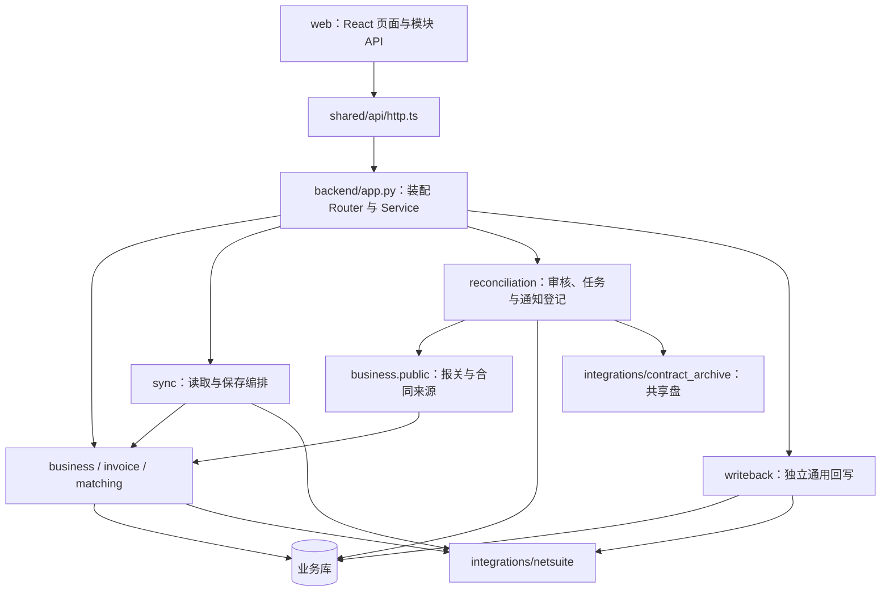

# 项目目录与架构地图

核对日期：2026-09-24。本文描述当前工作区的实际目录、入口和依赖，包含未提交实现。业务规则与接口细节统一链接到模块文档；未来设计见[架构方案](architecture-plan.md)，业务衔接见[系统链路](system-chain.md)。

## 1. 架构结论

当前是一个模块化 FastAPI 应用和一个正式 React 前端，后端内部按业务划分职责。正式运行统一读取业务 MySQL 配置并共用一个连接池；两条历史 Alembic 迁移链和版本表保留。没有独立的 Python 任务 worker，也没有持久同步队列；根目录 `worker/` 服务于历史 Vinext 原型。



图是依赖概览，省略各模块内部 Controller、DAO、Mapper，以及公共 identity/audit。`matching` 当前通过发票公开接口与注入的采购来源能力取数，没有接入审核获批范围。共用数据库和连接池不自动合并各 Service 的事务；审核与匹配的获批范围联动尚未接通。

## 2. 实际目录

```text
项目根目录/
├── web/
│   ├── main.tsx                     React 挂载
│   ├── app/                         路由分派、工作区装配、导航与 DemoPage
│   ├── modules/
│   │   ├── identity/                本机会话 API
│   │   ├── invoice/                 Excel 导入、发票列表及 API
│   │   ├── matching/                候选、人工搜索、整票关联与分配 UI
│   │   ├── reconciliation/          PL 对照、财务核对、开票任务页面
│   │   ├── sync/                    数据源入口与 NS 拉取工作区
│   │   ├── business/                旧页面移除说明，目前仅 README
│   │   └── writeback/               旧页面移除说明，目前仅 README
│   ├── shared/                      HTTP、AppFrame、Sidebar、Button、Pagination、样式
│   ├── vite.config.ts               正式构建与开发代理
│   └── tsconfig.json                正式前端及其演示依赖的类型检查
├── backend/
│   ├── __main__.py / app.py         启动与应用装配
│   ├── core/                        配置、数据库连接、身份依赖、中间件、静态托管
│   ├── modules/                     八个已实现业务模块，见下一节
│   ├── integrations/                NS 认证/HTTP/合同来源及共享盘适配
│   ├── migrations/                  应用库迁移
│   ├── business_migrations/         业务库增量迁移
│   ├── manage.py                    数据库命令与受控恢复入口
│   ├── tests/                       Python 测试、fixtures 与隔离预览辅助程序
│   └── config.py 等                 旧导入兼容路径，见第五节
├── app/                             Vinext 页面外壳、全局原型样式及 demo/
├── worker/                          Vinext / Cloudflare 原型入口
├── scripts/
│   ├── dev.mjs / dev-config.mjs     联动启动与统一开发端口配置
│   ├── python.mjs                   npm 调用 Python 的运行器
│   ├── check-web-architecture.mjs   前端静态依赖检查
│   ├── vinext.mjs                   原型启动器
│   └── netsuite/                    需上传 NS 的 RESTlet，不是本地 API 服务
├── tests/                           Node 测试及 fixtures；入口以 package.json 为准
├── docs/                            索引、当前架构、专题说明、方案、mysql/、history/
└── public/                          Vite 静态资源目录
```

`pages/`、`components/` 只在复杂模块内按实际需要使用，不为让目录外观一致给简单模块增加空层。现有 `web/app/*WorkspacePage.tsx` 负责组合页面与共享外壳；业务实现继续放在对应 `web/modules/`。

## 3. 模块归属与代码落点

| 模块 | 后端职责与入口 | 前端归属 |
| --- | --- | --- |
| [identity](../backend/modules/identity/README.md) | 会话、认证身份，`service.py` | `web/modules/identity/api.ts` |
| [business](../backend/modules/business/README.md) | 来源读取与存储，`service.py`、`storage_service.py`、`public.py` | 来源对照 UI 当前在 reconciliation；旧 business 页面已移除 |
| [sync](../backend/modules/sync/README.md) | 连接、分页拉取，`service.py`、`pull_service.py` | `web/modules/sync/` |
| [invoice](../backend/modules/invoice/README.md) | Excel 解析、导入、查询，`parser.py`、`service.py` | `web/modules/invoice/`；同步工作区复用其导入组件 |
| [matching](../backend/modules/matching/README.md) | 候选、关系、分配、占用，`service.py`、`policy.py`、`dao.py` | `web/modules/matching/` |
| [reconciliation](../backend/modules/reconciliation/README.md) | 审核、任务、合同与人工通知，`service.py`、`task_service.py`、`notification_service.py` | `web/modules/reconciliation/` |
| [writeback](../backend/modules/writeback/README.md) | 不可变预览、执行和未知结果保护，`service.py` | 正式旧页面已移除，菜单对应演示页 |
| [audit](../backend/modules/audit/README.md) | 在调用方事务中追加审计，`public.py`、`dao.py` | 暂无独立正式页面 |

`exception` 与 `dashboard` 是目标业务归属，目前没有对应正式后端目录。不要因导航有演示入口就补空模块，也不要把已有任务功能另建为第二套业务实现。

新增规则优先进入所属模块的 Service/Policy；数据库访问放 DAO；纯转换放 Mapper。跨模块使用已有 `public.py` 或应用层注入的公开能力，不导入其他模块的 DAO/Entity。分层详细约束以 [AGENTS.md](../AGENTS.md) 为准。

## 4. 数据库与迁移归属

正式运行只读 `BUSINESS_DATABASE_URL` / `BUSINESS_MYSQL_*`，连接入口为 `backend/core/business_database.py`；所有模块共用该引擎。`core/database.py` 保留连接工厂，SQLite 仅供隔离测试、预览和历史复制。

| 迁移链 | 内容 | 配置 / 目录 | 版本表 |
| --- | --- | --- | --- |
| 历史应用表 | 审核、任务、合同、通知、群配置、回写及审计 | `backend/alembic.ini` / `backend/migrations` | `alembic_version` |
| 来源与匹配 | 母子采购、报关、发票、关联依据及匹配占用 | `backend/business_alembic.ini` / `backend/business_migrations` | `business_alembic_version` |

两条链均在同一业务库执行；统一命令为 `npm.cmd run db:upgrade`，`db:business:upgrade` 是兼容入口。业务迁移仍依赖已有基础表，不能当作空库初始化。代码 head 不代表部署状态，环境必须分别核对版本表。

审核、审计和开票任务保持同事务，匹配和占用保持同事务；同一个连接池不代表所有来源读取与更新已自动合并到一个事务。正常启动不清除 executing/unknown 或释放其目标锁。旧应用记录迁移步骤见[历史数据迁移](python-backend.md#历史应用库合入业务库)。

## 5. 容易误删或混淆的目录

| 路径 | 保留依据 | 后续整理条件 |
| --- | --- | --- |
| `app/`、根 `vite.config.ts`、`next.config.ts`、`tsconfig.json`、`next-env.d.ts`、`postcss.config.mjs` | 原型配置仍由 `dev:prototype/build:prototype/test:prototype` 使用；`web/app/DemoPage.tsx` 直接导入 `app/page.tsx`、演示页和 CSS | 若迁移到独立原型目录，需一起调整相对导入、TS 配置、格式/lint 范围、原型构建与测试；本次未迁移 |
| `worker/`、`.openai/hosting.json` | 根 Vite 配置引用，用于原型 Cloudflare 构建 | 原型链路退役或迁移并通过独立验证后再处理；不属于 FastAPI 部署要求 |
| `backend/config.py`、`database.py`、`netsuite.py`、`workflow.py` | 仍被启动器、manage、迁移环境或测试引用；`database.py` 还注册应用表元数据 | 调用方与元数据装配切换并验证后移除，不直接删兼容入口 |
| `backend/auth.py` | 旧 Auth 调用签名适配；本轮静态检索未发现仓库内调用，后端说明仍保留外部兼容约定 | 确认外部调用退役后清理；不能仅凭无 import 判断所有使用方不存在 |
| `SuiteScripts/` | 本地忽略的 NS 共用脚本；部分 Node 测试和部署说明依赖 | 与 `scripts/netsuite/` 的 RESTlet 配套维护，不能当缓存删掉 |
| `data/`、`secrets/`、`.env*` | 本地数据库、密钥或环境配置，已按规则忽略；`.env.example` 是可提交模板 | 按数据与配置管理，不按代码目录整理删除 |
| `.venv/`、`node_modules/` | 已安装运行依赖 | 仅在明确需要重建依赖时处理 |
| `dist/`、`.next/`、`.vinext/`、`.wrangler/`、缓存、`outputs/`、`work/` | 构建产物、工具状态或本地输出；部分目录按需生成 | 停止相关进程并核实内容与用途后再清理；本次未删除 |

测试分为 `backend/tests/` 与根 `tests/`，分别由 Python 和 Node 运行。`npm.cmd test` 只聚合 package.json 指定的测试，不能称为运行了根 tests 下所有脚本；原型需另执行 `npm.cmd run test:prototype`。依赖本地 SuiteScripts 或专用 MySQL 的测试要单独核对环境。

## 6. 本次已整理与后续工作

本次将根 README 收敛为当前能力、目录入口和启动命令；原阶段记录集中到 `docs/history/implementation-notes.md`。增加 `docs/README.md` 统一导航，修正文档入口中的迁移版本和现状表述。未移动业务源码、变更依赖或运行迁移。

后续应优先完成审核范围 → 匹配 → 任务收票的业务衔接，再按具体任务拆分较大的 business、reconciliation 用例文件。原型隔离、兼容入口退役都需要独立验证，不以批量改目录代替职责收敛。静态架构检查只能验证所覆盖的导入规则，不能证明所有带前缀的层文件、动态调用或运行时事务都符合约束。
