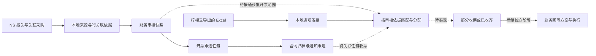
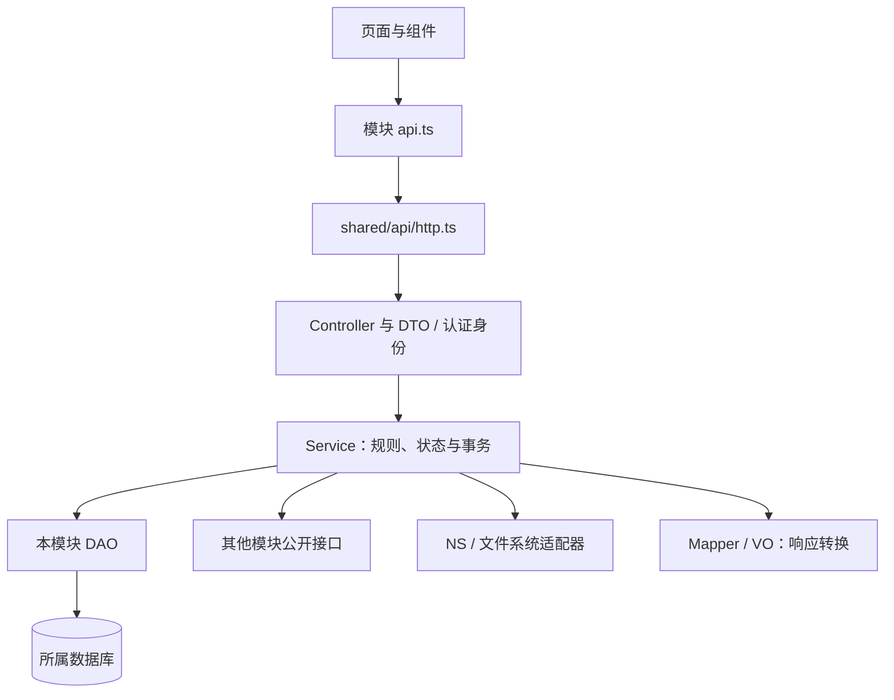
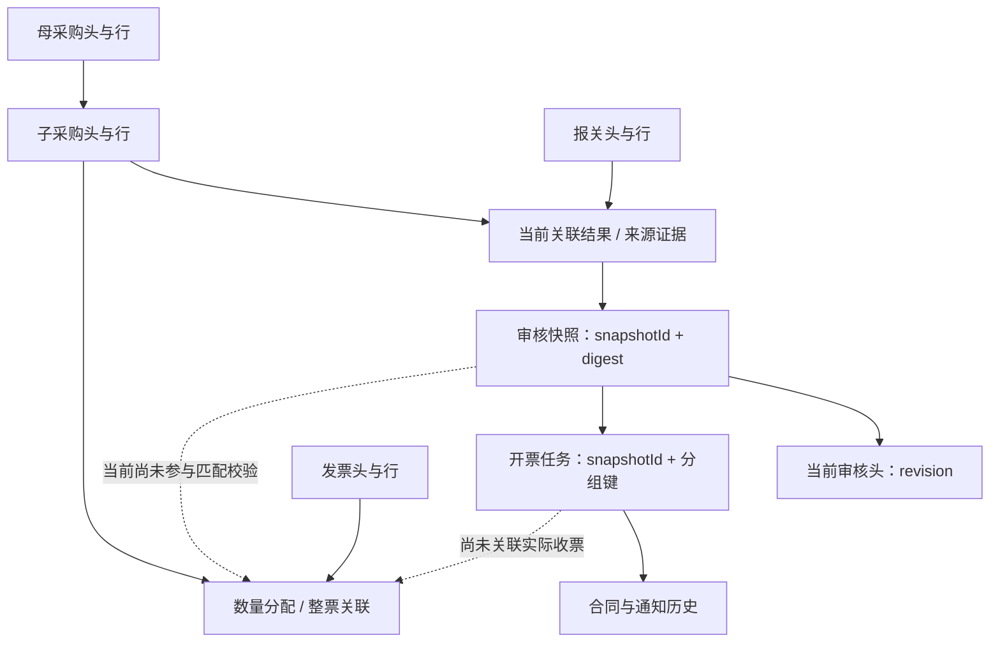
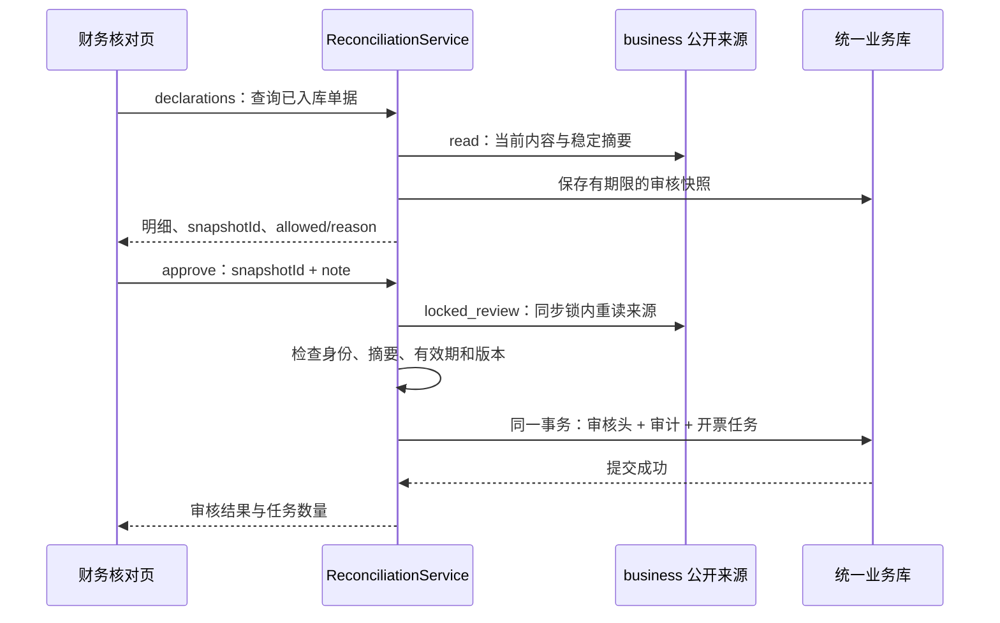

# 系统整体链路与实现关系

> **2026-10-09 更新**：按[架构设计 v2](architecture/README.md)第 1 步，NS 回写 `writeback` 已移至 `archive/writeback` 分支，原型与 `/demo` 演示页、无调用方的接口和旧兼容入口已删除。下文中涉及这些内容的描述已过时；本文将在实施完成后由 `docs/architecture/` 替代。

文件和配置归属见[目录与架构地图](project-structure.md)，专题与模块资料见[文档索引](README.md)；本文集中说明业务链路和实现差距。

梳理日期：2026-09-24。依据为当前工作区的应用装配、页面入口、Service、表定义和迁移文件，包含尚未提交的实现。本次仅整理文档，未执行迁移、访问真实数据库、发送通知或操作 NS。

本文是理解现状与后续衔接的入口；模块 README 解释局部规则，[架构方案](history/architecture-plan.md)保留分层原则与早期目标，[匹配方案](lemon-invoice-matching-plan.md)保留审核证据联动的详细要求。**代码存在、数据库已迁移、真实环境已验收是三个不同结论。** 文中的“已实现”仅表示已发现注册的调用链和对应代码。

## 1. 先统一业务主线

系统应围绕“本次报关范围经过财务审核，供应商据此开票，收到发票后核对归属和剩余范围”组织。建议统一为以下主线：

图中实线表示当前已有的业务衔接，虚线表示目标衔接。H 的**发票与子采购直接匹配**已经实现，但**按财务审核范围匹配**尚未接通。合同和通知是协作过程，不能代替数量、金额和来源版本校验。

当前实际运行的是以下几条链路：

| 链路 | 当前实现终点 | 尚未衔接的下一步 |
| --- | --- | --- |
| NS → 本地来源 → 财务审核 → 开票任务 → 合同共享盘 | 已有本地通知草稿和人工发送登记代码，登记后进入等待开票 | 任务没有关联实际收到的发票，不能自动判定收齐 |
| Excel → 发票两表 → 发票查询 → 匹配 | 可确认整票关系或按数量分配，保存本地记录 | 匹配未读取审核快照和任务，不受“本次获批报关范围”约束 |
| PL 条件 → NS 共用脚本 → 来源对照 | 实时只读展示 | 查询不会自动同步入库、审核或生成开票任务 |
| 手工指定 NS 操作 → 不可变预览 → 确认执行 | 通用回写 API、任务及目标锁 | 未由匹配结果自动生成业务回写方案；菜单中的回写仍是演示 |

因此，当前不能把“审核通过”“匹配已确认”“人工登记已发送”“NS 写入成功”合并成一个“已完成”。

## 2. 页面、接口、服务和存储如何对应

正式前端入口由 [router.tsx](../frontend/src/app/router.tsx)和 [paths.ts](../frontend/src/app/paths.ts)决定；后端是否接入以 [app.py](../backend/app.py)注册的 Router 和注入的 Service 为准。

| 页面 / 入口 | 主要接口 | 后端用例 | 读取或产生的数据 |
| --- | --- | --- | --- |
| `/sync/ns` | `/api/ns/sync/{kind}/pull`、`/pull-save` | `sync.PullService` → `business.StorageService` | NS 来源单、完整明细、当前关联结果 |
| `/pl-reconciliation`，当前默认首页 | `POST /api/ns/pl-script-comparison` | `business.PlScriptService` | 实时 NS 对照结果，不持久化该次页面查询 |
| `/finance-reconciliation` | `POST /api/reconciliation/declarations`、`/approve` | `ReconciliationService.browse/approve` | 统一业务库来源 → 审核快照、审核头、审计、任务 |
| `/invoice-followup` 与任务详情 | `/api/reconciliation/invoice-tasks/query`、`/{id}`、`/{id}/documents/{orderId}/prepare` | `InvoiceTaskService` → `SubpoContractSource`、`ContractArchive` | 任务、合同缓存、共享盘路径及归档时间 |
| 任务详情中的通知区 | `/{id}/notification/draft`、`/{id}/notification/record`，前缀同上 | `InvoiceTaskService.save_notification` → `notification_service` | 通知版本、人工登记、任务状态；没有自动发送渠道回执 |
| `/sync/lemon` | `/api/invoices/import/configuration`、`/preview`、`/confirm` | `InvoiceService`、`parser.py` | 原文件解析和校验 → 业务库发票头、商品行 |
| `/invoices` | `GET /api/invoices`、`/{id}`；`POST /api/matching/summaries` | `InvoiceService` + `MatchingService.summaries` | 发票来源状态和匹配摘要分别提供 |
| `/matching?invoiceId=本地主键` | `/api/matching/invoices/{id}`、`/links/review`、`/links`、`/confirm` | `MatchingService` | 当前发票、子采购候选、整票关系或数量分配 |
| 后端保留的通用回写能力 | `/api/ns/preview`、`/preview-text`、`/execute`、`/jobs` | `WritebackService` | 统一业务库 NS 预览、持久目标锁、审计 |

`/sync/lemon` 虽位于同步工作区，Excel 解析和入库归属 `invoice`，由 [SyncWorkspacePage.tsx](../frontend/src/app/SyncWorkspacePage.tsx)装配，不在 `sync` 中再写一套导入规则。

`dashboard`、`exceptions`、`reconcile`、`writeback` 视图目前经 `viewPath` 进入 `/demo?view=...`。其中“系统对账”演示与正式“财务核对”是不同入口；正式后端 `reconciliation` 当前主要承担审核和开票跟进，并未实现完整三方系统对账。

### 一次请求的分层

页面只提交输入、资源 ID、选择和确认标识；后端返回十进制字符串、状态及 `allowed/reason`。Mapper 是纯转换职责，不要求每个用例都额外建立一层。既有接口使用 `/api/invoices`、`/api/matching`、`/api/reconciliation`、`/api/ns`，早期方案中的 `/api/v1/*` 不能当作已实现接口。

## 3. 模块依赖：谁负责哪一段

| 模块 | 唯一职责 | 当前主要依赖 / 公开边界 |
| --- | --- | --- |
| `identity` | 会话与认证 owner | `core`；目前为单进程内存会话 |
| `sync` | 连接状态、分页拉取、发起保存 | NS 客户端、注入的 `business.storage` 用例；尚无持久同步队列 |
| `business` | NS 来源读取、字段映射、当前来源和行关系保存 | NS 适配器、业务库；公开采购、报关、合同读取能力 |
| `invoice` | 发票导入、去重、冲突检查、来源查询 | 业务库；向 matching 提供带权限的发票读取 |
| `reconciliation` | 财务审核、版本快照、任务、合同准备与通知登记 | `business.public`、`audit.public`、统一业务库、合同归档适配器 |
| `matching` | 候选、比对、人工确认、两种关联方式的占用保护 | `invoice.public`、注入的 `PurchaseMatchingSource`、业务库；当前未依赖审核来源 |
| `writeback` | NS 写入预览、执行权、未知结果保护 | NS 客户端、统一业务库、`audit.public`；当前独立于 matching |
| `audit` | 调用方事务内追加审计 | 共用调用方 Connection；不自行推进业务状态 |
| `exception`、`dashboard` | 目标中的异常闭环和统一汇总 | 当前无对应正式后端模块，不能把演示统计当作真实能力 |

几个关键连接位置：

- [business/public.py](../backend/modules/business/public.py)提供 `CustomsReconciliationSource`、`PurchaseMatchingSource` 和 `SubpoContractSource`。审核、匹配不直接访问 business 私有 DAO。
- [app.py](../backend/app.py)把同一个 `InvoiceService` 和业务库引擎注入 `MatchingService`，把报关读取能力注入财务审核和开票任务。
- [reconciliation/service.py](../backend/modules/reconciliation/service.py)在审核事务内调用 `generate_tasks`；该函数属于同模块的 [task_service.py](../backend/modules/reconciliation/task_service.py)。
- `audit.public.record_finance_review` 与审核使用同一个应用库事务；匹配自身保存操作者、时间和不可变快照，不等于所有模块都已经接入统一业务事件台账。

新增连接应沿用这些公开入口。不把发票解析塞进同步 Controller，不把审核规则塞进匹配页面，也不让任务页面自行汇总金额决定“收齐”。

## 4. 两个数据库与三类业务事实

### 4.1 当前存储分工

| 数据位置 | 当前主要表 | 业务含义 |
| --- | --- | --- |
| 统一业务库：`BUSINESS_DATABASE_URL` / `BUSINESS_MYSQL_*` | `parent_purchase_orders`、`parent_purchase_order_lines` | 母采购来源 |
| 同上 | `purchase_orders`、`purchase_order_lines` | 子采购来源；不是已审核可开票额度 |
| 同上 | `customs_declarations`、`customs_declaration_lines` | 报关来源及汇总行 |
| 同上 | `invoices`、`invoice_lines` | 实际导入发票及商品行 |
| 同上 | `customs_reconciliation_results` | 每张报关单一份当前证据和关联结果；可被后续完整同步替换 |
| 同上 | `invoice_purchase_allocations` | 按数量保存的分配及占用 |
| 同上 | `invoice_purchase_link_batches`、`invoice_purchase_link_pairs` | 整票确认批次及行关系，占用所选子采购行 |
| 统一业务库：`BUSINESS_DATABASE_URL` / `BUSINESS_MYSQL_*` | `finance_review_snapshots`、`finance_reviews`、`finance_review_audit` | 不可变审核依据、当前审核头、追加式审核历史 |
| 同上 | `finance_invoice_tasks`、`finance_task_documents`、`finance_task_notifications` | 开票跟进、合同元数据与归档路径（旧副本保留）、通知版本和人工登记 |
| 同上 | `ns_previews`、`ns_target_locks`、`ns_audit` | 独立通用回写流程及其保护 |
| 共享盘 | 按首次下载日期组织的子采购合同 PDF | 新合同唯一持久文件；数据库元数据存在不等于已归档成功 |

“八张来源表”只计算母采购、子采购、报关、发票各两张，**不代表整个业务库只有八张表**。

当前保留两条历史 Alembic 迁移链，在同一业务库记录 `alembic_version` 和 `business_alembic_version`。统一升级入口为 `npm.cmd run db:upgrade`。业务迁移仍依赖已有基础表，不能作为空库初始化；旧 SQLite 应用记录须通过[离线复制工具](python-backend.md#历史应用库合入业务库)迁入。配置变化不会自动复制数据。

### 4.2 关系键与证据

上图是业务引用关系，跨库箭头不表示数据库外键。NS 单头身份需要 `tenant_id + ns_account + ns_internal_id`；本地 `id` 与 NS 内部 ID 不是同一标识。来源行使用稳定行键；PL、供应商名称、显示行号只能作线索，不能替代行身份。

审核头以 `owner + account + declaration_id` 定位；任务另保存 `snapshot_id`、`review_revision` 和供应商／公司／币种分组。来源可更新，审核快照和确认历史不能覆盖。

### 4.3 金额与数量必须保留口径

| 概念 | 从哪里来 | 可以用于什么 |
| --- | --- | --- |
| 报关数量、报关货值 | 报关来源行 | 来源核对；币种和计价可能不同于采购结算 |
| 子采购原数量、单位、行含税金额 | 子采购来源行 | 采购原始业务范围 |
| 子采购报关数量、报关单位 | 子采购 `declaration_quantity/declaration_unit` | 当前匹配使用的数量口径，不能用原单位补空 |
| NS v3 分摊展示值 | NS 共用脚本的明确关联 | 展示本次来源范围；必须保留对应行身份与精度 |
| 本次获批开票数量和含税金额 | 目标中的有效审核范围 | 后续匹配控额；当前尚未形成完整、可锁定的业务闭环 |
| 已确认匹配量／额 | 分配台账或整票关系 | 已确认关联事实；不同模式不能重复计入额度 |

当前 `task_policy.split_scope` 的本地路径保存采购原值，`TaskSummary.expectedAmount` 默认空值；任务可准备合同，不代表系统已计算本次应开票总额。`MatchingService.confirm` 则按子采购行金额与其报关数量分摊。**审核页面展示、任务原值、匹配计量是三种不同用途，不能因同属一张单据便直接等同。**

所有正式计算继续由后端 Decimal / 数据库 DECIMAL 完成；展示舍入单价不作为金额重新计算依据。申报公司和采购公司也不能互相代替：当前任务和匹配采用采购公司，早期方案中的“购方等于申报主体”需要逐一核实业务映射后再统一。

## 5. 四个关键用例的真实执行顺序

### 5.1 NS 拉取保存

1. `/pull` 只读分页记录；`/pull-save` 才进入保存用例。标准采购订单目前只能拉取，不能与子采购映射混写。
2. `PullService` 调用 `StorageService.sync_page`，后者协调同身份、同 NS 账户的同步锁。
3. `PlReader` 补齐报关和关联子采购明细；`RelationReader` 收集原始行、Packing、交易行依据，并复用 NS v3 关联结果。
4. 必要接口缺失、旧版、截断、范围不一致时整页失败；完整读取后的实际关系冲突可保存为 `partial` 并保留原因。
5. HTTP 读取结束后，在短业务库事务内保存单头、明细、外键和当前关联结果。同步命名锁可能覆盖外部读取阶段，不等于持有长时间数据库写事务。

网页按页读取不等于已实现全范围定时同步。创建日期筛选也不等于能捕获历史修改；未来调度必须复用同一保存用例，并补分页、水位和恢复能力。

### 5.2 本地财务审核与任务生成

本地列表不读取实时 NS，但查询可能保存待审核快照，不是完全无写入的浏览请求。财务审核当前由配置管理员身份确认；服务身份只读，尚无完整财务／采购多角色共享模型。

本地审核允许人工核对已有完整展示范围，不要求技术关联状态一定为 `matched`；未归属采购行保留在整单核对范围中。审核通过后按报关单、供应商身份、采购公司身份、币种生成任务；身份缺失时按子单隔离。它不会自动把整张子采购金额转成获批额度。

兼容的 `/api/reconciliation/query` 仍是实时 NS 查询审核路径，确认时重读 NS 并要求原完整性条件；不能把其行为写成本地列表的行为。

### 5.3 合同归档与通知登记

`prepare_document` 检查任务来源和版本 → 从指定 NS 环境获取合同 → 重新核验后只保存元数据 → 锁外写共享盘 → 再次核验来源和审核版本 → 记录归档成功。新 PDF 不存入数据库或服务器本地归档目录；失败重试重新获取并核对首次内容与日期。旧版副本保持原样。共享盘失败时保持资料待准备，不能只因取得 PDF 就推进任务。

工作区的 `notification/draft` 保存群名称、发送员工及通知文本；`notification/record` 在合同全部归档后允许人工确认实际发送时间和说明，保存追加版本并进入 `awaiting_invoice`。`notification.send.allowed` 仍为 false，当前没有企微自动发送实现，也没有渠道送达证明。本次未验证该新增路径的运行状态或测试结果。

### 5.4 发票匹配与确认

1. Excel 导入在 `InvoiceService` 中预览、重新校验后原子入库。当前只筛选“采购固定资产”，没有柠檬云 API 同步；图片摘录另有人工内部入口，没有网页 OCR 接口。
2. `MatchingService` 读取当前身份的发票和本地子采购，按备注线索、名称等返回候选、差异、来源摘要和操作能力。
3. 整票确认 `/links` 保存所选发票行与采购行关系；可按受控规则确认差异并留说明。数量分配 `/confirm` 则按严格规则保存数量和后端计算的金额。
4. 正式保存要求 MySQL 业务库；同事务重新读取并锁定来源及占用，核对 `snapshot` 和 `requestId`。两种模式检查彼此占用，不能把同一采购行再分给另一张票。
5. 来源变化显示待复核，保留历史关联及占用。当前没有取消、红冲调整、审核证据联动或匹配后自动回写。

整票模式适合一次确认多条子采购关系；数量分配支持分批和一单多票。人工差异整票确认表示“人工接受这些关系”，并不证明两侧数量金额一致，未来不能直接据此标记“足额收齐”。

## 6. 状态各管一件事

| 维度 | 当前状态 / 表达 | 与其他状态的边界 |
| --- | --- | --- |
| 来源技术依据 | `partial / collected / matched`、`review_ready` | 由 business 维护；不是财务审批结论 |
| 财务人工审核 | 待审核、审核通过；来源变化重新待审 | 审核历史保留；当前没有正式驳回流程 |
| 开票任务 | `documents_pending → notify_pending → awaiting_invoice`；旧任务 `superseded` | 等待收票是任务阶段，不代表已经关联发票 |
| 合同 | `pending / archive_pending / ready` | 只有共享盘成功才 ready |
| 通知 | 草稿、人工登记已发送；自动发送未接入 | 人工登记和渠道送达不可混称 |
| 发票来源 | normal、red_offset、void、unknown；导入校验另有状态 | 匹配确认不改写票面合法性或来源事实 |
| 匹配 | 未关联、部分分配、完整分配、已确认有差异、来源变化待复核等展示结果 | 由已有关系和来源计算，不等同审核或 NS 执行 |
| 回写 | `preview → executing → succeeded / unknown` | unknown 保留锁并要求核实；正常启动不清除 |

回写在发出请求前校验失败，可以返回 preview 并释放目标锁；请求发出后不能把网络异常当作可重发失败。若成功结果落库失败，可能仍留 executing 和持久锁，应按既有核实流程处理。

当前任务统计的 `awaitingInvoice` 包含待准备合同、待通知和等待开票的当前任务；`needsAttention` 只包含前两类，`receivedInvoices=null`。因此两个计数会重叠，“未接入”不能显示成已收票 0 张。

## 7. 已确认的不一致及收敛方向

| 优先级 | 实现证据 | 影响 | 建议统一方式，尚未实施 |
| --- | --- | --- | --- |
| 1 | [app.py](../backend/app.py)给 MatchingService 的依赖只有发票、采购来源和业务库；[confirm/link](../backend/modules/matching/service.py)不读取审核版本 | 可确认本地关系，但无法证明属于本次已审核范围 | 建立 reconciliation 的公开获批依据接口；匹配必须绑定审核版本、报关行及明确采购份额 |
| 1 | [0006 业务迁移](../backend/legacy_migrations/business/versions/0006_approved_invoice_matching.py)增加 `review_snapshot_id/review_revision/customs_line_id` 等列，当前确认保存未填这些审核字段 | “已有列”容易被误解为“审核匹配已实现” | 先完成批准范围、锁与确认写入链路，再以字段和测试证明实际生效 |
| 1 | [task_policy.py](../backend/modules/reconciliation/task_policy.py)保存原采购范围；任务金额为空；匹配按子采购报关数量及行金额计算 | 审核表、合同任务、匹配可能对应不同数量金额口径 | 明确本次获批范围，保留原值／分摊值标签；单位和币种未核实不得转成额度 |
| 1 | [task_service.py](../backend/modules/reconciliation/task_service.py)的 compare 禁用、receivedInvoices 为空 | 发票即使匹配成功，开票任务也不会随之收齐 | 用审核版本与稳定来源行关联任务和匹配结果；后端计算部分收票、已收齐与需复核 |
| 1 | [task_dao.replace_revision](../backend/modules/reconciliation/task_dao.py)将所有非 superseded 旧任务替代，已包括 awaiting_invoice | 已人工通知的旧范围会保留历史，但尚无通知变更／收票影响处理闭环 | 重审后单独暴露已通知范围变化；保留旧通知和占用，禁止把旧票静默迁到新版本 |
| 2 | [task_controller.py](../backend/modules/reconciliation/task_controller.py)已有通知草稿及人工登记，模块说明仍有“仅禁用占位” | 读文档可能漏掉新增持久状态和迁移要求 | 以当前注册接口区分人工登记、自动发送；新增实现完成验收后同步模块文档 |
| 2 | [paths.ts](../frontend/src/app/paths.ts)仍将工作台、异常、系统对账和回写指向演示 | 菜单齐全容易被当成业务闭环齐全 | 页面持续标注数据模式；导航命名与实际能力在后续交互任务中统一 |
| 2 | 回写服务独立，未接收匹配／审核业务标识 | 通用写入保护已存在，业务回写前置条件未建立 | 后续由后端依据有效匹配生成不可变回写方案，复用现有锁和 unknown 保护 |
| 2 | 现有数据按 owner 摘要隔离，会话仅单进程 | 管理员、服务身份及未来真实用户可能看到不同范围 | 正式多人协作前设计组织／主体授权及旧 owner 映射，不能直接放宽查询或前端传角色 |
| 3 | [早期架构方案](history/architecture-plan.md)、[数据库说明](mysql/README.md)保留六表、统一库、尚未实现匹配等阶段表述 | 文档年代不同导致新需求重复建链路 | 本文提供当前总览，历史方案保留背景；新功能以注册代码及最新模块规则核对 |

这些是本次梳理发现的边界与设计差距，不表示已完成业务修复。已有审核、已确认关联和原始数据均保持不动。

## 8. 建议的最小衔接方案

### 8.1 用“获批开票范围”连接两条主线

新增能力应由 `reconciliation` 负责定义获批范围，`matching` 负责引用和占用，`business` 继续提供来源；不再新增一套平行匹配台账。获批依据至少需要：

| 身份与版本 | 范围与口径 | 有效性 |
| --- | --- | --- |
| owner / 授权主体、NS account、报关本地及来源行键、采购行键、snapshotId、revision、digest | 供应商、购方、开票品名、单位、获批数量、币种、获批含税金额、对应采购份额 | 来源仍当前、审核仍有效、单位金额已核实、历史占用已纳入 |

人工整单审核可以保留现有操作；“已审核”和“具备可执行开票范围”分别表达。仅有 `scope=order` 原值、无法定位稳定行、购方或币种不明时，允许继续资料准备，但不能据此开放未经核实的金额分配。

整票关系与数量分配继续共享占用约束。人工差异关联的数量、金额归属未经额外核实前，作为“已关联有差异”保留，不能把采购全额当成已收票金额；后续若统一内部占用模型，需要迁移现有关系，禁止新台账从零起算。

### 8.2 共用业务库后仍须明确事务与获批范围

当前运行已共用业务 MySQL 引擎。审核、审计、任务保持同事务，匹配和占用保持同事务；共用连接池不代表全部 Service 调用已共用一个 Connection，也不代表审核获批范围已接通。

建议后续将**可执行获批范围及其占用**放在同一个业务库事务边界内，仍由各业务模块维护自己的表。应用库审核快照作为不可变依据，通过明确的版本衔接建立可用范围。上线前必须完成以下设计和验证：

1. 审核确认、来源同步、重审和匹配确认采用一致的锁顺序及版本检查；新版本失效旧范围时不能留下可继续使用的窗口。
2. 若未来重新拆库并采用跨库投影，持久记录待投影工作，幂等应用；投影未完成或无法证明版本当前时禁止消费。一次先读应用库、再写业务库的普通调用不足以保证一致性。
3. 若改为同库权威批准范围，则明确旧审核数据的引用和迁移方法，保留历史，不重建数据库、不修改历史迁移文件。
4. 无论采用哪种实现，必须用隔离 MySQL 多连接验证“重审与确认竞争”“同步与确认竞争”“中途失败与重启恢复”。

本节确定的是设计边界，不是假定已有跨库事务机制。具体迁移或投影协议需要在实施前定稿，不能只补几个 `review_*` 字段就称为接通。

### 8.3 任务状态从同一份匹配事实生成

任务关联使用“审核版本 + 获批来源行”，匹配详情可反查审核和任务；任务详情可查询对应发票与差异。收票数量和金额由后端基于有效关系计算，不靠手动改“已完成”。

建议采用单向依赖：matching 读取 reconciliation 的公开获批依据；跨任务和匹配的汇总由上层查询用例组合两模块的公开结果，按实际需要落在 dashboard 等汇总职责中，不让 reconciliation 与 matching 互相导入私有 DAO。本次不预建空模块或通用工作流框架。

收票先于通知、同一供应商多任务、任务重审、人工差异确认都需要明确展示。通知记录仅是协作证据，不作为确认发票真实性或数量金额守恒的替代条件。

## 9. 实施顺序与验收出口

| 顺序 | 交付内容 | 验收出口 |
| --- | --- | --- |
| 1 | 固定一组隔离样例，确认报关行、子采购行、发票行及单位金额口径 | 从三个方向均能追溯稳定来源；未确定业务口径明确阻断 |
| 2 | 接通审核获批范围与现有匹配台账，完成跨库版本方案 | 无有效审核不能消费范围；两票争额度、重审竞争、重复提交都不超占 |
| 3 | 接通任务与收票查询，区分差异关联、部分收票、已收齐 | 从任务看到真实发票，从发票看到审核版本；刷新和重启后结果一致 |
| 4 | 完善人工通知及来源变更后的影响处理；自动渠道按需单独接入 | 人工登记和真实回执区分；旧版本通知和发票历史可追溯 |
| 5 | 如需财务入账，再接业务回写方案 | 回写依据绑定有效版本；预览、持久锁、unknown 与审计行为保持 |
| 6 | 按实际授权接柠檬云 API、定时增量、正式异常与汇总 | 复用当前 Service；全分页、历史修改、失败恢复及一致统计可验证 |

第 1—3 步形成首个可核验闭环：**审核范围 → 开票任务 → 已导入发票 → 按审核依据匹配 → 任务收票结果**。多人正式使用前需要同时补齐主体共享和角色权限；不必等待外部发票 API 或自动通知才验证本地闭环。

已有针对性测试可复用 `test_relation_sync.py`、`test_finance_manual_review.py`、`test_finance_manual_mysql.py`、`test_invoice_tasks.py`、`test_task_documents.py`、`test_contract_archive.py`、`test_matching_allocations.py`、`test_matching_manual.py` 和 `test_workflow.py`。新增审核匹配、任务收票及通知状态需补交叉用例，不能只运行原单模块测试便声称端到端通过。

## 10. 本次文档交付与核对范围

- 阅读根目录规范、README、架构方案和相关模块说明；沿正式前后端入口核对调用链、服务依赖、存储表、迁移及状态。
- 本文给出现状、差距和建议；根 README 与早期架构方案增加导读，后端目录说明更新实际模块。没有删除业务代码或迁移，也没有改动用户已有实现。
- 仅执行文档本地链接和差异检查，不运行业务测试。本次未验证 MySQL 迁移版本、真实 NS 部署、合同共享盘、通知页面或端到端业务效果；历史文档中的验收记录不算本次验证结果。

## 供应商群配置补充（2026-10-09）

开票跟进新增 `/invoice-followup/supplier-groups`。用户选择已同步的供应商，输入群名查询企微并选择目标群，系统获取群和群主 ID 建立默认群映射；运行时只使用 MySQL 业务库的 `finance_supplier_groups`，配置接口和任务带出复用同一服务。应用库历史迁移保留兼容，遗留映射表不再读写；迁移 `0009_simplify_supplier_groups` 删除旧配置历史表与群目录表，不再提供 Excel 群清单导入。当前任务可带出启用的同身份、同账套、同供应商配置，已有通知快照保持原内容。查询与保存前群身份核验已接入；此能力仅维护映射，真实发送和渠道结果查询仍待接入，详见[模块接口说明](../backend/modules/reconciliation/README.md#供应商默认企微群配置已实现)。
